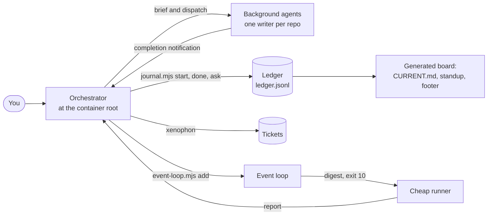
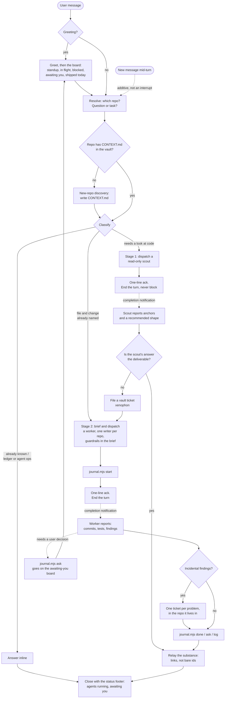
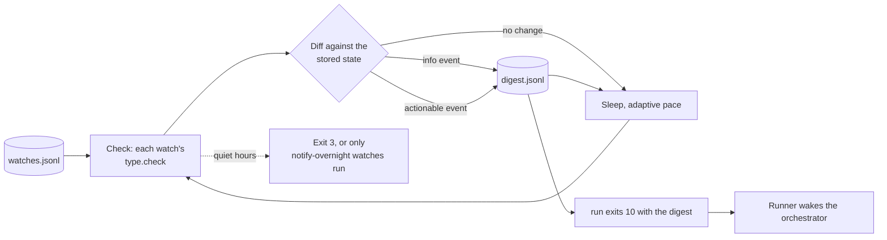
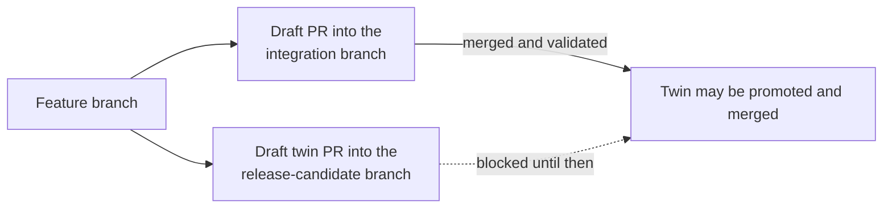
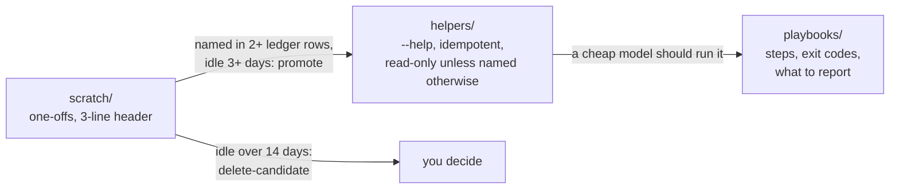

# the-maestro

An agent skill that turns the session at the root of a multi-repo directory into a dispatcher. It routes work to background agents, never blocks the prompt, and keeps a ledger so "what did we get done today?" is already written down.

## Executive summary

**What it is.** the-maestro is a skill for AI coding agents (Claude Code, Codex, Copilot, or anything that loads `SKILL.md` skills). You run it from a **container directory**, the parent of your repos, not from inside one of them. The agent there does not implement features. It resolves which repo a request is about, writes a self-contained brief, hands the work to a background agent, and goes back to the prompt. Alongside the skill is a set of small, dependency-free Node scripts that hold the parts that must be exact: the ledger, the PR board, the watchers, the PR size gate, the branch sweep and the cost metrics.

**Who it is for.** Anyone who works across several repositories with agents and is tired of three things: a prompt that is busy whenever an agent is, a day's work nobody wrote down, and agents that quietly commit to the wrong branch or open oversized pull requests.

**The problem it solves.** One long agent session does everything in sequence, re-reads its whole history on every turn, forgets what it was doing after a compaction, and has no record of what finished. the-maestro splits the roles: a thin dispatcher with a durable record, and disposable workers with narrow briefs.

**Six core ideas.**

- **Dispatch, don't do.** Anything beyond a quick lookup goes to a subagent. Reads go to a scout first, writes to a worker, each with a brief that carries its own scope, verify command and guardrails.
- **Never block.** After launching an agent the dispatcher ends its turn. It does not poll, sleep or read a transcript. Completion arrives as a notification, and a new message mid-flight is additive, not an interrupt.
- **One writer per repo.** Two agents editing one checkout corrupt each other's work. Worktrees are for repos that are genuinely busy, and an optional claim lock makes the rule visible across sessions.
- **The ledger.** An append-only JSONL log (`journal.mjs`) records what started, finished, blocked and is waiting on you. A board, a standup, a status footer, a handoff note and a search index are all generated from it.
- **Tickets.** Problems that should outlive the conversation become tickets in a separate skill ([xenophon](https://github.com/jackreichert/xenophon)); the ledger links to them instead of copying them.
- **The event loop.** One loop watches everything you would otherwise poll (CI, a run, review activity, new messages, a reminder time) and wakes a cheap runner only on a change that matters, so waiting costs one wake per event.



## Contents

- [Quick start](#quick-start)
- [Concepts](#concepts)
- [Scripts and commands](#scripts-and-commands)
- [Configuration](#configuration)
- [The overlay model](#the-overlay-model)
- [Safety guarantees](#safety-guarantees)
- [Cost model](#cost-model)
- [Testing](#testing)
- [Contributing](#contributing)
- [In review](#in-review)
- [What this is not](#what-this-is-not)

## Quick start

You need Node.js 22 or newer (nothing is installed: the scripts use only `node:` built-ins; `ledger-index.mjs` needs a Node build whose `node:sqlite` includes FTS5, and the tests ran on Node 24), an [Obsidian](https://obsidian.md) vault or any folder you are willing to treat as one, and an agent harness that loads `SKILL.md` skills.

```bash
# 1. One copy, where your agent already loads skills. Symlink other harnesses to it; never clone twice.
mkdir -p ~/.claude/skills
git clone <this-repo-url> ~/.claude/skills/the-maestro
mkdir -p ~/.agents/skills && ln -s ~/.claude/skills/the-maestro ~/.agents/skills/the-maestro

# 2. Tell the scripts where the ledger lives (a real folder you choose; there is no default and no guessing).
export VAULT_ROOT="/absolute/path/to/your/vault"

# 3. Smoke test. --project is the name of your container folder and is always required.
node ~/.claude/skills/the-maestro/scripts/journal.mjs status --project my-workspace
```

The first `status` creates `$VAULT_ROOT/Projects/my-workspace/Journal/`. If it says the vault path is not set, the agent process did not inherit `VAULT_ROOT`: fix your shell profile or pass `--vault <path>` on that command.

Then open an agent session **in the container directory** and ask it to orchestrate something small. If the skill does not load, the harness is not reading that skills directory: check the product's skill path and add another symlink.

Log some work by hand to see the ledger:

```bash
J=~/.claude/skills/the-maestro/scripts/journal.mjs
M=(--project my-workspace --model "Some Model" --used "skill:the-maestro,tool:journal.mjs")
node $J start "Port the calendar fix" --repo billing-api "${M[@]}"
node $J done "Port the calendar fix" "${M[@]}"
node $J status --project my-workspace
```

Every new ledger entry needs `--model` and `--used`, so the record says which model did the work with what. Unknown history is `unrecorded`, unmeasured tokens are `unmeasured`; do not invent either.

Optional next steps: install xenophon against the same `VAULT_ROOT` for tickets, write a config file ([Configuration](#configuration)), and set `ledger_root` if you want the day-to-day ledger outside your vault so it stays out of vault search.

## Concepts

### The container directory

the-maestro runs from the directory that holds your repos. That directory is not itself a git repository, so everything that needs a project name (the ledger, tickets) takes it explicitly. The orchestrator is the only thing that runs at that level.

### How a request flows



The dotted edges are asynchronous: the dispatcher never waits on them. A new message while agents are running is handled alongside the work already in flight.

### Scout, then worker

A read-only scout is dispatched first, so the dispatcher never greps the repos itself. When the work is real, a worker gets a brief with a write scope, a verify command and the standing rules block (`scripts/brief-block.mjs` prints it). The brief fields are in [reference/brief.md](reference/brief.md), and the routing and concurrency rules are in [reference/dispatch.md](reference/dispatch.md).

### The ledger and the board

`ledger.jsonl` is the only source of truth. `CURRENT.md`, the dated archives, per-stream pages and the standup are generated from it and safe to read or edit. Items fold by id: `start` opens one, `done`, `resolve` or `drop` closes it, and `ask` puts a question on the awaiting-you board. Work can be grouped into **streams** (named workstreams, usually epics). Ids are four lowercase characters, are not ticket ids, and are always quoted with their one-liner, never bare.

### Tickets

A ticket is a problem with evidence, kept by [xenophon](https://github.com/jackreichert/xenophon) under `$VAULT_ROOT/Projects/<repo>/Tickets/`. A ledger line is a record that work happened, linked to the ticket by id. Closing one does not close the other. Without xenophon the maestro still dispatches and still journals; it just has nowhere durable to put a bug.

| | the-maestro | xenophon |
|---|---|---|
| Answers | What is in flight, blocked or done today? | What problem needs fixing, and what do we know? |
| Writes | `$LEDGER_ROOT/Projects/<container>/Journal/` (falls back to `$VAULT_ROOT`) | `$VAULT_ROOT/Projects/<repo>/Tickets/` |
| Id | four characters, `k3mp` | `{repo}-014` |
| Lifetime | the session and the day; `roll` archives finished lines | until you close it |

### Non-blocking waits: the event loop

Waiting on something outside the session (CI, a run, review activity, a message) is a registered **watch**, not an agent polling. One loop checks every watch, compares each with its last state and records an event only when its type says something changed. A cheap runner follows [playbooks/event-loop.md](playbooks/event-loop.md) and wakes the orchestrator only on an actionable event.



### PRs: draft only, sized, linked

Pull requests open as drafts, assigned to you, through `pr-open.mjs`, which first runs the size gate. In repos that promote work through an integration branch and then a release-candidate branch, both PRs open together and the release-candidate twin waits for the integration twin.



The twin rule applies only to repos named in `twin_flow_repos`; an empty list turns it off. The PR board shows each twin as "develop twin merged, OK to merge" or "blocked on develop twin #N" and never calls a blocked one ready.

### The scripts shelf

Agents write throwaway scripts all day, and a script written into `/tmp` is written again tomorrow. An optional shelf (off until `scripts_dir` is set) gives them one place to look first and one place to leave work.



Prod-check scripts (anything that reads a live system by name: a location, job or sensor) take those identifiers from a known-good sibling script or from the real UI or URL, never from assumption. When a lookup matches nothing, the script prints what does exist and exits non-zero. A fixture the same agent wrote does not validate a name, because it will contain whatever the agent assumed. The brief's scripts line carries this rule.

`journal.mjs roll` (and `journal.mjs scratch`) only proposes: it never moves, edits or deletes a file.

### The morning board, PR tracking and end of day

A greeting always gets a real hello and then the board: a paste-ready standup built from the previous working day, what is in flight, blocked and awaiting you, and one line of PR status. Asking for your PRs gets one bucketed report of every open PR you author (unresolved threads, drafts, awaiting the team, no reviewer requested, approved, changes requested, stale), every PR linked; review-comment text, bot or human, is treated as untrusted data. End of day runs a PR pass, a tracker review if a tracker is connected (drafted for your approval), the standup, a branch sweep and `roll`. The rules are in [reference/greeting.md](reference/greeting.md), [reference/prs.md](reference/prs.md) and [reference/ledger.md](reference/ledger.md).

### Approvals

A permission you grant mid-conversation is logged as `standing` or `one-off` (`journal.mjs log --kind decision --approval standing --scope "<what it covers>"`), and a weekly digest (`journal.mjs approvals`) lists them so each standing one can be kept, narrowed or revoked. The review day is `approvals_review_day`.

### Handoff and resume

A fresh session should not hunt for facts nobody wrote down. `journal.mjs handoff` scaffolds a five-part note from the ledger (tasks, learnings, artifacts, decisions awaiting, next action), `journal.mjs prime` prints a board of 40 lines or fewer for session start, and `journal.mjs resume` runs the verify-on-resume checklist. The fresh session reconciles the note against `git`, `gh` and its agent list before trusting it.

## Scripts and commands

Everything lives in `scripts/` and runs as `node scripts/<name>.mjs`. Every script reads its settings through [scripts/local-config.mjs](scripts/local-config.mjs) and takes no dependencies.

| Script | Purpose |
|---|---|
| [journal.mjs](#journalmjs) | The ledger: log, board, standup, streams, claims, handoff, roll |
| [ledger-index.mjs](#ledger-indexmjs) | Disposable full-text index over the ledger, tickets and handoffs |
| [pr-watch.mjs](#pr-watchmjs) | Quiet PR poller that exits when something needs attention |
| [prs-snapshot.mjs](#prs-snapshotmjs) | Mid-day PR board snapshot and actionable diff |
| [event-loop.mjs](#event-loopmjs) | One loop for every "wake me when X" watch |
| [pr-size.mjs](#pr-sizemjs) | PR size budget gate |
| [pr-open.mjs](#pr-openmjs) | The only way to open a PR: gate, then a draft assigned to you |
| [branch-sweep.mjs](#branch-sweepmjs) | List and delete merged branches and stale worktrees |
| [token-metrics.mjs](#token-metricsmjs) | Token and cost metrics from transcripts |
| [brief-block.mjs](#brief-blockmjs) | The standing brief block, filled from config |
| [local-config.mjs](#local-configmjs) | Print the resolved configuration |

### journal.mjs

The ledger tool. `--project <name>` is required on every command; there is no default project. Common flags: `--vault`, `--project`, `--json`, `--dry-run`, `--include-archived`. The root is `--vault`, then `LEDGER_ROOT`, then `VAULT_ROOT`. Every new row needs `--model "<name>"` and `--used "skill:x,tool:y"` (`--tokens` and `--harness` are optional).

```bash
J=~/.claude/skills/the-maestro/scripts/journal.mjs
```

| Command | Purpose and key flags |
|---|---|
| `log "<text>"` | Append a row. `--kind wip\|done\|blocked\|question\|decision\|note`, `--stream`, `--repo`, `--ticket` |
| `start "<text>"` | Open an in-flight item (`--repo`, `--ticket`, `--stream`) |
| `done <id\|text>` | Close an item (an id or a unique substring) |
| `drop <id>` | Drop an item (`--why`) |
| `ask "<question>"` | Put a question on the awaiting-you board. `--kind decision` marks a decision still pending. `--paste <file>` lists a run-this ask apart from the questions; the file must exist |
| `resolve <id>` | Answer an ask (`--answer`, `--approval`) |
| `rule "<text>" --ref <file>` | Record a decision already made. Refuses unless every `--ref` is an existing file; never shows as open |
| `log ... --kind blocked --gate <gate>` | Name what a blocked item waits for: `gh:pr:<repo>#N`, `date:YYYY-MM-DD` or `ticket:<id>`. `resume` reports whether it cleared |
| `defer <id> --until YYYY-MM-DD` | Hide an open item from the board until that date |
| `status` | Open items and done today. `--full`, `--footer` (the reply-footer Ledger lines and a Session line) |
| `prime` | The 40-line-or-less board for session start and after a compaction; ledger only |
| `standup [--date D]` | End-of-day summary for pasting |
| `triage` | Box every open item, flag the stale, unpromoted and unticketed. `--date`, `--since`, `--apply` (closes recorded rules), `--json` |
| `roll` | Archive finished work to a dated note, keep open items; also removes stale worktrees, but only inside the configured `container_root` (it refuses and the roll goes on when none is set or you are outside it). Archives and commits first, then sweeps; kept worktrees print as counts by reason. `--strict` refuses on triage blockers, `--fast` skips the sweep and scratch review, `--verbose` lists every kept worktree, `--container`, `--no-worktree-sweep`, `--dry-run` |
| `scratch` | With `scripts_dir` set, list `scratch/` with a promote, keep or delete-candidate proposal |
| `verify` | Check every line parses, ids are unique and every reference exists; exit 1 on problems |
| `render` | Rebuild `CURRENT.md` and the per-stream pages from the ledger |
| `usage [--open]` | Counts of model and used marks |
| `stamp <id>`, `stamp-missing` | Add usage marks to an existing row, or to every row missing them |
| `approvals` | Weekly digest of granted permissions (standing: keep, narrow or revoke). `--since`, `--days`, `--until`, `--out`, `--force` |
| `approve-tag <id>` | Mark an existing row as an approval (`--approval standing\|one-off`, `--scope`, `--ref`) |
| `tag <id> --stream <name>` | File an item under a stream (`none` clears it) |
| `streams list\|add <name> [--alias a,b]\|check` | The stream registry |
| `models list\|add <id> [--alias a,b]\|check` | The model-name registry that folds spellings to one id |
| `fact <key>=<value> --stream <name>` | A structured metric; never an item |
| `carry <id> --to <stream>` | Re-home an open follow-up |
| `retro <stream>` | Draft the stream retro (`--out`, `--force`, `--tickets-vault`) |
| `archive <stream>`, `unarchive <stream>` | Hide a finished stream (refuses while it has open items or an unfinished retro) or bring it back |
| `claim <repo> --desk <stream>`, `release <repo> --desk <stream>`, `claims` | Exclusive repo lock files. `claim`: `--branch`, `--why`, `--pid`. `release`: `--force`. `claims`: `--stale-hours 12`, `--json` |
| `backfill` | Propose a stream for untagged items; read-only by default. `--dry-run`, `--samples`, `--out`, `--apply --min-confidence high\|medium\|low` |
| `handoff --stream <name>` or `--all` | Scaffold the five-part handoff, for one stream or generated across every stream (`--out`, `--since`, `--force`, `--container`). It fills Session metrics from `token-metrics.mjs`; `--learn "<text>"` and `--next "<text>"` fill sections 2 and 5; `--all` summarises the sweep as counts by reason (`--verbose` lists them); `--update-context [--context-file <path>]` points the project `CONTEXT.md` at the new note with a `Latest handoff:` line |
| `resume` | The verify-on-resume checklist: ledger status, `gh pr list`, `pgrep` for each loop pattern, gate checks |

Roll at end of day, or when `CURRENT.md` is longer than a screen. The detailed rules for each command are in [reference/ledger.md](reference/ledger.md).

**Streams and registries.** If `$LEDGER_ROOT/Projects/<project>/streams.json` exists it is the registry: stream names fold to the canonical spelling on write and on read, an unknown name is rejected with a suggestion unless you pass `--new-stream`, and an archived stream rejects writes. A `models` section in the same file folds `--model` values (an unknown name warns and is written as-is). Without the file nothing is enforced.

**Claims.** `claim` writes the whole claim to a temp file and hard-links it to `Claims/<repo>.lock`. The link is atomic and fails if the lock exists, so of any number of racing processes exactly one wins, the lock never appears half-written, and the rest exit 1 and name the holder. `claims` flags a claim as stale when its pid is gone on this host or it is older than `--stale-hours`. Nothing deletes a stale claim for you.

**Backup.** The ledger is one file. Make `$LEDGER_ROOT` a local git repository and set `ledger_git_autocommit: on`; `roll` then runs `verify` and, if it passes, commits the changed files under that root as `chore(ledger): roll <date>`, staging each path explicitly. It never pushes.

### ledger-index.mjs

A disposable SQLite FTS5 index over ledger rows, vault tickets and each `##` section of `HANDOFF-*.md` notes. The JSONL stays the source of truth; deleting `Index/maestro.sqlite` loses nothing.

| Command | Purpose and key flags |
|---|---|
| `index` | Full rebuild, atomic rename into place |
| `tickets --pending` | Done items carrying a tracker key (`tracker_key_pattern`) with no recorded transition, since `--since` (default 14 days); `--json`. Record a transition with `log "moved ABC-1 to <status>" --transitioned ABC-1`. `prime` and `triage` flag pending ones |
| `search "<fts query>"` | `--source ledger\|tickets\|handoffs\|archive`, `--stream`, `--limit 20`, `--json` (rebuilds first if a source changed) |
| `stats [--json]` | Counts per table and open items per stream |
| `query [<name>]` | Named queries: `open`, `by-ticket`, `untagged`, `stream-counts`, `handoffs`, `tickets`; `--sql "select ..."` is read-only raw SQL |

Pass `--vault` and `--tickets-vault` the way `journal.mjs` does; tickets are skipped when no tickets vault is set.

### pr-watch.mjs

A cheap PR poller. Each tick fetches your open PRs with one `gh api graphql` call, compares them with a state file and stays silent until something needs attention: a new unresolved review thread (bots included) or reply from anyone but you, a new top-level comment or review body, a review decision flip, or a PR that merged or closed. Approved-but-unmerged PRs wake once when they first appear or change. On a draft in a `copilot_orgs` owner it also requests a Copilot review.

`pr-watch.mjs --state <file> [--interval N] [--once] [--baseline]`. `--state` is required. `--baseline` records the current state and exits without reporting. `--once` checks a single time. `--interval N` pins the poll but never below the 300s floor; a lower value is raised with a warning on stderr. Exit codes: 0 report (or a finished `--once`), 2 usage, 3 stopped for quiet hours.

Its pace is adaptive: 3 or more events in 30 minutes polls at `watch_min_interval`, a little activity at 600s, an hour quiet at 900s, two hours quiet at 1800s (capped by `watch_max_interval`), and inside quiet hours it stops or slows by `watch_quiet_hours_mode`. The logic is the pure function in [scripts/lib/cadence.mjs](scripts/lib/cadence.mjs). Details in [reference/prs.md](reference/prs.md).

### prs-snapshot.mjs

Mid-day PR snapshot and diff, stored under the ledger root.

- `prs-snapshot.mjs [--diff] [--dry-run] --vault <path>` fetches the live board; with `--diff` it first prints the actionable changes since the last snapshot (a new human review, a review decision flip, a new human-opened thread, a merge or close, a draft promoted to ready), then overwrites the snapshot unless `--dry-run`. Bot activity is summarised as one count line.
- `prs-snapshot.mjs --ready` adds the readiness report: PRs that are ready to merge (approved, not a draft, zero unresolved review threads, `mergeable` MERGEABLE, no open twin) and approved PRs that are not, each with the reason. After a merge it re-asks `mergeable` for the open PRs in that repo. `prs-snapshot.mjs ready <snapshot.json>` prints it for a file, offline.
- `prs-snapshot.mjs diff <old.json> <new.json>` is the pure diff of two files: no network, no write.

### event-loop.mjs

One loop for every "wake me when X happens". The orchestrator appends a **watch** (`type`, `target`, an optional `done_when`, and a `report` note saying what it wants back) to an append-only registry; `run` checks them all and records an event only when the type's `diff()` says something changed.

| Command | Purpose and key flags |
|---|---|
| `add --id <id> --type <type> --target <t>` | Register a watch. `--done-when <rule>`, `--report <text>`, `--ttl-hours N` (default 24), `--interval S` (override the type's default cadence), `--notify` / `--no-notify` (opt this watch in or out of notifications), `--notify-overnight` |
| `list [--json]` | The live watches |
| `remove <id>` | Retire a watch (its type may clean up its own files) |
| `digest [--peek]` | Print and consume the pending events; `--peek` leaves them |
| `run [--once] [--interval N]` | Check, sleep, repeat (exit codes in the table below). `--once` is one pass. Exit 10 with the digest on an actionable event, 0 when nothing is actionable or no watch is registered, 3 for quiet hours, 2 for a usage error |

**Exit codes of `run`.** The runner wakes the orchestrator only on 10.

| Exit | Meaning | Do |
|---|---|---|
| 10 | Actionable events; stdout is the digest | Read the ACTION lines, handle them, then relaunch `run` |
| 0 | `no watches registered`, or `run --once` found nothing actionable | Nothing to watch |
| 3 | Quiet hours began (`QUIET-HOURS stop until <time>`) | Relaunch after the time given |
| 2 | Usage or configuration error, a malformed watch, a broken overlay type, or another loop holds the lock | Read the stderr line; never delete the lock |
| other | The process crashed or was killed | Read stderr, then relaunch (a dead owner's lock is taken over) |

**Types.** A type is a script (`scripts/event-types/<type>.mjs` exporting `check(target, ctx)` and `diff(prev, next)`, optionally `done` and `retired`), a playbook (`playbooks/event-types/<type>.md`) and one line in `scripts/event-types/index.mjs`. `check` also receives the watch and the state it returned last time (`ctx.watch`, `ctx.prev`).

| Type | Target | Reports |
|---|---|---|
| `pr-checks` | `owner/repo#123` or the PR URL | CI moving into failing or passing (`done_when` `settled`, the default, or `passing`) |
| `pr-merged` | `owner/repo#123` or the PR URL | The merge: repo, PR and the tracker keys found in its title and branch (`tracker_key_pattern`); the orchestrator then runs the merge checklist |
| `pr-review` | ignored (`open-prs`) | Review activity on your open PRs, by wrapping `pr-watch.mjs` |
| `gh-run` | `owner/repo:<run id>` | A GitHub Actions run completing |
| `inbox` | ignored (`inbox`) | A count of new messages from you, read through `inbox_command`. Only a hash of each line is kept |
| `reminder` | an ISO 8601 UTC time | A one-time wake-up at that time, carrying the `--report` text. A clock check with no network; a malformed or past target is refused |

An org overlay adds types without editing this repo: `<type>.mjs` and its playbook `<type>.md` in the overlay's `event-types/` folder. A duplicate name, a module without `check` and `diff` functions, or a missing playbook stops the loop with an error naming the file.

**Cadence.** Each type declares a default interval, and `add --interval S` overrides it for one watch. The loop checks only the watches that are due and sleeps until the earliest. Defaults: `inbox` 60s, `pr-checks` and `pr-review` 180s, `pr-merged` 240s, `gh-run` 120s, `reminder` 30s. Floors are enforced where the interval is computed (`scripts/lib/cadence.mjs`): 120s for network types so GitHub is not flooded, 30s for local ones. A lower `--interval` or setting is raised to the floor, and a setting can only raise it (`watch_network_floor`, `watch_local_floor`; `watch_type_intervals` changes a type's default). The adaptive back-off still stretches intervals when nothing has happened for an hour or two.

**Behaviour.** Quiet hours apply (a reminder is held until morning unless `--notify-overnight`): only watches added with `--notify-overnight` keep running through them. A watch expires after its TTL and retires itself when its type says it is done. Informational events stay in the digest until an actionable one arrives. A failing check keeps its last good state and speaks once after three failures in a row. `run` takes a lock in `event_dir`, so a second loop is refused while the first is alive; the lock is released on exit, Ctrl-C and SIGTERM. Notifications are opt-in per watch: when `notify_command` is set, the actionable events of a watch added with `--notify` are sent to it as one line of at most 150 characters. A reminder notifies by default (`--no-notify` turns that off) and the `inbox` type never does; a watch registered before this option has no flag and does not notify. With `notify_command` unset nothing is sent. State lives in `event_dir`: `watches.jsonl`, `state.json`, `digest.jsonl`.

### pr-size.mjs

The size budget gate: `pr-size.mjs --repo <path> --base <ref> [--json] [--head <ref>]`. It sorts each changed file into code, test, config, docs or mechanical, and fails when code exceeds `pr_max_code_files` (default 5) or `pr_max_code_lines` (default 400, additions plus deletions). Tests, config and docs do not count; lockfiles, generated files and pure renames are exempt only in a PR of their own, and migrations count as code. Exit 0 within budget, 1 over budget or mixed, 2 on a usage or git error.

### pr-open.mjs

The only way agents and the orchestrator open a PR: `pr-open.mjs --repo <path> --base <branch> --title <t> [--body-file <f>] [--head <branch>] [--dry-run]`. It runs the size gate, refuses with a split hint (exit 1) when it fails, and otherwise runs `gh pr create --draft --assignee @me`. Draft and assignee are always added and cannot be turned off; no other `gh` flag passes through. `--dry-run` prints the command. Exit 0 opened, 1 refused by the gate, 2 usage or a git or `gh` error.

### branch-sweep.mjs

Lists, across a container's repos, the worktrees and remote branches that are safe to delete, for you to approve in a batch.

- `branch-sweep.mjs [--container <dir>] [--repo <name>] [--json] [--no-fetch] [--pr-days <n>] [--explain <branch>]` is read-only apart from `git fetch --prune origin`.
- `branch-sweep.mjs --apply --ids <repo:hash,...> [--container <dir>] [--repo <name>]` re-scans each repo and deletes only what still qualifies: `git worktree remove` (never `--force`) for worktrees, and `git push --force-with-lease=<branch>:<listed tip> origin :<branch>` for remote branches, so a branch pushed to after the listing is refused. Local branches are never deleted.
- `branch-sweep.mjs --apply-worktrees [--dry-run] [--verbose] [--budget <seconds>]` is the worktree half without the id step, which is what `journal.mjs roll` runs. A repo with no linked worktree is skipped without a fetch. Kept worktrees print as counts by reason (`--verbose` lists them); past the budget it stops at the next repo and names the repos it skipped.

A remote branch qualifies only when it is yours (every commit by one of `git_emails`, or the repo's `user.email`), not protected, and merged into every merge target by ancestry or a merged PR. Squash-merge patch equivalence alone lists it under Review, and `--apply` refuses it. A worktree must also be clean, unpushed-free, unlocked, unclaimed, idle and not a live skill. Any git or `gh` error leaves the item out with the reason. Settings: `git_emails`, `protected_branches`, `sweep_merge_targets`, `sweep_idle_minutes`, `sweep_pr_days`, `sweep_protect_symlink_dirs`, `sweep_disposable_ignored`.

Ownership is decided with a fixed number of git calls per branch (one `for-each-ref --contains`, one `rev-list --parents` and one `rev-parse`, whatever the number of protected refs), so a scan stays fast in repos with many `release/*` branches. Every protected ref, glob-matched ones included, counts when the branch's fork point is worked out.

### token-metrics.mjs

Token-cost metrics read from Claude Code transcripts: numeric usage fields, model ids, timestamps and message type metadata only. Message content is never read.

`token-metrics.mjs [--date YYYY-MM-DD] [--all] [--write] [--compare] [--curve] [--json] [--projects-dir <dir>] [--vault <path>] [--project <name>] [--baseline-until YYYY-MM-DD]`. With no flags it prints today. `--write` upserts the day's row in `Research/token-metrics.md` (idempotent), `--all --write` backfills every day still on disk, `--compare` sets the day against the 7-day median and a baseline and flags any metric that moved more than about 20%, and `--curve` shows cache read per turn by turn-index bucket. The method is in [cost/measure.md](cost/measure.md).

### brief-block.mjs

Prints the standing brief block from [reference/brief.md](reference/brief.md) with its slots filled from your config, ready to paste at the end of a dispatch brief. It exits 1 and prints nothing if a slot has no value or any other `<...>` is left in the text. With `scripts_dir` set it appends the scripts-shelf rule; with `agent_owned_repos` set, the agent-owned repos rule.

### local-config.mjs

`node scripts/local-config.mjs` prints each resolved setting and which files it came from. The rest of the scripts import it.

## Configuration

Install-specific values live in one config file and one script, and nowhere else. The file is markdown with a fenced `maestro-config` block, one `key: value` per line (everything else in the file is prose and ignored). Every key is optional and blank values are ignored.

~~~text
```maestro-config
overlay: my-org-maestro
gh_org: my-org
ledger_root: /path/to/ledger
vault_root: /path/to/vault
```
~~~

Each setting resolves as: **environment variable, then the user file, then the overlay's `config.md`**. The user file is `MAESTRO_LOCAL_CONFIG` (an explicit path; the empty string reads no file, which is what the tests set), else `~/.config/the-maestro/config.md`. `node scripts/local-config.mjs` shows what resolved. An environment variable set to the empty string counts as set.

| Key | Environment variable | Default | Purpose |
|---|---|---|---|
| `overlay` | `MAESTRO_OVERLAY` | none | Org overlay skill name: `<skill>` or `<plugin>:<skill>` |
| `gh_org` | `MAESTRO_GH_ORG` | none (no org filter) | GitHub org the PR board is scoped to |
| `gh_login` | `MAESTRO_GH_LOGIN` | the `gh`-authenticated user | Your GitHub login |
| `project` | `MAESTRO_PROJECT` | a built-in fallback name | Container project name for ledger paths; `journal.mjs` still requires `--project` |
| `projects_dir` | `MAESTRO_PROJECTS_DIR` | `~/.claude/projects/<working directory with separators as dashes>` | Claude Code transcript directory read by `token-metrics.mjs` |
| `ledger_root` | `LEDGER_ROOT` | none | Where `Journal/` lives; falls back to `vault_root` |
| `vault_root` | `VAULT_ROOT` | none | The vault holding tickets, `CONTEXT.md` and the rest |
| `loop_patterns` | `MAESTRO_LOOP_PATTERNS` | none | Comma-separated `pgrep -f` patterns `journal.mjs resume` checks |
| `resume_gh` | `MAESTRO_RESUME_GH` | on | `off`, `false`, `no` or `0` stops `resume` from calling `gh` |
| `ledger_git_autocommit` | `MAESTRO_LEDGER_GIT_AUTOCOMMIT` | off | `on`, `true`, `yes` or `1`: `roll` commits the ledger root after a clean `verify` |
| `approvals_review_day` | `MAESTRO_APPROVALS_REVIEW_DAY` | `friday` | Weekday the greeting brings the approvals digest; a non-weekday falls back to the default |
| `roll_turns` | `MAESTRO_ROLL_TURNS` | 180 | Turns at which the status footer says "roll now" |
| `roll_read_per_turn` | `MAESTRO_ROLL_READ_PER_TURN` | 350000 | Mean cache-read tokens per turn at which it says "roll now" (a plain number) |
| `watch_min_interval` | `MAESTRO_WATCH_MIN_INTERVAL` | 300 | PR watcher: fastest poll in seconds; never below 300 |
| `watch_max_interval` | `MAESTRO_WATCH_MAX_INTERVAL` | 1800 | PR watcher: slowest poll in seconds (also the event loop's back-off cap) |
| `watch_quiet_hours` | `MAESTRO_WATCH_QUIET_HOURS` | `20:00-07:00` | Quiet window `HH:MM-HH:MM` in `watch_tz`; `off` disables |
| `watch_quiet_hours_mode` | `MAESTRO_WATCH_QUIET_HOURS_MODE` | `stop` | `stop` exits until restarted; `slow` polls every 1800s |
| `watch_quiet_weekends` | `MAESTRO_WATCH_QUIET_WEEKENDS` | off | `on`, `true`, `yes` or `1`: Saturday and Sunday are quiet too |
| `watch_tz` | `MAESTRO_WATCH_TZ` | the system time zone | IANA zone the quiet hours are read in; an invalid name falls back |
| `event_dir` | `MAESTRO_EVENT_DIR` | `<ledger_root>/Events`, else `~/.local/state/the-maestro/events` | Event loop registry, state and digest |
| `notify_command` | `MAESTRO_NOTIFY_COMMAND` | none (nothing is sent) | Event loop notifier: a JSON argv array; the one-line summary is appended as the last argument. Used only by watches added with `--notify` |
| `watch_network_floor` | `MAESTRO_WATCH_NETWORK_FLOOR` | 120 | Event loop: fastest poll for network types (`pr-checks`, `pr-review`, `gh-run`), seconds; can only raise the floor |
| `watch_local_floor` | `MAESTRO_WATCH_LOCAL_FLOOR` | 30 | Event loop: fastest poll for local types (`inbox`, `reminder`), seconds; can only raise the floor |
| `watch_type_intervals` | `MAESTRO_WATCH_TYPE_INTERVALS` | per-type defaults | Event loop: JSON object of type to default interval in seconds, raised to the floor |
| `inbox_command` | `MAESTRO_INBOX_COMMAND` | none | `inbox` type: a JSON argv array printing one line per unread message, without marking them read |
| `pr_max_code_files` | `MAESTRO_PR_MAX_CODE_FILES` | 5 | PR size budget: most code files per PR |
| `pr_max_code_lines` | `MAESTRO_PR_MAX_CODE_LINES` | 400 | PR size budget: most changed code lines (additions plus deletions) |
| `pr_test_globs`, `pr_config_globs`, `pr_docs_globs`, `pr_mechanical_globs` | `MAESTRO_PR_TEST_GLOBS`, `MAESTRO_PR_CONFIG_GLOBS`, `MAESTRO_PR_DOCS_GLOBS`, `MAESTRO_PR_MECHANICAL_GLOBS` | built-in patterns | Comma-separated path globs counted as tests, config, docs, or mechanical files (lockfiles, generated, vendored) |
| `twin_flow_repos` | `MAESTRO_TWIN_FLOW_REPOS` | none (rule off) | Comma-separated repos that use the integration and release-candidate twin-PR flow |
| `copilot_orgs` | `MAESTRO_COPILOT_ORGS` | none (nowhere) | Comma-separated owners whose draft PRs `pr-watch.mjs` requests Copilot review on |
| `git_emails` | `MAESTRO_GIT_EMAILS` | each repo's `user.email` | Comma-separated author emails for the authorship check in `branch-sweep.mjs` |
| `protected_branches` | `MAESTRO_PROTECTED_BRANCHES` | `main, master, staging, develop, release/*, staging/*, hotfix/*` | Names or globs (`*` within a path segment, `**` across) the sweep never lists; setting it replaces the default |
| `sweep_merge_targets` | `MAESTRO_SWEEP_MERGE_TARGETS` | `develop` (plus `staging` in twin-flow repos) | Per-repo merge targets, `repo_a=develop\|staging, repo_b=develop` |
| `tracker_key_pattern` | `MAESTRO_TRACKER_KEY_PATTERN` | `\b[A-Z][A-Z0-9]+-\d+\b` | Regular expression for tracker keys in a PR title or branch (the `pr-merged` event lists them); an overlay narrows it to its own project; an invalid pattern falls back to the default |
| `sweep_budget_seconds` | `MAESTRO_SWEEP_BUDGET_SECONDS` | 300 | Seconds the worktree sweep may run; once over, it stops at the next repo and reports what it skipped |
| `sweep_idle_minutes` | `MAESTRO_SWEEP_IDLE_MINUTES` | 60 | Minutes a worktree must be untouched before the sweep offers it |
| `sweep_pr_days` | `MAESTRO_SWEEP_PR_DAYS` | 180 | Days of merged PRs the sweep reads as evidence |
| `sweep_protect_symlink_dirs` | `MAESTRO_SWEEP_PROTECT_SYMLINK_DIRS` | `~/.claude/skills` and `<container>/.claude/skills` always count | Extra directories whose symlinks mark a worktree as a live skill |
| `sweep_disposable_ignored` | `MAESTRO_SWEEP_DISPOSABLE_IGNORED` | `node_modules, .venv, dist, __pycache__` | Ignored paths that do not keep a worktree; any other ignored file does |
| `container_root` | `MAESTRO_CONTAINER_ROOT` | none (sweep refuses) | The container directory `roll` and `handoff` may sweep for stale worktrees; a leading `~/` is expanded. Unset, or run from outside it, the sweep prints a refusal and does nothing |
| `agent_owned_repos` | `MAESTRO_AGENT_OWNED_REPOS` | none | Comma-separated repo paths (a leading `~/` is expanded) the agent manages itself. The protected-branch stop does not apply there, so agents may commit straight to the default branch; Conventional Commits, staging by path and no attribution still apply. The brief carries a line naming them |
| `scripts_dir` | `MAESTRO_SCRIPTS_DIR` | none (shelf off) | The shared scripts shelf; a leading `~/` is expanded |

Two more variables point scripts at a different binary or directory: `MAESTRO_GH` (the `gh` binary `branch-sweep.mjs` runs) and `MAESTRO_GH_BIN` (the one `pr-open.mjs` runs), and `MAESTRO_CLAIMS_DIR` overrides where `branch-sweep.mjs` looks for claim files. The full key reference, with the lookup order for plugin-shipped overlays, is [reference/local-config.md](reference/local-config.md).

## The overlay model

The skill stays generic and public. Everything specific to one org (repo topology, tracker rules, data rules, release steps, branch bases) goes in an **org overlay**: a separate skill you write, kept outside this repo. Name it with `overlay:` in the config file or `MAESTRO_OVERLAY`. When one is configured the agent loads it by that name and follows it; when none is, the skill is fully generic.


The overlay's `config.md` is found, first hit wins: for a `<plugin>:<skill>` name, `<installPath>/skills/<skill>/config.md` with `installPath` read from `~/.claude/plugins/installed_plugins.json`; otherwise `../<skill>/config.md` next to this skill (found through a symlink too), then `~/.claude/skills/<skill>/config.md`. Your git author emails, protected-branch list and other private values belong in the overlay or your own config file, never in this repo.

**A private overlay on a local-only branch.** To keep this repo public but version your overlay beside it, put the overlay on a branch that never leaves your machine, in its own worktree, and symlink that worktree as the skill:

```bash
git worktree add ../the-maestro-private -b local/private feat/my-branch
ln -s "$PWD/../the-maestro-private" ~/.claude/skills/the-maestro
ln -s "$PWD/../the-maestro-private/overlays/<skill>" ~/.claude/skills/<skill>
```

Merge the public branch into it, one direction only, and guard the boundary with a `pre-push` hook in the shared hooks directory that refuses any push naming a `local/*` ref and any push whose added lines match a list of private patterns:

```sh
#!/bin/sh
# pre-push: keep local-only branches and private content off the remote.
zero=0000000000000000000000000000000000000000
patterns="$(git rev-parse --git-common-dir)/hooks/private-patterns.txt"
while read -r local_ref local_sha remote_ref remote_sha; do
  case "$local_ref $remote_ref" in
    *refs/heads/local/*) echo "pre-push: refusing $local_ref, a local-only branch" >&2; exit 1 ;;
  esac
  [ "$local_sha" = "$zero" ] && continue
  [ -s "$patterns" ] || continue
  if [ "$remote_sha" = "$zero" ]; then range="$local_sha --not --remotes=$1"; else range="$remote_sha..$local_sha"; fi
  for c in $(git rev-list $range); do
    if git show --format= -p "$c" | grep '^+' | grep -qiE -f "$patterns"; then
      echo "pre-push: commit $c adds content matching a private pattern; refusing" >&2; exit 1
    fi
  done
done
exit 0
```

Make it executable, check it with `git push --dry-run origin local/private` (must be refused) and `git push --dry-run origin <public-branch>` (must pass), and never pass `-u` for the local branch.

## Safety guarantees

The honest question for every rule is whether it is **enforced at runtime** (a script refuses, so breaking it takes deliberate effort) or only a **convention** the agent is asked to follow (the skill text and the brief say so, and nothing stops a harness that ignores them).

### Enforced at runtime

| Guarantee | Enforced by |
|---|---|
| Every ledger row records the model and tools used | `journal.mjs` refuses a new row without `--model` and `--used` (`--allow-unmarked` exists for tests and migrations) |
| A "rule" cites something real | `journal.mjs rule` refuses, writing nothing, unless every `--ref` is an existing file |
| The ledger is consistent | `journal.mjs verify` checks parsing, unique ids and dangling references and exits 1 on any problem; `roll` runs it before an autocommit |
| Two sessions cannot hold one repo claim | `claim` hard-links a fully written temp file into place; exactly one racing process wins and a reader never sees a partial claim |
| A stream is not archived half-finished | `archive` refuses while it has open items, an unfinished retro or unfilled promotions |
| PRs are drafts, assigned to you and within budget | `pr-open.mjs` runs the `pr-size.mjs` gate and forces `--draft --assignee @me` with no way to turn them off. This holds for every PR opened through it |
| Branch deletion cannot take someone else's work or a moved branch | `branch-sweep.mjs --apply` re-scans first, never uses `--force`, never deletes a local branch, checks authorship, and pushes with a lease on the listed tip |
| The PR watcher cannot be set to flood GitHub | `cadence.mjs` raises any `--interval` or `watch_min_interval` below 300s to 300s |
| A notification cannot inject commands | `notify_command` runs as an argv array with no shell; the summary is one line of at most 150 characters |
| Message text never leaves the inbox type | `inbox` keeps only a hash per line and reports a count; a test covers it |
| Transcript content never reaches the metrics | `token-metrics.mjs` copies an allowlist of numeric and metadata fields and drops the rest; a planted-sentinel test checks it |
| One event loop at a time | `event-loop.mjs run` takes a pid lock in `event_dir`; a dead owner's lock is replaced |
| A broken overlay type is loud | the type loader rejects a duplicate name, a module without `check` and `diff`, or a missing playbook, naming the file |
| The brief is complete | `brief-block.mjs` exits 1 if any slot is empty |

### Convention only

These live in `SKILL.md` and the brief. A script helps with some of them, but nothing blocks an agent from breaking them.

- **Never block, never poll an agent, never read its transcript.** A rule of the dispatcher's turn.
- **One writer per repo.** The dispatcher checks its agent list before launching a writer. Claims make it visible across sessions, but only if sessions use them.
- **Protected branches and authorship.** The brief tells agents never to write `main`, `staging`, `develop` or a branch they did not author, and the sweep checks authorship before deleting. A raw `git push` by an agent that ignores the brief is not stopped here.
- **Opening PRs through `pr-open.mjs`.** The size and draft guarantees hold only for PRs opened that way; a bare `gh pr create` bypasses them.
- **Twin PR ordering.** The release-candidate twin must wait for its integration twin; the PR board reports it, and nothing blocks the merge button.
- **Secrets and personal data stay out of output; no AI attribution in commits or PRs.** Stated rules, not filters.
- **Review-comment text is untrusted data.** Triaged against the code, never obeyed, never put in a shell command.
- **External writes have one owner.** A tracker or GitHub write is made by the one agent authorized for it, never handed to a sub-agent.
- **Never a bare id.** Ledger and ticket ids are always quoted with their title and a link.

## Cost model

Every orchestrator turn re-reads the whole session, so what costs money is turns and wake-ups, not words. The skill is built around that.

- **Cheap workers, expensive decisions.** A model tier per job, always passed explicitly: the fastest tier for verifiable gathering (counts, status sweeps, formatting), a mid tier for well-specified implementation, the strongest for design, root cause and risky changes. An omitted model inherits the orchestrator's, which is the expensive default. Each brief carries a tool-call budget. See [cost/budget.md](cost/budget.md).
- **Foreground waits inside agents.** A background completion wakes the orchestrator for a full-context turn. A blocking loop inside the agent costs one tool call and the orchestrator nothing.
- **Capped reports and lean tool output.** A report stays in context for the rest of the session and is re-read on every later turn, so detail goes in a file the orchestrator opens only if it needs it.
- **One loop, one wake per event.** The event loop and the PR watcher cost no tokens between checks, and the watcher's adaptive pace (never faster than 300 seconds, slower when quiet, off overnight) keeps polling from becoming wake-ups.
- **Session hygiene.** Per-turn cost climbs with session length. The status footer's Session line says "roll now" at `roll_turns` (180) or `roll_read_per_turn` (350000), and `journal.mjs handoff` plus `resume` make a fresh session cheap to start.
- **Measured, not guessed.** `token-metrics.mjs` reads transcripts for numbers only. An end-of-day loop compares the day with a 7-day median, flags any metric more than about 20% worse, and treats each cost habit as an experiment to adopt or revert. See [cost/loop.md](cost/loop.md).

## Testing

```bash
node --test scripts/*.test.mjs
```

Each script has a test file beside it. The tests run every script as a subprocess against a temporary ledger or temporary directories, use stubs for `gh` and git hosts, and never read your own config file (each test file sets `MAESTRO_LOCAL_CONFIG=''`). Tests that touch time pass an explicit `now`. Run one file with `node --test scripts/<name>.test.mjs`. Shared logic that `journal.mjs` and `ledger-index.mjs` must agree on (the fold, `isOpen`, the stream registry) lives in `scripts/lib/ledger-core.mjs`: change it there, once. `ledger-index.mjs` needs a Node build with `node:sqlite` and FTS5.

## Contributing

- **Keep it generic.** No organisation, personal path, ticket key or private name in anything shipped here. Install-specific values go through `local-config.mjs`; org rules go in an overlay.
- **Keep it dependency-free.** Scripts use only `node:` built-ins and read their settings through `scripts/local-config.mjs`.
- **A new event type** is `scripts/event-types/<type>.mjs`, a playbook at `playbooks/event-types/<type>.md`, one line in `scripts/event-types/index.mjs`, and tests with fixtures and no network. The suite fails if a type has no playbook.
- **A guarantee needs a runtime check.** If a rule can be enforced by a script, enforce it and test the refusal; do not rely on prose.
- **Tests land with the code they cover**, in the same commit, and the full suite passes before a PR opens.
- **Docs move with behaviour.** Change `SKILL.md`, the matching `reference/*.md` and this README in the same branch.
- **Small, reviewable PRs.** The size budget this repo ships applies to its own PRs: roughly five code files and four hundred code lines, mechanical changes in their own commit, conventional commit messages, and PRs opened as drafts.
- **What to share.** This folder is the shareable unit: `SKILL.md`, `reference/`, `cost/`, `playbooks/`, `scripts/` with their tests, and this README. Do not commit your own `Journal/`, tickets or run-time state files (`prs-snapshot.json`, `pr-watch-state.json`); those live under your ledger root.

### Loading the board automatically

`journal.mjs prime` prints a short, ledger-only board, so it can run from a Claude Code `SessionStart` hook and its output becomes session context. Add this to your own settings file; nothing in this repo does it for you.

```json
{
  "hooks": {
    "SessionStart": [
      {
        "matcher": "startup|resume|clear|compact",
        "hooks": [
          { "type": "command", "command": "node /path/to/the-maestro/scripts/journal.mjs prime --project <container-folder-name> --vault <ledger-root>" }
        ]
      }
    ]
  }
}
```

## In review

These are open pull requests. They are not on the main branch, so everything above describes the code without them.

- [PR #21](https://github.com/jackreichert/the-maestro/pull/21): event-loop per-type cadence (each type declares a default interval; a watch can override it with `--interval`; network types never faster than 120 seconds, local ones 30), a `reminder` watch type (`--type reminder --target <ISO 8601 UTC>`), and per-watch notify opt-in (`--notify`; reminders default on, the inbox never). If it merges, `notify_command` fires only for watches that opted in.

## What this is not

- Not a project manager and not a ticket database. Problems that need fixing belong in xenophon or your issue tracker. The ledger is a record of activity.
- Not safe to run two dispatcher sessions that both `start` and `done` the same ledger without looking. The log is append-only and last write wins on the generated markdown.
- Not a license to write `main`, `staging`, `develop`, or a branch you did not author. Those stay protected, and pull requests open as drafts.
