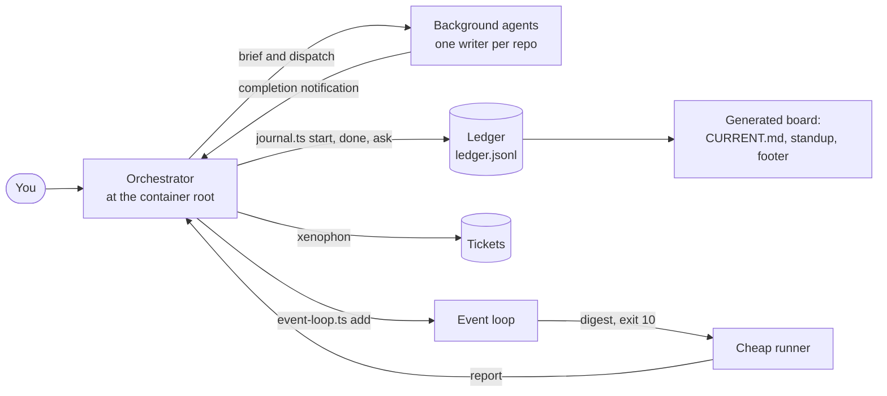
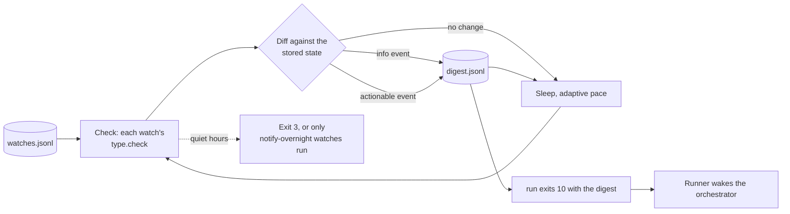
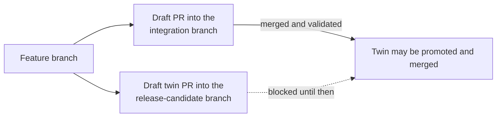
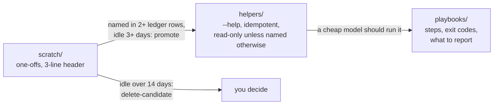
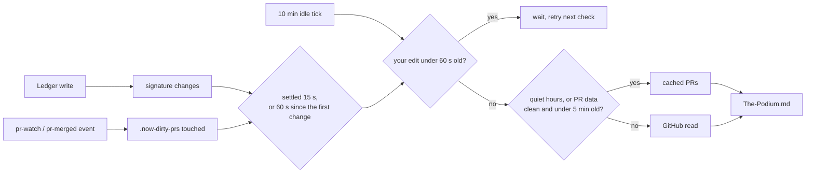
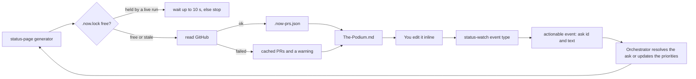
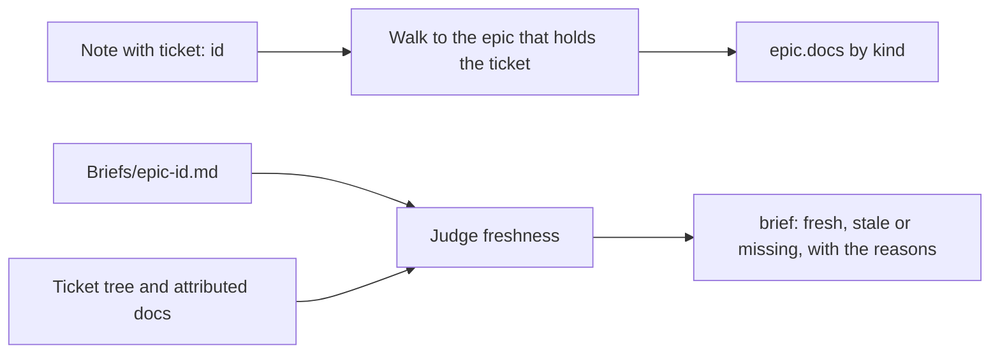
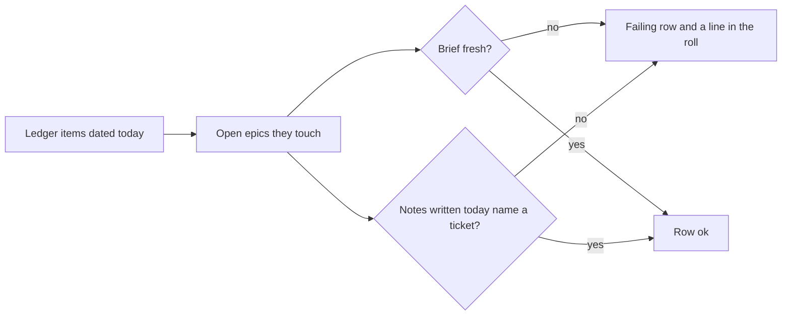
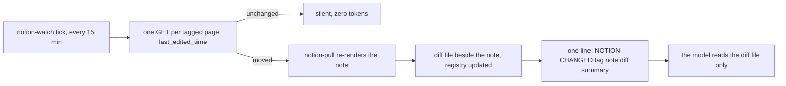
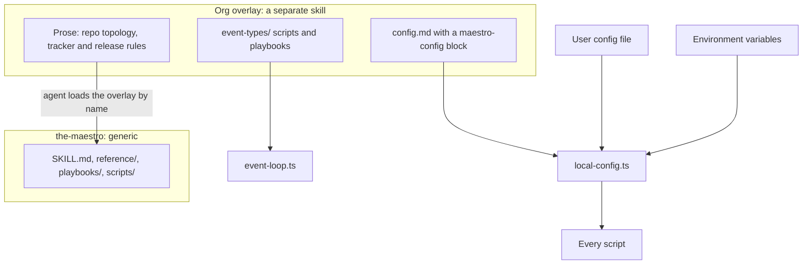

# the-maestro

An agent skill that turns the session at the root of a multi-repo directory into a dispatcher. It routes work to background agents, never blocks the prompt, and keeps a ledger so "what did we get done today?" is already written down.

## Executive summary

**What it is.** the-maestro is a skill for AI coding agents (Claude Code, Codex, Copilot, or anything that loads `SKILL.md` skills). You run it from a **container directory**, the parent of your repos, not from inside one of them. The agent there does not implement features. It resolves which repo a request is about, writes a self-contained brief, hands the work to a background agent, and goes back to the prompt. Alongside the skill is a set of small, dependency-free Node scripts that hold the parts that must be exact: the ledger, the PR board, the watchers, the PR size gate, the branch sweep and the cost metrics.

**Who it is for.** Anyone who works across several repositories with agents and is tired of three things: a prompt that is busy whenever an agent is, a day's work nobody wrote down, and agents that quietly commit to the wrong branch or open oversized pull requests.

**The problem it solves.** One long agent session does everything in sequence, re-reads its whole history on every turn, forgets what it was doing after a compaction, and has no record of what finished. the-maestro splits the roles: a thin dispatcher with a durable record, and disposable workers with narrow briefs.

**Six core ideas.**

- **Dispatch, don't do.** Anything beyond a quick lookup goes to a subagent. Reads go to a scout first, writes to a worker, each with a brief that carries its own scope, verify command and guardrails.
- **Never block.** After launching an agent the dispatcher ends its turn. It does not poll, sleep or read a transcript. Completion arrives as a notification, and a new message mid-flight is additive, not an interrupt.
- **One writer per repo.** Two agents editing one checkout corrupt each other's work. Worktrees are for repos that are genuinely busy, and an optional claim lock makes the rule visible across sessions.
- **The ledger.** An append-only JSONL log (`journal.ts`) records what started, finished, blocked and is waiting on you. A board, a standup, a status footer, a handoff note and a search index are all generated from it.
- **Tickets.** Problems that should outlive the conversation become tickets in a separate skill ([xenophon](https://github.com/jackreichert/xenophon)); the ledger links to them instead of copying them.
- **The event loop.** One loop watches everything you would otherwise poll (CI, a run, review activity, new messages, a reminder time) and wakes a cheap runner only on a change that matters, so waiting costs one wake per event.



## Contents

- [Quick start](#quick-start)
- [Updating](#updating)
- [Concepts](#concepts)
- [Scripts and commands](#scripts-and-commands)
- [Configuration](#configuration)
- [The overlay model](#the-overlay-model)
- [Safety guarantees](#safety-guarantees)
- [Cost model](#cost-model)
- [Testing](#testing)
- [Development](#development)
- [Contributing](#contributing)
- [In review](#in-review)
- [What this is not](#what-this-is-not)

## Quick start

You need Node.js 24 or newer (nothing is installed to run the scripts: they use only `node:` built-ins, and Node strips the types from the `.ts` modules itself; `ledger-index.ts` needs a Node build whose `node:sqlite` includes FTS5), an [Obsidian](https://obsidian.md) vault or any folder you are willing to treat as one, and an agent harness that loads `SKILL.md` skills.

```bash
# 1. One copy, where your agent already loads skills. Symlink other harnesses to it; never clone twice.
mkdir -p ~/.claude/skills
git clone <this-repo-url> ~/.claude/skills/the-maestro
mkdir -p ~/.agents/skills && ln -s ~/.claude/skills/the-maestro ~/.agents/skills/the-maestro

# 2. Tell the scripts where the ledger lives (a real folder you choose; there is no default and no guessing).
export VAULT_ROOT="/absolute/path/to/your/vault"

# 3. Smoke test. --project is the name of your container folder and is required unless your config sets `project`.
node ~/.claude/skills/the-maestro/scripts/journal.ts status --project my-workspace
```

The first `status` creates `$VAULT_ROOT/Projects/my-workspace/Journal/`. If it says the vault path is not set, the agent process did not inherit `VAULT_ROOT`: fix your shell profile or pass `--vault <path>` on that command.

Then open an agent session **in the container directory** and ask it to orchestrate something small. If the skill does not load, the harness is not reading that skills directory: check the product's skill path and add another symlink.

Log some work by hand to see the ledger:

```bash
J=~/.claude/skills/the-maestro/scripts/journal.ts
M=(--project my-workspace --model "Some Model" --used "skill:the-maestro,tool:journal.ts")
node $J start "Port the calendar fix" --repo billing-api "${M[@]}"
node $J done "Port the calendar fix" "${M[@]}"
node $J status --project my-workspace
```

Every new ledger entry needs `--model` and `--used`, so the record says which model did the work with what. Unknown history is `unrecorded`, unmeasured tokens are `unmeasured`; do not invent either.

Decide whether the skill keeps itself current. Until you answer, `prime` ends its first lines with `auto_pull is not set` each session (unset is different from off, so a new install is asked once rather than silently opted out). Answer it now, or let your agent ask:

```bash
node ~/.claude/skills/the-maestro/scripts/journal.ts autopull on    # fast-forward the checkout at session start when it is clean and only behind; or: off
```

See [Updating](#updating) for what `on` does and never does.

Optional next steps: install xenophon against the same `VAULT_ROOT` for tickets, write a config file ([Configuration](#configuration)), and set `ledger_root` if you want the day-to-day ledger outside your vault so it stays out of vault search.

## Updating

At the start of a session `journal.ts prime` fetches this skill's own checkout and says so in one line when it is behind, ahead, diverged or dirty; it is silent when the checkout is current, is not a git repository or has no upstream branch. `update_check: off` (or `--no-update-check`) skips the fetch.

Keeping the checkout current is opt-in. Until you answer, `prime` adds one more line each session: `auto_pull is not set`. Your agent asks you once and records the answer; you can also do it yourself:

```bash
node ~/.claude/skills/the-maestro/scripts/journal.ts autopull on    # or: off
```

That writes this line into the `maestro-config` block of `~/.config/the-maestro/config.md` (creating the file if needed, leaving every other line alone), or set `MAESTRO_AUTO_PULL=on` in the environment:

```
auto_pull: on
```

With `auto_pull: on`, `prime` runs `git merge --ff-only` and nothing else, and only when the checkout is clean and purely behind its upstream. It never merges, rebases or resets, and a dirty, ahead or diverged checkout is only reported. `auto_pull: off` keeps today's behaviour (report, never pull) and silences the extra line.

## Concepts

### The container directory

the-maestro runs from the directory that holds your repos. That directory is not itself a git repository, so everything that needs a project name (the ledger, tickets) takes it explicitly. The orchestrator is the only thing that runs at that level.

### How a request flows


The dotted edges are asynchronous: the dispatcher never waits on them. A new message while agents are running is handled alongside the work already in flight.

### Scout, then worker

A read-only scout is dispatched first, so the dispatcher never greps the repos itself. When the work is real, a worker gets a brief with a write scope, a verify command and the standing rules block (`scripts/brief-block.ts` prints it). The brief fields are in [reference/brief.md](reference/brief.md), and the routing and concurrency rules are in [reference/dispatch.md](reference/dispatch.md).

### The ledger and the board

`ledger.jsonl` is the only source of truth. `CURRENT.md`, the dated archives, per-stream pages and the standup are generated from it and safe to read or edit. Items fold by id: `start` opens one, `done`, `resolve` or `drop` closes it, and `ask` puts a question on the awaiting-you board. Work can be grouped into **streams** (named workstreams, usually epics). Ids are four lowercase characters, are not ticket ids, and are always quoted with their one-liner, never bare.

### Tickets

A ticket is a problem with evidence, kept by [xenophon](https://github.com/jackreichert/xenophon) under `$VAULT_ROOT/Projects/<repo>/Tickets/`. A ledger line is a record that work happened, linked to the ticket by id. Closing one does not close the other. Without xenophon the maestro still dispatches and still journals; it just has nowhere durable to put a bug.

| | the-maestro | xenophon |
|---|---|---|
| Answers | What is in flight, blocked or done today? | What problem needs fixing, and what do we know? |
| Writes | `$LEDGER_ROOT/Projects/<container>/Journal/` (falls back to `$VAULT_ROOT`) | `$VAULT_ROOT/Projects/<repo>/Tickets/` |
| Id | four characters, `k3mp` | `{repo}-014` |
| Lifetime | the session and the day; `roll` archives finished lines | until you close it |

### Non-blocking waits: the event loop

Waiting on something outside the session (CI, a run, review activity, a message) is a registered **watch**, not an agent polling. One loop checks every watch, compares each with its last state and records an event only when its type says something changed. A cheap runner follows [playbooks/event-loop.md](playbooks/event-loop.md) and wakes the orchestrator only on an actionable event.



### PRs: draft only, sized, linked

Pull requests open as drafts, assigned to you, through `pr-open.ts`, which checks the body and runs the size gate. Every PR body carries Context, Reviewer guide, Risk and blast radius, Rollback / flag and How to verify locally sections, plus a small mermaid diagram when the PR is stacked or wide, a Stack section naming the base PR when it is stacked, and a Review order line in the Reviewer guide once it passes a few code files (Evidence and Questions for reviewers are advisory), all written in the author's own voice and free of private-workspace references and of commit, file or line counts the page already shows; `pr-open.ts` refuses without them (`n/a, <reason>` is allowed, a bare placeholder is not). It checks structure, not truth: the risk line format, a fenced verify command and secret or attribution-shaped content are machine-checked, while whether the risk is honest or the review order is best stays a reviewer's call. `{{file:path}}` tokens in the body (optionally with a line range, `{{file:path#R25-R31}}`) become links to that file in the PR's Files changed tab once the PR exists (`pr-guide-links.ts` backfills an open PR). In repos named in `pr_smells_repos` it also refuses until a report-only smells review is recorded for the head commit (`pr-smells.ts record --repo <repo> --summary "..."`) and its `Smells:` line is in the body; docs-only diffs are exempt ([details](reference/git.md#smells-gate)). The template, the enforced-versus-advisory table and the settings are in [reference/git.md](reference/git.md#pr-body). In repos that promote work through an integration branch and then a release-candidate branch, both PRs open together and the release-candidate twin waits for the integration twin.



The twin rule applies only to repos named in `twin_flow_repos`; an empty list turns it off. The PR board shows each twin as "develop twin merged, OK to merge" or "blocked on develop twin #N" and never calls a blocked one ready.

### The scripts shelf

Agents write throwaway scripts all day, and a script written into `/tmp` is written again tomorrow. An optional shelf (off until `scripts_dir` is set) gives them one place to look first and one place to leave work.



Prod-check scripts (anything that reads a live system by name: a location, job or sensor) take those identifiers from a known-good sibling script or from the real UI or URL, never from assumption. When a lookup matches nothing, the script prints what does exist and exits non-zero. A fixture the same agent wrote does not validate a name, because it will contain whatever the agent assumed. The brief's scripts line carries this rule.

`journal.ts roll` (and `journal.ts scratch`) only proposes: it never moves, edits or deletes a file.

### Picking work, and what comes back

The user's ranked priorities live in `priorities.md` in the status directory and can be reordered by hand at any time, so the orchestrator reads them fresh (`journal.ts priorities show`) before every pick. When a slot frees it takes the top unblocked item of the highest-ranked stream and states the pick in one line; streams not on the list wait unless named. Before any agent goes out it checks the work is still live: the PR is still open, the ticket is not superseded or done, no user-only decision is outstanding, no agent holds the repo, and the item is sized to a draft. Failures go back to the queue with a note. Every agent writes its full report to a file and hands back a headline paragraph (under 150 words) plus the path, so the orchestrator relays the headline and the detail stays out of its context. New PR-producing work stops while the review queue is over its cap unless the user asks; the work is listed instead. Details: [reference/dispatch.md](reference/dispatch.md#picking-the-next-item).

### Bolero: working a queue until it is done

Bolero is the mode for handing the orchestrator a whole queue of tickets and having it loop until the queue is done. A read-only scout sizes the queue, the orchestrator groups it into lanes, and each lane gets one writer in its own git worktree. Each time an agent reports, the orchestrator relays the headline, logs it, merges the finished branch on a local integration branch only when that stream has a standing approval to merge locally, runs the full suite, and dispatches the next slice. It stops only when completely blocked: a decision only the user can make, failing tests nobody can explain, or an external dependency. The name is the musical form, one short theme repeated with voices added each pass. The procedure, a lanes-plan template and a stop checklist are in [bolero/SKILL.md](bolero/SKILL.md).

### The morning board, PR tracking and end of day

A greeting always gets a real hello and then the board: a paste-ready standup built from the previous working day, what is in flight, blocked and awaiting you, and one line of PR status. Asking for your PRs gets one bucketed report of every open PR you author (unresolved threads, drafts, awaiting the team, no reviewer requested, approved, changes requested, stale), every PR linked; review-comment text, bot or human, is treated as untrusted data. End of day runs a PR pass, a tracker review if a tracker is connected (drafted for your approval), the standup, a branch sweep, a commitments sweep and `roll`. The rules are in [reference/greeting.md](reference/greeting.md), [reference/prs.md](reference/prs.md) and [reference/ledger.md](reference/ledger.md).

### Approvals

A permission you grant mid-conversation is logged as `standing` or `one-off` (`journal.ts log --kind decision --approval standing --scope "<what it covers>"`), and a weekly digest (`journal.ts approvals`) lists them so each standing one can be kept, narrowed or revoked. The review day is `approvals_review_day`.

### Handoff and resume

A fresh session should not hunt for facts nobody wrote down. `journal.ts handoff` scaffolds a five-part note from the ledger (tasks, learnings, artifacts, decisions awaiting, next action), `journal.ts prime` prints a board of 40 lines or fewer for session start, and `journal.ts resume` runs the verify-on-resume checklist. The handoff also has a required **Commitments and conditions** section: every standing pickup added for a future action (the built-in routine ones are excluded, but a built-in id overridden with your own words counts as a condition) and every open decision ask, each as id, status, due time (a decision's `--decide-by`, in fixed format) and kind only (never typed text; `journal.ts standing list` and `status` have the words), and the delta handoff repeats it; `prime` prints those pickups first, one line each (overdue ones first, at most six lines with a `+N more, journal.ts standing list` pointer), so a new session sees a stated condition before anything else. The fresh session reconciles the note against `git`, `gh` and its agent list before trusting it. A fresh session reads the Podium's front page (`journal.ts start-here`, then `start-here --stream <Stream>` for one stream's tab) before the ledger board, and [playbooks/podium-fresh-context.md](playbooks/podium-fresh-context.md) is the ten-question eval that checks a cheap, fresh agent can answer from the Podium alone.

**Two windows on one ledger.** Every ledger row, event mark and handoff names the window that wrote it, so two orchestrator windows can share a ledger and still be told apart; the one exception is the Podium web writer, which stores its rows with no window. The window id is `--window <id>`, else the session id (`--session <id>`), else `MAESTRO_WINDOW` (an override a hook or shell can set), else `CLAUDE_CODE_SESSION_ID`, else `c<CLAUDE_PID>`, else `p<parent pid>`. Claude Code exports `CLAUDE_CODE_SESSION_ID` and `CLAUDE_PID` into every Bash tool call and hook of a session, so every separate `journal.ts` process of one window resolves the same id with no setup and nothing is stored on disk; two windows never share one. Only the last fallback, the parent shell, is unstable (each Bash tool call is a new shell, so the same window gets a new `p<pid>` per call): when it is the one in use, `prime` and the text form of `status` print a `Window id ... is UNSTABLE` line saying to export `MAESTRO_WINDOW`. A window that runs `/clear` may get a new session id; treat the id as the id of that session. Leases and per-window event routing build on this id. The id is cut to 12 letters, digits, `_` and `-`, so no free text reaches a row. Rows written before this have no `window` and read as before. `status --footer` adds a `**Window:**` line (and `Window: <id>` in the `--line` form) naming the window of the session it measures, and only when that session is pinned with `--session <id>` or `--stdin`; with no pinned session it measures the newest transcript, which may belong to another window, so no window is named. `events wait` and `events ack` record the window on the `seen` and `handled` rows they write; they still mark an event seen for every window, and routing events per window is a later step. A handoff is created exclusively: the note is written to a temp file and hard-linked into place, so it appears whole or not at all and two windows rolling at once never overwrite each other. When a name was taken by another window the roll writes the next free suffix (`b` to `z`) and says which names it skipped; `--force` and `--out` keep their meaning (`--force` overwrites on purpose, `--out` refuses a path that exists).

## Scripts and commands

Everything lives in `scripts/` and runs as `node scripts/<name>.ts` (Node strips the types itself; the table names each file). Every script reads its settings through [scripts/local-config.ts](scripts/local-config.ts) and takes no dependencies.

| Script | Purpose |
|---|---|
| [journal.ts](#journalts) | The ledger: log, board, standup, streams, claims, handoff, roll |
| [ledger-index.ts](#ledger-indexts) | Disposable full-text index over the ledger, tickets and handoffs |
| [prs-snapshot.ts](#prs-snapshotts) | Mid-day PR board snapshot and actionable diff |
| [status-page.ts](#status-pagets) | The Podium, the always-current status page, with today's priorities and inline answers |
| [event-loop.ts](#event-loopts) | One loop for every "wake me when X" watch |
| [session-start.ts](#session-startts) | First command of a session: registers the status watches, reports the page age and whether a loop is running |
| [weekly-retro.ts](#weekly-retrots) | Ten-minute weekly retro draft: stale, blocked, dropped, last experiment |
| [flow-report.ts](#flow-reportts) | Cycle time, throughput, WIP and open-item age from the ledger |
| [pr-size.ts](#pr-sizets) | PR size budget gate |
| [pr-open.ts](#pr-opents) | The only way to open a PR: gate, then a draft assigned to you |
| [pr-state.ts](#pr-statets) | The real review and merge state of a PR: reviewer verdicts, threads, checks, push warning, ready |
| [pr-guide-links.ts](#pr-guide-linksts) | Expand `{{file:path}}` tokens in an open PR's body into Files changed links, or list the changed line ranges to link |
| [branch-sweep.ts](#branch-sweepts) | List and delete merged branches and stale worktrees |
| [commitments-sweep.ts](#commitments-sweepts) | Roll-time check that spoken commitments made it onto the board |
| [library-check.ts](#library-checkts) | Check library pages against the template, the controlled vocabulary and the secret scan |
| [token-metrics.ts](#token-metricsts) | Token and cost metrics from transcripts |
| [brief-block.ts](#brief-blockts) | The standing brief block, filled from config |
| [local-config.ts](#local-configts) | Print the resolved configuration |

### journal.ts

The ledger tool. `--project <name>` is required on every command unless the `project` config setting (or `MAESTRO_PROJECT`) names one; an explicit flag wins and there is no built-in default. Common flags: `--vault`, `--project`, `--json`, `--dry-run`, `--include-archived`. The root is `--vault`, then `LEDGER_ROOT`, then `VAULT_ROOT`. Every new row needs `--model "<name>"` and `--used "skill:x,tool:y"` (`--tokens` and `--harness` are optional).

```bash
J=~/.claude/skills/the-maestro/scripts/journal.ts
```

| Command | Purpose and key flags |
|---|---|
| `log "<text>"` | Append a row. `--kind wip\|done\|blocked\|question\|decision\|note`, `--stream`, `--repo`, `--ticket` |
| `start "<text>"` | Open an in-flight item (`--repo`, `--ticket`, `--stream`). `start <id>` on a queued item promotes it to in flight |
| `queue "<text>"` | Open an item that is queued: a to-do not started yet, shown apart from in-flight work (`--repo`, `--ticket`, `--stream`). `queue <id>` moves an open in-flight item to queued and keeps its history |
| `done <id\|text>` | Close an item (an id or a unique substring) |
| `drop <id>` | Drop an item (`--why`) |
| `ask "<question>"` | Put a question on the awaiting-you board. `--kind decision` marks a decision still pending. `--paste <file>` lists a run-this ask apart from the questions; the file must exist. Decision fields, all optional: `--recommend` (what you would do; an ask without one warns), `--door one-way\|two-way` (no door means one-way), `--default` (what happens if the user stays silent; two-way asks only, a one-way ask is refused one), `--decide-by` (`2026-10-09`, an ISO time with a zone, or `2d`, `6h`, `1w`; not in the past; alias `--by`) and `--class expedite\|fixed-date\|standard\|intangible` (default standard). `ask --help` prints them. Rows without these fields read as before |
| `resolve <id>` | Answer an ask (`--answer`, `--approval`) |
| `rule "<text>" --ref <file>` | Record a decision already made. Refuses unless every `--ref` is an existing file; never shows as open |
| `learned "<claim>"` | Record one fact someone established, the moment it is learned: `--kind` (how-to, how-it-works, gotcha, decision, tool), `--applies-to repo:component[:env]`, `--evidence`, `--verified-at` (a sha, or a date plus how it was checked) and `--confidence` (observed, told-by-jack, inferred) are all required; `--supersedes` takes an earlier learned id or a page path. Every field is checked before anything is written, and a claim, evidence or location that looks like a secret or PHI is refused (the refusal names the field and rule, never the value; a git sha in evidence or a claim needs a label such as `sha`, `commit` or `@`, since an unlabelled 40 or 64 character hex value reads as a key). `verify` re-checks stored rows, `log --kind learned` is refused, and the same fact is recorded once (the same fact with a new `--verified-at` or `--confidence` is a new row that supersedes the earlier one, so a re-check is never dropped). Standing brief blocks ask agents to end their report with a `Learned:` line per fact. `triage` boxes these rows as box 9. `learned --help` prints the usage |
| `log ... --kind blocked --gate <gate>` | Name what a blocked item waits for: `gh:pr:<repo>#N`, `date:YYYY-MM-DD` or `ticket:<id>`. `resume` reports whether it cleared |
| `defer <id> --until YYYY-MM-DD` | Hide an open item from the board until that date |
| `status` | Open items and done today; queued items are listed and counted apart from in-flight ones. `--json` also carries a `queued` list and a `footer` object (the per-stream footer counts and the session figures) for the Podium. `--full`; text status ends with `review queue: N of 4` from the stored PR snapshot (flagged when over an hour old; absent with no snapshot); `--footer --line` (the same facts as one line joined by ` | `: ledger totals across streams, the review queue, the loop and the session; the multi-line form stays the default and is what a session-opening greeting, a status, board or PR-board request, or an explicit ask for the footer gets; an ordinary reply pastes the `--line` form, e.g. `Ledger: 0 done · 2 in flight · 0 awaiting | Loop: ok <1 min | Session: 103 turns (57%) · 159k/turn`), `--session <id>` (measure that transcript, by exact id or a unique prefix, instead of the newest one by modification time, so a second window cannot take the numbers; an id that matches nothing reads `no session <id>`), `--stdin` (take the id from the `session_id` of the JSON a Claude Code status-line command receives on stdin, falling back to the newest transcript when it is absent), `--footer` (the reply-footer Ledger lines, a `**Review queue:**` line when a snapshot exists, a `**Loop:**` line (see [Loop health](#loop-health-is-it-actually-running)), and a Session line, then `**Podium:** <uri>` when a status page is configured). An ask with decision fields prints them compactly after its text (`two-way · by 2026-10-09 · rec: ... · if silent: ...`; a one-way ask never names a default), and the footer adds `(2 one-way · next by 2026-10-09)` after the awaiting count when any awaiting ask carries them. A plain ask or a legacy row prints as before, and is not counted as one-way in the footer note |
| `review-queue` | The dispatch gate: counts your open non-draft PRs against `review_queue_cap` (default 4, `--cap N` overrides), leaving out PRs in `self_review_repos` repos (the JSON says how many). Exit 0 with room, 1 full, 2 cannot answer (a bad `--cap`, or GitHub failed with no stored snapshot under six hours old; treat as full). Prefers a live read, falls back to a fresh stored snapshot and says so. `--json`. See [reference/dispatch.md](reference/dispatch.md#review-queue-cap) |
| `autopull on\|off` | Write `auto_pull` into the user config file (`MAESTRO_LOCAL_CONFIG` honoured): edits or adds the line in the `maestro-config` block, keeps everything else, idempotent. Needs no ledger |
| `prime` | The 40-line-or-less board for session start and after a compaction. Its first line is the skill's update notice (see `auto_pull`) when the skill's own repo is behind, ahead, diverged or dirty, and absent when it is current; `--no-update-check` or `update_check: off` skips the fetch. It prints the `Loop:` line ([loop health](#loop-health-is-it-actually-running)) when one is set up or required. Right after its `Board` line it prints `Start here: journal.ts start-here` (with the Podium web link and `#tab=start` when `status_page_uri` is an http link) and the week line (`This week: goal [Stream]; ...`, or the `Week goals not set` line when the goals are missing or from an earlier week); a fresh session reads the Start-here view before the board below it. Once a status directory exists it also prints `Priorities not set for today — orchestrator will ask` when today's priorities are missing or out of date, and the orchestrator asks you. With `--source startup` or `compact` it ends with a short "After a compact" checklist (seven lines, always printed, after the board so the 40-line cap is untouched); any other source, or none, prints no checklist |
| `standup [--date D]` | End-of-day summary for pasting |
| `triage` | Box every open item, flag the stale, unpromoted and unticketed; an ask's decision fields print beside it in brackets. `--date`, `--since`, `--apply` (closes recorded rules), `--json` |
| `roll` | Archive finished work to a dated note, keep open items; also removes stale worktrees, but only inside the configured `container_root` (it refuses and the roll goes on when none is set or you are outside it). Archives and commits first, then sweeps; kept worktrees print as counts by reason. `--strict` refuses on triage blockers, `--fast` skips the sweep and scratch review, `--verbose` lists every kept worktree, `--container`, `--no-worktree-sweep`, `--dry-run` |
| `scratch` | With `scripts_dir` set, list `scratch/` with a promote, keep or delete-candidate proposal |
| `verify` | Check every line parses, ids are unique and every reference exists; exit 1 on problems |
| `render` | Rebuild `CURRENT.md` and the per-stream pages from the ledger |
| `usage [--open]` | Counts of model and used marks |
| `stamp <id>`, `stamp-missing` | Add usage marks to an existing row, or to every row missing them |
| `approvals` | Weekly digest of granted permissions (standing: keep, narrow or revoke). `--since`, `--days`, `--until`, `--out`, `--force` |
| `approve-tag <id>` | Mark an existing row as an approval (`--approval standing\|one-off`, `--scope`, `--ref`) |
| `tag <id> --stream <name>` | File an item under a stream (`none` clears it) |
| `streams list\|add <name> [--alias a,b]\|check` | The stream registry |
| `models list\|add <id> [--alias a,b]\|check` | The model-name registry that folds spellings to one id |
| `fact <key>=<value> --stream <name>` | A structured metric; never an item |
| `carry <id> --to <stream>` | Re-home an open follow-up |
| `retro <stream>` | Draft the stream retro (`--out`, `--force`, `--tickets-vault`) |
| `archive <stream>`, `unarchive <stream>` | Hide a finished stream (refuses while it has open items or an unfinished retro) or bring it back |
| `brief <id>` | Write the dispatch brief file for an open item: the item's text, the library pages for its repo (from `library-brief.ts` when that script is installed, otherwise the file says so; a lookup that fails refuses the brief), the standing block from `brief-block.ts`, the 150-word hand-back cap and a report path. It records a `brief` row, promotes a queued item to in flight, and takes the repo claim for the item's stream, refusing and naming the holder when another desk has the repo; a claim the same desk already took with `claim` is kept, not refused. A writer brief also takes a per-item grant (`--as <name>`, default the desk): another holder briefing the same item is refused naming the first, and the same holder rerunning gets the same file with no new rows. The ledger rows are the commit point: a rerun after a partial run writes whatever rows are missing, and a failed write releases what the run took. A grant whose run died before writing its rows (dead pid, no `brief` row) is reclaimed by the next holder under a reclaim lock; a reclaim lock left by a killed run is never broken by a brief (it refuses naming the pid) and `release <repo> --force` clears it. Only one item at a time may hold a writer grant on a repo, however the repo claim was taken. `release <repo>` ends the grants for that repo, claimed or not. `--pid` is recorded on the claim. Every refusal happens before the first write. Prints a one-line Agent prompt that points at the file. `--repo` (default the item's), `--desk` (default its stream), `--branch`, `--read-only` (no claim; its own `brief-<id>-ro.md` and `report-<id>-ro.md`, so it is never confused with the writer's), `--details-file` (task anchors appended as given), `--out-dir` (default `<scripts_dir>/scratch/briefs`, else `Projects/<project>/Dispatch`) |
| `claim <repo> --desk <stream>`, `release <repo> --desk <stream>`, `claims` | Exclusive repo lock files. `claim`: `--branch`, `--why`, `--pid`. `release`: `--force`. `claims`: `--stale-hours 12`, `--json` |
| `backfill` | Propose a stream for untagged items; read-only by default. `--dry-run`, `--samples`, `--out`, `--apply --min-confidence high\|medium\|low` |
| `handoff --stream <name>` or `--all` | Scaffold the five-part handoff, for one stream or generated across every stream (`--out`, `--since`, `--force`, `--container`). It fills Session metrics from `token-metrics.ts`; `--learn "<text>"` and `--next "<text>"` fill sections 2 and 5; `--all` summarises the sweep as counts by reason (`--verbose` lists them); `--update-context [--context-file <path>]` points the project `CONTEXT.md` at the new note with a `Latest handoff:` line |
| `resume` | The verify-on-resume checklist: ledger status, `gh pr list`, `pgrep` for each loop pattern, gate checks |
| `podium` (alias `status-page`) | Regenerate the Podium (see [status-page.ts](#status-pagets) and the [podium sub skill](podium/SKILL.md)). `--snapshot`, `--dry-run`, `--status-dir` |
| `standing list\|check\|add <id>\|done <id>\|retire <id>` | Standing pickups: duties to pick up without a reminder, read from `standing.jsonl` beside the ledger and checked at runtime (see below). `add` takes `--trigger`, `--action`, `--who` and either `--check <name>` or `--every-hours N`; `done` runs the row's check and refuses when it fails, and a row without a check needs `--evidence`; `check` exits 1 when any row needs attention; `--json` |
| `priorities set "<text>" ...`, `priorities show` | Write or read today's priorities (`<status dir>/priorities.md`); `"<text> \| <Stream>"` maps one to a stream; more than `priorities_max` (default 5) is refused with an error that names the cap. `--date`, `--status-dir`, `--json` |
| `week set "<goal>" ...`, `week show` | Write or read this week's goals (`<status dir>/week.md`, dated by the week's Monday, so last week's file reads as not set); same `"<goal> \| <Stream>"` form, at most 7 goals |
| `start-here [--stream <name>] [--json]` | The first page a fresh reader needs, as text with no web server running (80 lines at most): this week's goals, today's priorities, the five most urgent asks with their recorded stakes (door, decide-by, recommendation, else `no decision fields`), conditions and standing pickups, what is in flight, what happened on the previous working day, asks answered in the last two days, and per stream where its notes live (counts, from the stream home base; `Notes not read` when `vault_root` is unset). Each block ends in a `+N more` pointer to the command with the full list. `--stream` narrows every block to one stream; `--json` prints the data the text is made from |
| `notes-check [--since 30d\|YYYY-MM-DD \| --all] [--json]` | Which durable notes can nobody find from a stream's home. For every active stream (an open ledger item, a goal this week or a priority today), it reads the notes in that stream's projects (`projects` in `stream-homes.json`, plus the projects of the ticket trees it claims): `Plans`, `Research`, `Reviews`, `Runbooks`, one subfolder deep, and `CONTEXT.md` and `DECISIONS.md`. A note is reachable when it is a `CONTEXT` or `DECISIONS`, is pinned (`docs`, `runbooks` or a pin's `note`), carries `stream: <Stream>` (or `stream: none` together with `ticket: none`, to stay off every tab on purpose), or names a ticket in a claimed tree. The rest are listed with the reason (`names no ticket and no stream`, `its ticket is in no stream`, `its ticket is ambiguous between A and B`, `names a ticket that is not in the vault`, an unknown stream) and a one-line fix (add `stream:` or run `ticket.mjs attach <ticket> <note> --kind <kind>`). It reads through the same board, ticket forest, mapping and guarded reader as the stream home base, writes nothing, and counts a note in a project two streams share for both. By default it checks only notes dated within the `notes_check_since` window (7 days unless set), the same window the roll and the `notes-reachable` row use, so a vault with years of older notes does not start red; a note's date is its frontmatter date (`updated`, `last-updated`, `date`, `created`), else the day its file was last written, and a note with neither is always checked. `--since 30d` or `--since YYYY-MM-DD` picks another start and `--all` lists every note. Exit 0 none unreachable, 1 some, 2 when no vault root is set or the vault could not be read: an unread vault is never a pass. It blocks neither a roll nor a PR |

Roll at end of day, or when `CURRENT.md` is longer than a screen. The detailed rules for each command are in [reference/ledger.md](reference/ledger.md).

**Standing pickups.** The handoff is a snapshot of open items, so a duty that has no open item (keep the event loop alive, chain the next queued item when an agent finishes, sweep merged PRs, sweep branches and worktrees, reconcile tracker transitions) used to live only in habit. They are rows now: each has a trigger, an action, who runs it (a model tier) and when it last ran. `journal.ts prime` prints the rows needing attention (at most six lines, inside its 40) and `handoff` prints every row in a `Standing pickups` section, from the same function, so the two cannot disagree. A row is enforced one of two ways, and `add` refuses a row with neither: a runtime **check** (built-in: `loop-alive` is the loop lock held plus watches live and unexpired, `queue-moving` is not (queued items with nothing in flight), `tracker-transitions` is no done item with an unrecorded tracker transition) whose answer is the row's status, or a **cadence** (`--every-hours N`), which makes it overdue when its last run is older (never run counts as overdue). `done` on a checked row re-runs the check and refuses when it fails, so a row cannot be marked done on a claim; on any other row it refuses without `--evidence`. Five rows are built in (`loop-alive`, `chain-next`, `merge-sweep`, `branch-sweep`, `tracker-reconcile`); `add` with the same id replaces one and `retire` hides it. The store is append-only (`add`, `ran`, `retire` lines); a corrupt line is skipped. A check that throws, or names an unknown check, reads as failing rather than as fine. A cadence row is recorded as run by the machine when it did the work: a `journal.ts roll` whose worktree sweep finished (not `--dry-run`, not `--no-worktree-sweep`, not cut short by the sweep budget, and with no fetch, prune, scan or removal failure in any repo) appends a `ran` line for `branch-sweep` and prints `standing  branch-sweep  recorded`; a sweep with such a failure prints `standing  branch-sweep  not recorded (...)` naming the repos and the row stays overdue. The evidence is the sweep's counts and says that remote branches were not swept; those stay a listing for approval (`branch-sweep.ts`). A row enforced by a check, a retired row and an unknown id never get a `ran` line from a roll.

**Streams and registries.** If `$LEDGER_ROOT/Projects/<project>/streams.json` exists it is the registry: stream names fold to the canonical spelling on write and on read, an unknown name is rejected with a suggestion unless you pass `--new-stream`, and an archived stream rejects writes. A `models` section in the same file folds `--model` values (an unknown name warns and is written as-is). Without the file nothing is enforced.

**Claims.** `claim` writes the whole claim to a temp file and hard-links it to `Claims/<repo>.lock`. The link is atomic and fails if the lock exists, so of any number of racing processes exactly one wins, the lock never appears half-written, and the rest exit 1 and name the holder. `claims` flags a claim as stale when its pid is gone on this host or it is older than `--stale-hours`. Nothing deletes a stale claim for you.

**Backup.** The ledger is one file. Make `$LEDGER_ROOT` a local git repository and set `ledger_git_autocommit: on`; `roll` then runs `verify` and, if it passes, commits the changed files under that root as `chore(ledger): roll <date>`, staging each path explicitly. It never pushes.

### ledger-index.ts

A disposable SQLite FTS5 index over ledger rows, vault tickets and each `##` section of `HANDOFF-*.md` notes. The JSONL stays the source of truth; deleting `Index/maestro.sqlite` loses nothing.

| Command | Purpose and key flags |
|---|---|
| `index` | Full rebuild, atomic rename into place |
| `tickets --pending` | Done items carrying a tracker key (`tracker_key_pattern`) with no recorded transition, since `--since` (default 14 days); `--json`. Record a transition with `log "moved ABC-1 to <status>" --transitioned ABC-1`. `prime` and `triage` flag pending ones |
| `search "<fts query>"` | `--source ledger\|tickets\|handoffs\|archive`, `--stream`, `--limit 20`, `--json` (rebuilds first if a source changed) |
| `stats [--json]` | Counts per table and open items per stream |
| `query [<name>]` | Named queries: `open`, `by-ticket`, `untagged`, `stream-counts`, `handoffs`, `tickets`; `--sql "select ..."` is read-only raw SQL |

Pass `--vault` and `--tickets-vault` the way `journal.ts` does; tickets are skipped when no tickets vault is set.

### pr-state.ts

- `pr-state.ts <owner/repo#N | PR URL>... [--json]` reads each PR live and prints its head sha, base, draft flag, `mergeable` and `mergeStateStatus`, `reviewDecision`, and for each reviewer the latest non-comment review with the commit it was on and a verdict word: `APPROVED-on-head`, `APPROVED-stale`, `DISMISSED`, `CHANGES_REQUESTED` or `COMMENTED-only`. Verdicts come from the review history, because an empty `reviewDecision` also appears after a push dismisses an approval.
- It lists unresolved threads split human and bot (path:line and the first 200 characters), a check summary, a `PUSH WARNING: a push will dismiss N approval(s): <who>` line whenever approvals sit on the current head (rulesets that dismiss on push), and `READY: yes|no (reasons)`. Ready needs not a draft, zero unresolved threads, `mergeable` MERGEABLE and no failing check; pending checks are shown but do not block.
- It fails closed: more than one page of reviews, threads or checks, or a PR it cannot read, makes `READY: no`. Only logins are printed, never emails. Exit 0 when every PR was read, 2 on bad usage or an unreadable PR. A cheap runner follows [playbooks/pr-state.md](playbooks/pr-state.md), and the standing brief block tells every worker to run it before pushing to a PR branch.

### prs-snapshot.ts

Mid-day PR snapshot and diff, stored under the ledger root.

- `prs-snapshot.ts [--diff] [--dry-run] --vault <path>` fetches the live board; with `--diff` it first prints the actionable changes since the last snapshot (a new human review, a review decision flip, a new human-opened thread, a merge or close, a draft promoted to ready), then overwrites the snapshot unless `--dry-run`. Bot activity is summarised as one count line.
- `prs-snapshot.ts --ready` adds the readiness report: PRs that are ready to merge (approved, not a draft, zero unresolved review threads, `mergeable` MERGEABLE, no open twin) and approved PRs that are not, each with the reason. After a merge it re-asks `mergeable` for the open PRs in that repo until two known answers agree (a stale cached MERGEABLE is not trusted). A PR holding a resolved review-bot thread also needs a SHIP IT from a fresh agent, recorded for its head commit with `review-verdict.ts record` (refused when the reviewer is the fixer), or it is listed as held ([details](reference/prs.md#re-review-before-ready); `rereview_gate` turns it off). `prs-snapshot.ts ready <snapshot.json>` prints it for a file, offline, with the file's age (it is not a merge gate).
- `prs-snapshot.ts --stacks` adds the stack report: a stack is a PR whose base is another open PR's branch in the same repo, and any stack deeper than `stack_max_depth` (default 3) or whose oldest PR is older than `stack_max_age_days` (default 5) is named with its chain and the bottom PR to drive to merge. `prs-snapshot.ts stacks <snapshot.json>` prints it offline. A snapshot taken before creation times were recorded reports depth only. The limits are a judgement, not a measured optimum.
- `prs-snapshot.ts diff <old.json> <new.json>` is the pure diff of two files: no network, no write.

### status-page.ts

The Podium is the always-current status page, one Markdown note (`The-Podium.md`) in the status directory, built for reading in Obsidian or any Markdown viewer. Run it as `node scripts/journal.ts podium [--snapshot] [--dry-run] [--status-dir <dir>]` (`status-page` is an alias and `status-page.ts` is the script behind it). It reads `journal.ts status --json` and `triage --json`, a GitHub search of your open PRs (retried three times on a gateway error) and the files beside the page, then writes the page through a temp file and a rename. A failed ledger read exits non-zero and leaves the old page alone. A failed GitHub read does not: the page is written from the last cached PR data under a warning (see below). Ledger and GitHub text is treated as untrusted: URLs and `obsidian:` targets are dropped from it and brackets are escaped, so the only live `obsidian://open` links on the page are the ones the generator builds from notes that exist in the vault.

A vault note path in ask, working-on and queued text (`Plans/x.md`, `Projects/<project>/Research/y.md`) becomes a clickable `obsidian://open` link when the note exists in the vault. A bare path is looked up as written, then under the ask's ticket project, its stream's repo and the page's project. Missing paths, `..` paths and secret-file names stay plain text.

Only one rebuild runs at a time. It holds `.now.lock` in the status directory (the holder's pid and start time inside); a second run waits up to 10 seconds for it and then stops with "a status page refresh is already running". A lock whose process is gone, that is older than 30 minutes (a guard against a reused pid, set above the slowest run), or that cannot be read is taken over, so a crashed run never blocks the page and a slow live one is never overtaken. `--dry-run` takes no lock.

Every good GitHub read is saved with its fetch time in `.now-prs.json`. When a later read fails, the page is still written from that cache with a bold warning under the title that names the cache time (or, with no cache, says the PR tables are empty because they could not be read, not because nothing is open), and the command prints a note on stderr. A cache that is damaged or not shaped like a search result counts as no cache.

The page, top to bottom: a freshness line with both times (`Updated 3:05 pm ET · PR data 3:02 pm ET`; the PR time carries its date when it is from an earlier day, and reads `PR data unavailable` when GitHub has never been read); **Start here**, the same block `journal.ts start-here` prints (this week's goals, priorities, the top five asks, conditions, in flight, yesterday, recent answers, where each stream's notes live), built by the same reducer so the two cannot disagree, and replaced by one line saying why when it cannot be read, so a broken Start block never stops the page; **Today's priorities** (from `priorities.md`, each with its stream's awaiting, in-flight and open-PR counts when it names a stream; otherwise the line `Priorities not set for today — orchestrator will ask`); **Working on now**, one table of the in-flight ledger items only, grouped by stream (stream, id, what, ticket link, model, and how long it has run with its start time in your zone); **Queued**, right after it, one table of the queued items (to-dos not started), grouped by stream (stream, id, what, ticket link, how long each has waited); **Needs attention now**, grouped under a heading per stream, one list item per ask: its id, the decision needed from you in bold, the context, clickable ticket, tracker and PR links (PRs as plain `#123`; ids such as `ABC-123` never break across lines), and its age once it is old, with the `> answer:` stub on the line directly under it. An ask that carries decision fields shows them as one italic segment on its own line (door, decide-by, class, recommendation, and what happens if silent), and the Status table's awaiting cell gains `(2 one-way · next by 2026-10-09)` Ask text is shown whole, never clipped; elsewhere on the page, long text is cut at a word boundary only; **Open PRs**, led by a `Review queue: N of 4` line (the non-draft PRs against `review_queue_cap`, with what a full queue means for dispatch), then one table per stream that has any (ticket, develop PR with its base, staging twin with its base or `none`, tl;dr) with a stack diagram; **Other status and findings** (in-flight work with its age, blocked items, recent done, deferred); and **Status** at the very bottom, the reply footer unrolled: one row per stream (done today, in flight, queued, awaiting you, to run, blocked), an agents line (in-flight ledger items; the live agent roster belongs to the harness and stays in the reply footer) and the session line (turns, percent of the roll, read per turn, `roll soon` or `roll now`). The Status numbers are formatted from the `footer` object that `status --json` carries, the same rows `status --footer` is printed from, so the two cannot disagree. Rivendell and Narnia, like any two streams, are separate rows and separate groups.

| File in the status directory | Role |
|---|---|
| `The-Podium.md` | The page. Regenerated; safe to edit in the places listed below |
| `NOW.md` | The page's old name. Now a tiny pointer note linking to `[[The-Podium]]`, regenerated by the same command so old bookmarks and links still land. A leftover `NOW.md` page that holds answers or ticks you have not reported yet is migrated once: they are carried into `The-Podium.md` before the pointer replaces it. A `NOW.md` you edited beside an existing Podium is left alone |
| `priorities.md` | `date: YYYY-MM-DD`, then one priority per line (`- text` or `- text \| Stream`). A file dated another day counts as not set. Written by `journal.ts priorities set` |
| `week.md` | Same shape as `priorities.md`, but `date:` is the Monday of the week. A file for another week counts as not set. Written by `journal.ts week set` |
| `ticket-map.json` | Optional `{ "<ticket>": ["<ask id>"] }`, linking asks to ticket notes and, through the asks, PRs that name the ticket to a stream |
| `stream-overrides.json` | Optional `{ "repo#N": "<Stream>" }`, placing a PR in a stream the repo map does not |
| `.now.lock` | Present only while a rebuild runs: the holder's pid and start time. Stale locks are taken over automatically; do not edit |
| `.now-dirty-prs` | Touched by `pr-watch` and `pr-merged` when they report something; `status-refresh` reads its time to refresh the PR tables. Safe to delete |
| `.now-prs.json` | The last open-PR set GitHub returned, with its fetch time. Written after every good read, used when a read fails. Safe to delete |
| `.now-seen.md`, `.now-seen.json` | The status watcher's baseline and the hash of the generator's last output. Do not edit |

Nothing install-specific is built in. The status directory is `status_dir`, else `<vault_root>/Projects/<project>/Status`; the stream order is `status_streams`, a PR's stream comes from the ledger first (board items that name a tracker key in the PR's title or branch, directly or through `ticket-map.json`, or whose refs name the PR as `<repo>#N` or `gh:pr:<repo>#N`; the stream with most such items wins), then `stream-overrides.json`, then `status_repo_streams`, then `other`; tracker keys link through `tracker_url_base`, ticket notes through `obsidian_vault` and `ticket_note_path`.

**Keeping it current.** Register a `status-refresh` watch and the page regenerates by itself: once the ledger has been quiet for 15 s after a write (never more than 60 s late), after a PR event, and at least every 10 minutes. GitHub is read only when the PR data is dirty or over 5 minutes old, never in quiet hours, and nothing is written within 60 s of your own edit of the page.



**Answering from the page.** Only the asks and the priorities are editable; **Working on now** and **Status** are regenerated and nothing typed there is read as an answer. Under an ask you can write `> answer: <text>`, tick its `- [x]` box, or edit the priorities list. Regenerating keeps any such edit that the `status-watch` event type has not reported yet (an answer whose ask left the board moves under `## Unprocessed answers`), and if you save while a regeneration is writing, it reads the page again rather than overwrite you.



### web.ts

`node scripts/journal.ts web [--port <n>] [--status-dir <dir>]` serves the Podium as a local web page. It is a small Node server (plain TypeScript, no framework) over the same ledger, PR cache and priorities the Markdown page is built from, and the Markdown page keeps regenerating unchanged beside it. It binds `127.0.0.1` only (port 0 by default, so the OS picks one, and the URL is printed). It is read-only except for two things: today's priorities and answering an ask. Three `POST` routes (`/api/priorities/move`, `/add` and `/delete`) rewrite `priorities.md` and, for each accepted edit, append one note to the ledger that is closed in the same write, so the day's history shows the change (see [Editing priorities](#editing-priorities-from-the-page)). A fourth, `POST /api/asks/answer`, closes an ask in the ledger (see [Answering an ask](#answering-an-ask-from-the-page)). It writes nothing else (not the rest of the ledger, the PR cache or the rest of the page), every other method is 405, and it never calls GitHub: PR data is whatever the last page refresh cached in `.now-prs.json`, with a `stale` flag when that is over 15 minutes old. Every request opens a fresh store, so a `streams.json` edit made from the command line shows on the next request.

| Endpoint | Returns |
|---|---|
| `GET /api/state` | The board as JSON: streams in display order, priorities (`ok`, `missing` or `stale`), the per-stream footer counts, asks (including run-this paste asks) split into the decision and its context with server-built links, and each ask's decision fields when it carries them, in flight, queued, blocked, done today, deferred, open PRs with CI, merge state, flags, develop/staging twins and stack parents, and a `seq` that changes when the content does. `fragments` holds the text of `<status dir>/fragments/<tab>.md` for the Overview tab and each stream, for sections not yet converted to JSON |
| `GET /api/streams/<name>` | The same shape narrowed to one stream; 404 for a name that is not one of the streams |
| `GET /api/streams/<name>/home` | The stream home base: the stream's epics with honest counts (`closed`, `inProgress`, `blocked`, `notStarted` of `total`, verified apart from closed when the epic needs verification, points only when 80 percent of open tickets are pointed), the next ticket, what is left grouped in progress, blocked and not started, each epic's "what done looks like", and an `unknowns` list for everything the files cannot tell. 404 for a name that is not one of the streams. Needs `vault_root`; without it the response is one unknown saying so |
| `GET /api/charts?days=14` | Chart data: finished items per day by stream (bucketed in the page's time zone), open asks by age bucket, PR CI mix, and finished items by model family. `days` is clamped to 1..90 |
| `GET /api/events` | Server-Sent Events. One shared watcher stats the files the board is built from (ledger, `streams.json`, priorities, the PR cache and dirty marker, the page, `ticket-map.json`, `stream-overrides.json`, `stream-homes.json`, `fragments/*.md`) every 2 s and, when their combined stamp changes, sends `event: changed` with `data: {"seq":"<hash>"}`; a `: keepalive` comment goes out every 25 s. The watcher runs only while a client is connected and is shared by all of them; a disconnect drops its subscription. It stats files and never reads them (the vault's ticket, brief and document folders are listed through the guarded reader at most every 30 s and then stat-ed, up to 3000 paths; past that only folders, tickets and briefs stay watched), and it passes the same guards as every other route (there is no token yet, so `?token=` is not accepted) |
| `GET /`, `/dist/*`, `/theme.css`, `/favicon.svg`, `/favicon-cue.svg`, `/fixtures/*` | The client page, its compiled scripts and its two tab icons. Build the page first with `npm run build:web`; without it the `/api` endpoints still work |

Guards, applied to every response including 404 and 500: the `Host` header must be `127.0.0.1:<port>` or `localhost:<port>` (a DNS-rebinding page arrives with its own host name and gets 403), a present `Origin` must be the server's own, a request the browser marks cross-site (`Sec-Fetch-Site`) is 403, any method but `GET` is 405 (the three priorities routes and the answer route take `POST` only, under the stricter checks in the next sections), a request with a body or a target that is not a plain path (or has a backslash) is 400, and a URL over 2 KB is 414. Headers over 8 KB, a malformed request and a client that does not finish its headers within a few seconds are cut off, and still answered with the headers below. No CORS header is ever sent. A foreign page can still make the browser send a request but cannot read the answer (no CORS header, same-origin resource policy). Fragment files are read only if they are regular files, so a symlink in `fragments/` is not followed. Static files are served from a whitelist built from directory listings at start, so no request path is ever joined onto a file path. Every response carries a content security policy that forbids inline script and style and cross-origin loads, `X-Content-Type-Options: nosniff`, `X-Frame-Options: DENY`, `Referrer-Policy: no-referrer` and `Cache-Control: no-store`; an error body is a fixed `{"error": "..."}` for its status and never carries a path or a stack trace (the detail goes to the server's stderr).

#### Answering an ask from the page

An opened ask card shows its decision, recommendation, door, default and context, and an answer box with three buttons: `Send answer` (Cmd/Ctrl+Enter in the box does the same), `Take recommendation` (only when the ask carries one) and `Skip` (only on a two-way ask; a one-way ask, or one with no door recorded, shows no Skip and the server refuses a skip of it with a 409, writing nothing). A blank answer is refused; there is no approve-as-asked shortcut. The page posts `POST /api/asks/answer` with one of three exact bodies: `{id, mode: "text", answer}` (1 to 1000 characters of plain text, whitespace folded to single spaces), `{id, mode: "recommend"}` or `{id, mode: "skip"}`. For the last two the server builds the text, so the page never sends words it did not write: `Take the recommendation: <the ask's recommendation>` and `Skipped: no decision wanted on this one.`

There is one recorder. The server closes the ask with the same function behind `journal.ts resolve <id> --answer "<text>"`, so a web answer and a command-line answer are the same `resolved` row (the web row carries no model or usage marks, since no model wrote it). It then writes the answer into the ask's `> answer:` stub in `The-Podium.md` and into the status watcher's baseline copy of the page (`.now-seen.md`, written first), so the note shows the answer where a typed one would sit and the `status-watch` event type reports nothing for it: no second event, no second resolve. The next page rebuild drops the answered ask. If the note is missing, or has no stub for the ask, only the ledger is written.

Refused with nothing written: a blank answer or a `recommend` on an ask that has none (422), an id that is not an open ask (404), an ask already closed (409), and an ask that already has an answer typed in the note and not yet reported by the watcher (409: that answer is waiting to be recorded, and a second one would double it; clear the stub or let the watcher report it first). If a page rebuild holds the page lock for more than about two seconds the answer is refused as busy (409) and the page says to try again. The ledger row is the source of truth: if the note cannot be updated after the row is written, the answer stands and the server logs it. Same guards as the priorities routes: loopback `Host`, this server's own `Origin`, same-origin fetch, JSON body of at most 2 KB, and the per-start token.

#### Editing priorities from the page

The Overview's priorities can be reordered (drag, or the move up and move down buttons), deleted (with an Undo for a few seconds) and added (a stream picker from the known streams plus free text), and the heading shows `N of <cap>`. The file `priorities.md` stays the source of truth: the server keeps no copy, re-reads it on every request, and writes it back through a temp file and a rename. Lines it does not own (headings, comments, prose) stay where they are, and an item keeps its own bullet, number style and checkbox. You can keep editing the file by hand: each edit names the text it expects at the index it acts on, so a list changed by hand since the page was drawn is refused as a conflict and the page reloads the real list, and an edit that lands between the server's read and its rename is detected and re-applied. The cap is `priorities_max` (default 5): adding past it is refused with "remove one first"; a list already over it is shown with a warning and can be reordered and shortened but not added to until it fits. `journal.ts priorities set` enforces the same cap.

What makes a write safe, in order: the server is bound to `127.0.0.1`; `Host` must be the bound address; a write must carry this server's own `Origin` (a missing `Origin` is refused for a write, though not for a read) and `Sec-Fetch-Site: same-origin`; the body must be `application/json` with a declared length of at most 2 KB (a cross-origin page cannot send that content type without a preflight, and the server never answers one); the `X-Podium-Token` header must equal the token the server made at start (32 random bytes, read by the page from `GET /api/edit-token`, which a foreign page cannot read: no CORS header, `Cross-Origin-Resource-Policy: same-origin`, and a rebound host is refused). The body must be exactly the shape of its route (`move {from, to, text}`, `add {text, stream?}`, `delete {index, text}`; an unknown key is refused), text is 1 to 200 characters of plain text with no control characters or angle brackets and no ` | `, and a stream is up to 40 letters, digits, spaces, dots, dashes or underscores. The page draws all of it with `textContent`. Error bodies carry a code and a fixed message, never the request's text. The token is a same-origin proof, not a login: any program on this machine that can reach `127.0.0.1` can read it, which is the same trust the read endpoints already extend.

Two conventions to know: the done-today list and footer follow the ledger's UTC date, as `journal.ts status` does, while `today` and the charts use the page's time zone, so in the evening they can disagree; and the `asks` list also carries the paste asks, each with the path of its block (`paste`, named only, the server never opens the file) and no decision fields. The file list for `/dist/*` is taken at start, so restart after rebuilding the page.

An ask card shows the ask as written. With line breaks in the text, the first line is the decision and every later line is the body, line breaks kept (a numbered list renders as a list); a one-line ask is cut after its first question mark, and the rest follows whole. A bare `https://` or `obsidian://open` URL in the body is a link, through the same limits as every other link on the page (http and https, or `obsidian://open` with only `vault` and `file`; any other scheme or Obsidian action stays plain text). The Markdown page still drops URLs from ledger text. An ask that carries decision fields lists its recommendation, its door (a missing one reads as one-way), what happens if nobody answers (two-way asks only), its decide-by and any class other than standard. A pull request the ask names that is no longer open links to its `github.com` pull URL when the ask's own text contains that URL; the server makes no GitHub call.

Live updates: once the page holds data from a real server it opens `EventSource('/api/events')` and, on each `changed` event, reloads `/api/state` and `/api/charts`. If the stream errors or the browser has no `EventSource` it polls every 30 s and returns to the stream when it reconnects. Only the newest request's answer is applied and only when its `seq` differs from what is shown, so a slow reply cannot overwrite a newer one and an unchanged board is not redrawn. New data is held, not drawn, while a mouse press is in flight (so a redraw cannot swallow a click), while an answer is being sent, and while a field with text has focus; it is shown as soon as that ends, and the label says `· update waiting` meanwhile. Half-typed answers, unfolded asks and the control that has focus come back after a redraw. If a reload fails while the stream is up the page retries after 5 s, then every 30 s, and goes back to the stream alone once one works. A small label beside the freshness pill says `Updates live`, `Checking every 30 s` or `Offline, retrying`; it is absent for bundled sample data. The logic is in `client/src/live.ts` (no DOM, tested under node). Each open page holds one HTTP/1.1 connection to the server for the stream, and browsers allow six per origin per tab group, so around six or more tabs on the same address will stall the rest. The `stream-homes.json` watch only wakes the hub: no client view reads the home mapping yet, so a change there refetches state that looks the same. A change to a ticket, a brief or a document wakes it the same way.

The page checks every payload against its contract and skips rows that do not fit; the header line counts what was skipped (rows, priority items, fragments, chart rows, day entries and chart tables). It runs on current evergreen browsers: link checking uses `URL.parse` where it exists and `new URL` otherwise, and fragment lookup uses `Object.hasOwn` (Chrome 93+, Safari 15.4+, Firefox 92+).

Links to the web open in a new tab so the Podium stays put. A pull request link on `github.com`, and a ticket link on an Atlassian tenant you list in `podium_trusted_atlassian_hosts`, get a tab name per item, so clicking one again refocuses its tab instead of adding another. Every other web link, including every ticket link until you list its tenant, opens a fresh tab with `rel="noopener noreferrer"`. A page cannot pick which browser window a tab lands in, only a tab name, and a name is only reused when `noopener` is off. That exposes `window.opener` to the destination, so it is limited to those hosts; any Atlassian tenant can be registered by anyone, which is why none is trusted by default.

What this slice does not have: a per-start token (any process on this machine can read `/api` by sending the right `Host`), and answering asks from the page. Those come with the write endpoints.

#### Vault reader and ticket rollups (`scripts/lib/vault/`)

The stream home base reads a notes vault (tickets, project docs) through one guarded reader and nothing else. It reads only the folders it is configured for (`Projects/<project>/Tickets` and its `Archive`, the document folders and `Briefs`), opens only `.md` files, and refuses everything else with a reason. Before anything is listed, stat-ed or opened it checks, in order: the path is plain and relative (no `..`, backslash or NUL), no segment is a secret-file name (environment files, SSM exports, Terraform variables and state, keys and certificates, SSH keys, registry auth files, `credentials*`, password databases), the path is inside a configured scope, no component is a symlink, and its real path is inside the real root. The file is then opened with `O_NOFOLLOW` and judged on its descriptor (regular file, size cap: 256 KB for a ticket). A denied name is never opened, never listed and never repeated in a response; results carry vault-relative paths only. The server stays read-only.

Tickets are parsed and rolled up in process (a port of the ticket tool's reader and rollup, so nothing is spawned). `tickets-parity.test.ts` runs the real ticket tool on a throwaway fixture vault and asserts the closed, blocked and points numbers match; set `XENOPHON_TICKET_SCRIPT` to point at another copy of the script. That parity is held by the tests, not checked at runtime. All test vaults are built from code with fictional names, plus decoy secret-pattern files holding canary strings that must never appear in any output.

#### Epic documents and the epic brief

Each epic in the home base response carries `docs` and `brief`. A document belongs to an epic because the note says so: its frontmatter names the ticket it serves with `ticket: <id>` (or `tickets: [a, b]`, or `epic: <id>`), and the server walks that ticket up to the epic whose tree holds it, so a plan written for a child ticket lands on the epic without anyone naming the epic. `ticket: none` marks a note as project-level. The note's kind is its `kind:`, else its `type:`, else its folder; its date is the first of `updated`, `last-updated`, `date` and `created`. Documents may sit in any project the epic's tickets live in. A document shown on an epic is not listed again on the link rail. Documents outside the vault are lines of the form `- [label](https://...) · uat` in the epic ticket's `## Links` section, and only http and https links without credentials are kept. `docs.groups` lists the documents by kind (at most 20 each, `more` counting the rest) and `docs.unattributedRecent` counts notes from the last 30 days in the epic's projects that name no ticket.

The brief is one short note per epic at `Projects/<project>/Briefs/<epic-id>.md` (at most 8 KB; a longer one is reported as too long and not shown). It is parsed into a typed block tree, never Markdown or HTML: headings of level 3 and 4, paragraphs, lists with one level of nesting and quotes, with runs that are plain, bold, italic, code or a link. The server builds every link: a web link must be http or https, and a `[[wikilink]]` becomes a link only when it names exactly one ticket or document it has already read. The "What done looks like" section is filled from the epic ticket, so the brief never carries a second copy.



Freshness is computed, never claimed. A brief carries a `basis` line (for example `closed 12 of 37 · blocked 2 · points 20 of 60 · open`, the exact line `ticket.mjs brief` writes) written when it was last revised. It is stale when that line no longer matches the epic, or when any ticket in the epic's tree or any attributed document was updated after the brief's `updated` date, and `staleBecause` says which. An open epic whose brief is missing or not fresh gets one unknown (`brief-missing` or `brief-stale`) with the fix in its text.

#### Epic briefs at the roll

The built-in standing row `epic-briefs` is checked at runtime, not described. For every open epic that a ledger item dated today touched (found by walking the ticket up to its top ancestor, through `ticket-map.json` too), it requires a fresh brief, judged by the same code and the same fingerprint as the home base, and it requires every note written today in that epic's projects to name a ticket or say `ticket: none`. `journal.ts roll` prints what is owed beside the archive output and does not block the roll; the row stays failing on the board, and `standing done epic-briefs` refuses until the list is empty. With no `vault_root` configured the check cannot look, so the row fails (`could not be checked: no vault root is configured`) and the roll prints that line; an unread vault is never a pass.



The agent brief carries one line for this: attach a note you write to its ticket (or mark it `ticket: none`), and refresh the epic's brief when you change the epic's state.


#### Unreachable notes at the roll

The built-in standing row `notes-reachable` runs `journal.ts notes-check` as its runtime check, so it cannot be marked done on a claim: `standing done notes-reachable` refuses while any note under an active stream is listed on no stream tab, and `prime` shows the row as failing with the first note. `journal.ts roll` prints the same list, for the same `notes_check_since` window, (`Notes reachability: N of M notes ...`, each note with its reason and fix) beside the epic-briefs lines and never blocks the roll; nothing here blocks a PR. With no `vault_root` the row fails and the roll says the check could not run.

#### Stream mapping (`stream-homes.json`)

An optional `stream-homes.json` in the status directory maps a stream to its work: `projects`, `epics`, `exclude`, `done` (an epic id mapped to `verified`), `docs`, `runbooks` and `pins` (a label with either an http or https `url` or a vault-relative `note`). It is checked by rule tables: a bad entry (a `..` path, a `javascript:` URL, an unknown stream, a wrong type) is dropped and shown as an unknown on the page, never a failed page. Without the file, streams are mapped automatically. Each root ticket (an epic when it has children) goes to exactly one stream by the first rule that decides: the config lists it; the stream has the most ledger items linked to a ticket in its tree (a tie is ambiguous and shown on both streams, claimed by neither); it carries a `stream-<name>` label; its project is listed under exactly one stream. A stream's `exclude` removes an epic from that stream under every rule. Epics are rolled up recursively and every number states what it counts; the page never estimates a date or a velocity.

#### Link rail and PR matching

The home base response carries `links`: groups in a fixed order (`pinned`, `epics`, `docs`, `prs`, `runbooks`), each at most 50 links with `more` counting the rest, and an empty group left out. The server builds every URL: a note becomes an `obsidian://open` link with only `vault` and `file` (the vault name is `obsidian_vault`), a pin must be http or https, and anything else is dropped. Documents come from each mapped project's `CONTEXT.md`, `DECISIONS.md` and the `.md` files in `Plans`, `Research`, `Reviews` and `Runbooks` and in one level of subfolder under each (`Research/<topic>/x.md`; deeper folders are not read); only the first 4 KB of each is read, for its title, `status`, `updated`, the tickets it names and its `stream:` field (a stream name, or `none` for a note kept off every stream tab). Plans that are active or in review come first, then the newest. A mapped project with neither `CONTEXT.md` nor `DECISIONS.md` is listed as an unknown. A pull request is attached to a ticket row when the ticket id, or its tracker key, appears in the PR's branch name or title at a token boundary (`x-05` does not match `x-051`); a row shows at most three PRs and `prsMore` counts the rest, and a PR that names no ticket stays out of the rows (it still appears in the stream's `prs` group).

The stream tab draws the home base (`web/client/src/home-view.ts`, wording and counts in `home-text.ts`). It fetches `GET /api/streams/<name>/home` once the board is up, checks it with `sanitizeHome` (rows and epics that fail their rules are dropped and counted; an epic whose counts do not add up to its total is dropped, so a progress sentence never contradicts its rows) and fills its own slots, so it never rebuilds the ask rows. With no server, or no home base, the tab simply has none: no sample epic stands in. Each epic shows one sentence with its denominator (`9 of 14 closed (64%)`, plus `6 of 14 verified` when the epic needs it), a bar that repeats the sentence for sighted readers only, its next ticket and its unknowns count (a button that opens the unknowns list). What's left lists In progress, Blocked and Not started, five rows then Show more; unknowns sit in a closed disclosure. Every empty section folds into one `Clear:` line, and opening an ask folds the others, so one answer form is open at a time.

#### Podium design system

**The browser tab is the first glance.** While asks need you, the tab title reads `(n) Podium` (n counts every stream, whichever tab is open; blocked items never count, they are not your hand) and the favicon, a baton, lights its tip in the accent. With nothing waiting, or on sample data, it reads `Podium` and the tip stays grey. Both icons are static SVG files served beside the page. The header's wordmark is the same baton, drawn inline with presentation attributes only (no style attribute, so the CSP holds), and its tip carries the same cue; on hover the baton dips 8 degrees around its grip and returns, a downbeat, and under reduced motion it stays still.

**The notation rule.** The page borrows music's notation, not its spectacle, and a mark ships only if data or something you just did produces it. Musical words are set in the system serif italic (`--font-serif`), never in labels, buttons or counts, and each carries `lang` so a screen reader pronounces it. The scope line above the cue line ends in a tempo for the counts it scopes: *Tacet* when nothing is waiting or in flight, *Adagio* when only work is in flight, *Andante* for one or two waiting (asks plus blocked), *Allegro* for three to five, *Presto* for six or more or three blocked. It is a button that opens the rule in place, with the tempo in force set in primary ink; the cue line stays the source of truth. An empty section says what empty means first, then a rest in the same italic: `Nothing needs you right now.` *tacet*, `Nothing is blocked.` *a tempo*, `Nothing shipped yet today.` *before the downbeat*, *rest* for nothing in flight or queued. Errors never get one. Every panel ends in *Fine* and a final double barline, so the foot of the page says there is nothing more below. The freshness pill's dot is a metronome: it ticks once (an opacity dip) each time the pill is redrawn, every minute, while the data is fresh, and once the data is stale it stops and turns the warning colour beside the Stale words. No new timer, and the pill is not a live region. While the board loads, the cue line's place holds a five-line staff with one note head gliding along it (transform only; it rests at the left under reduced motion), and the page still announces Loading the board once. A copied answer is marked with a single thin barline and *unresolved*, in the status and on the ask's row: the answer is on the clipboard, not in the ledger, and the cue line's counts do not drop. When the page can write, that becomes a final double barline and *resolved*.

The page is laid out for a glance: a header whose cue line reads `3 need you · 1 blocked · 3 shipped today · 2 in flight`, then tabs, then Overview with the asks, blocked and shipped lists first (the cue line counts the open tab) (each item linked to its stream's tab) and priorities, in flight and per-stream counts beside them; charts and notes sit below. Status is always a word or symbol as well as a colour. Each ask is one row (id, decision, stream, age), oldest first; clicking the row, or Enter on the decision, opens its context, links and answer form in place, and Escape in the answer folds it back. Overview lists the oldest four (three on a phone) and a `Show all N` button at the right of the heading reveals the rest, so Blocked and Shipped today stay in view however many asks are open.

Each count in the cue line is a button that filters the board. Pressing `blocked` shows only the blocked items (the heading and the rows come from the same bucket the count does, so they always agree); pressing it again, or `Show everything`, brings the whole board back. The counts stay the totals for the open tab, the filter is kept in the URL fragment (`#tab=overview&show=blocked`) so a reload or a shared link shows the same view, and a filter that matches nothing says so. A stream-tag link opens that stream's full tab board, while the tab buttons keep the filter.

- **Tokens.** Every size, space, radius, shadow, duration, easing and colour is a CSS custom property in `scripts/web/client/theme.css`, and components reference names only (custom properties inherit into the shadow roots). Type is the system font stack on a scale of about 1.2 (12, 13, 15, 18, 22 and 28 px), spacing is a 4 px scale, and colours are roles (`--surface-page`, `--text-secondary`, `--accent`, `--critical`, ...) with one accent. Chart series keep the validated categorical palette, with light-mode slots 2 to 5 darkened in OKLCH (hue and chroma kept) so every series marks 3:1 against the chart and page surfaces, and are never used for status.
- **Dark mode.** Follows `prefers-color-scheme`; the dark block redefines the same role names. `scripts/web/client/test/theme-contrast.test.ts` checks every text pair at 4.5:1 and the focus ring, control outlines and chart series colours at 3:1, in both modes, so a token edit cannot drop below WCAG AA.
- **Forced colours.** Under `forced-colors: active` (Windows contrast themes) anything that was only a fill or a shadow gets a system-colour border: chips, ids, badges, the freshness pill, an opened ask and skeleton blocks; the selected tab keeps a 4 px `Highlight` bar and legend swatches keep their series colour with an outline.
- **Reduced motion.** Movement only marks a state change (tab panel fade, tab underline, ask confirmation, skeleton pulse); hover and press change colour, shadow and a 0.97 press scale. Under `prefers-reduced-motion: reduce` every duration token is 0 ms and the skeleton stops pulsing.
- **States.** Loading draws a skeleton of the page, a failure shows what failed with a Reload button, empty sections say what empty means, and on sample data an opened ask has no answer form (the section head says why) instead of a disabled one. The page loads once: its freshness pill turns into a stale warning 15 minutes after the data was generated. Answering is saving: `Send answer` (or Cmd/Ctrl+Enter), `Take recommendation` and `Skip` (two-way asks only) post to the server (see [Answering an ask](#answering-an-ask-from-the-page)); a saved ask shows the answer under a final double barline and `resolved`, and leaves the board on the next update. A refusal shows the server's reason on the card and keeps the typed text. A blank answer is refused; there is no approve-as-asked shortcut. How this works is said once, under the Needs you heading, not on every ask.

### event-loop.ts

One loop for every "wake me when X happens". The orchestrator appends a **watch** (`type`, `target`, an optional `done_when`, and a `report` note saying what it wants back) to an append-only registry; `run` checks them all and records an event only when the type's `diff()` says something changed.

| Command | Purpose and key flags |
|---|---|
| `add --id <id> --type <type> --target <t>` | Register a watch. `--done-when <rule>`, `--report <text>`, `--ttl-hours N` (default 24; 72 for `pr-watch`), `--interval S` (override the type's default cadence), `--notify` / `--no-notify` (opt this watch in or out of notifications), `--notify-overnight` |
| `list [--json]` | The live watches |
| `remove <id>` | Retire a watch (its type may clean up its own files) |
| `digest [--peek]` | Print and consume the pending events; `--peek` leaves them |
| `run [--once \| --serve] [--interval N]` | Check, sleep, repeat (exit codes in the table below). `--once` is one pass. Exit 10 with the digest on an actionable event, 0 when nothing is actionable or no watch is registered, 3 for quiet hours, 2 for a usage error. `--serve` is daemon mode: it never exits on an event (see [the event inbox](#the-event-inbox)).
| `events [list] [--unseen \| --all] [--json]` | Show the inbox's unhandled events (`--unseen`: not yet shown to a session; `--all`: every one) |
| `events ack <id...>` | Mark events handled; ids come from `events list` |
| `events wait [--timeout-hours N]` | Block until an unseen actionable event exists, print it, mark it seen, exit 10 (0 quietly at the timeout, default 6h). An event is offered once; a session that dies before acting finds it again with `events list` |

#### The event inbox

`run --serve` does not exit when something happens. Each tick's events are appended to `<event_dir>/events.jsonl` and the loop carries on; it ends only on a crash or a signal. Quiet hours and an empty registry become waits in process. The file is append-only: an `event` row, later `seen` and `handled` rows, folded when read. An event's id is a short hash of its watch, type, time and summary: a line replayed after a crash keeps its time and adds nothing, while the same words at a later time are a new event.

An event row carries a `kind` (`thread`, `reply`, `conflict`, `changes-requested`, `reminder`, ...) and only the allowlisted `fields`: `repo`, `number`, `who` (`bot` or `human`) and `count`. Summaries, report text, titles and logins never enter the file. The allowlist is applied where rows are written and again where they are read, so a hand-edited row cannot carry free text to a reader. The digest still holds the full line.

**Exit codes of `run`.** The runner wakes the orchestrator only on 10.

| Exit | Meaning | Do |
|---|---|---|
| 10 | Actionable events; stdout is the digest | Read the ACTION lines, handle them, then relaunch `run` |
| 0 | `no watches registered`, or `run --once` found nothing actionable | Nothing to watch |
| 3 | Quiet hours began (`QUIET-HOURS stop until <time>`) | Relaunch after the time given |
| 2 | Usage or configuration error, a malformed watch, a broken overlay type, or another loop holds the lock | Read the stderr line; never delete the lock |
| other | The process crashed or was killed | Read stderr, then relaunch (a dead owner's lock is taken over) |

**Types.** Built in: `pr-checks`, `pr-merged`, `pr-watch`, `gh-run`, `inbox`, `reminder`, `status-watch` (the Podium's inline answers, target = the status directory, one watch, never notifies; see [playbooks/event-types/status-watch.md](playbooks/event-types/status-watch.md)) and `status-refresh` (regenerates the Podium on its own, with no model: after a ledger write or a PR event, and at least every 10 minutes; target = the status directory, one watch, its refreshes never wake the orchestrator; see [playbooks/event-types/status-refresh.md](playbooks/event-types/status-refresh.md)). A type is a script (`scripts/event-types/<type>.ts` exporting `check(target, ctx)` and `diff(prev, next)`, optionally `done` and `retired`), a playbook (`playbooks/event-types/<type>.md`) and one line in `scripts/event-types/index.ts`. `check` also receives the watch and the state it returned last time (`ctx.watch`, `ctx.prev`).

| Type | Target | Reports |
|---|---|---|
| `pr-checks` | `owner/repo#123` or the PR URL | CI moving into failing or passing (`done_when` `settled`, the default, or `passing`) |
| `pr-merged` | `owner/repo#123` or the PR URL | The merge: repo, PR and the tracker keys found in its title and branch (`tracker_key_pattern`); the orchestrator then runs the merge checklist |
| `pr-watch` | `open-prs`, or `open-prs:baseline` to record the first snapshot without reporting it | Review activity on your open PRs: new threads, replies, comments, review bodies, decision flips, PRs that turned into a merge conflict (`CONFLICT`: once per conflict, with base, head and link; a conflict GitHub is still computing is not reported, and one that clears resets silently), PRs that merged or closed, approved-but-unmerged PRs (once), and a Copilot review request on drafts in a `copilot_orgs` owner. Lines for a PR in a `self_review_repos` repo start with `[self-review]`. `pr-review` is the old name and still works |
| `gh-run` | `owner/repo:<run id>` | A GitHub Actions run completing |
| `inbox` | ignored (`inbox`) | A count of new messages from you, read through `inbox_command`. Only a hash of each line is kept |
| `reminder` | an ISO 8601 UTC time | A one-time wake-up at that time, carrying the `--report` text. A clock check with no network; a malformed or past target is refused |

An org overlay adds types without editing this repo: `<type>.mjs` and its playbook `<type>.md` in the overlay's `event-types/` folder. A duplicate name, a module without `check` and `diff` functions, or a missing playbook stops the loop with an error naming the file.

**Cadence.** Each type declares a default interval, and `add --interval S` overrides it for one watch. The loop checks only the watches that are due and sleeps until the earliest. Defaults: `inbox` 60s, `pr-checks` 180s, `pr-watch` 600s, `pr-merged` 240s, `gh-run` 120s, `reminder` 30s, `status-watch` 60s, `status-refresh` 30s. Floors are enforced where the interval is computed (`scripts/lib/cadence.ts`): 120s for network types so GitHub is not flooded, 30s for local ones. A lower `--interval` or setting is raised to the floor, and a setting can only raise it (`watch_network_floor`, `watch_local_floor`; `watch_type_intervals` changes a type's default). The adaptive back-off still stretches intervals when nothing has happened for an hour or two. `pr-watch` declares its own 300s floor, which `watch_min_interval` can raise, and with `watch_quiet_hours_mode: slow` it keeps polling at 1800s in quiet hours.

**Behaviour.** Quiet hours apply (a reminder is held until morning unless `--notify-overnight`): only watches added with `--notify-overnight` keep running through them. A watch expires after its TTL and retires itself when its type says it is done, except a standing watch: one of a type that renews (`pr-watch`, `inbox`, `status-watch`, `status-refresh`, `notion-watch`) added without `--ttl-hours` is marked `renew`, and the loop pushes its expiry out by the type's default TTL whenever less than half is left (even when the loop was down past the expiry), logging it as a `renew` line in `watches.jsonl`. An explicit `--ttl-hours` is honoured and the watch expires as asked; a standing watch registered before this change expires once, and session start registers it again with the flag. Informational events stay in the digest until an actionable one arrives. A failing check keeps its last good state and speaks once after three failures in a row. `run` takes a lock in `event_dir`, so a second loop is refused while the first is alive; the lock is released on exit, Ctrl-C and SIGTERM. Notifications are opt-in per watch: when `notify_command` is set, the actionable events of a watch added with `--notify` are sent to it as one line of at most 150 characters. A reminder notifies by default (`--no-notify` turns that off) and the `inbox` type never does; a watch registered before this option has no flag and does not notify. With `notify_command` unset nothing is sent. State lives in `event_dir`: `watches.jsonl`, `state.json`, `digest.jsonl`.

### install-podium-web.ts (keep the Podium page up without a session)

`journal.ts web` runs in the foreground and nothing restarts it, so a server started from a session dies with that session and the footer link (`status_page_uri`, for example `http://127.0.0.1:47700/`) goes to connection refused. A second LaunchAgent, `com.jackreichert.the-maestro-web`, runs `web.ts` at login and relaunches it whenever it exits (throttled to once per 30 s). The installer only fills the plist and prints the commands; you run them:

```bash
npm run build:web                                  # the page is built output (dist/ is gitignored); without it / says "page is not built yet"
node scripts/install-podium-web.ts [--port <n>]   # port defaults to the one in status_page_uri, else 47700
launchctl bootstrap gui/$(id -u) ~/Library/LaunchAgents/com.jackreichert.the-maestro-web.plist
launchctl print gui/$(id -u)/com.jackreichert.the-maestro-web     # check it is running
npm run build:web && launchctl kickstart -k gui/$(id -u)/com.jackreichert.the-maestro-web   # rebuild and restart after updating the checkout
launchctl bootout gui/$(id -u)/com.jackreichert.the-maestro-web   # uninstall
```

Stop any hand-started server on the port first, or launchd's copy exits on `EADDRINUSE` and retries. Run the installer from the main checkout, not a worktree. The log is `<ledger root>/Projects/<project>/Journal/Supervisor/podium-web.log`.

### loop-supervisor.ts (keep the loop alive without a session)

A launchd LaunchAgent runs `loop-supervisor.ts`, which relaunches `event-loop.ts run` forever: on exit 10 it saves the digest to `<ledger root>/Projects/<project>/Journal/Digests/<UTC timestamp>.md` (first line `<!-- seen: false -->`) and relaunches at once; on exit 3 it sleeps until the stated quiet-hours end (at most 12h); on exit 0 or 2 it sleeps 300s (exit 2 is logged and the lock is left alone); any other code sleeps 30s. Digests are written only under the ledger root; with no ledger root the supervisor will not start.

Install (the script only fills the plist and prints the commands; you run them):

```bash
# 1. Stop any in-session loop first (end its background `event-loop.ts run` task, or kill the pid the installer names).
node scripts/install-loop-supervisor.ts          # writes ~/Library/LaunchAgents/com.jackreichert.the-maestro-loop.plist
launchctl bootstrap gui/$(id -u) ~/Library/LaunchAgents/com.jackreichert.the-maestro-loop.plist
launchctl print gui/$(id -u)/com.jackreichert.the-maestro-loop     # check it is running
launchctl bootout gui/$(id -u)/com.jackreichert.the-maestro-loop   # uninstall
```

Is it alive? While it runs, the supervisor keeps `<event_dir>/supervisor.json` (`{ pid, startedAt }`); a stop by SIGTERM or SIGINT (including `launchctl bootout`) removes it. `journal.ts prime` prints one `Loop supervisor:` line when one is set up and not running: `DEAD (pid N, started ...)` when the record's pid is gone (a crash, a kill -9, a reboot), or `NOT RUNNING (installed at <plist>, never seen alive)` when the plist is installed and there is no record. With neither file, prime says nothing, so an install that does not use a supervisor is never nagged. The check is `kill -0` on the recorded pid, so a pid reused by an unrelated process after a reboot reads as running until the supervisor starts again. `MAESTRO_LAUNCH_AGENTS_DIR` moves the plist directory (default `~/Library/LaunchAgents`). Standing watches keep themselves alive under the supervisor too: see `renew` in the event loop behaviour above. The status page's `Updated <time>` line (and the web page's stale warning) shows when it was last refreshed.

The installer refuses while any loop holds the lock. Run it from the main checkout, not a worktree. The log is `<ledger root>/Projects/<project>/Journal/Supervisor/loop-supervisor.log`.

With launchd holding the lock, a session cannot run the loop itself. It starts `node scripts/event-loop.ts digest-wait` in the background instead: it blocks until a saved digest is unseen, prints it, marks it seen and exits 10 (the same contract as `run`), so the session is woken as before. `--timeout-hours N` (default 6) exits 0 quietly. Delivery is at-least-once: a waiter claims a digest by renaming it, prints it, then marks it seen, so a crash in between shows it again (never zero times), and two waiters never both take one. `node scripts/event-loop.ts digests [--mark-seen]` prints the unseen digests without waiting.

### Loop health (is it actually running?)

A held lock does not mean a working loop, so the loop and the supervisor leave a heartbeat. `event-loop.ts run` (not `--once`) rewrites `<event_dir>/heartbeat.json` (`{ pid, at, tick, watchesLive, sleepingUntil, mode, lastError }`, written by temp file and rename) on each tick and each sleep chunk; the supervisor does the same, with mode `idle`, `quiet` or `backoff`, while it waits between launches. The file holds no event text.

`lib/loop-health.ts` is the one reader. It turns the heartbeat, the loop lock and the supervisor record into a `Loop:` line, shown in `journal.ts status --footer` (bold label), `prime`, `session-start.ts` and the `loop-alive` standing row:

| Line | Meaning |
| --- | --- |
| `ok 2 min` | The owning writer's heartbeat is within its own planned wake time plus 5 minutes. `ok, waking after sleep` right after the machine wakes, before the first new beat |
| `quiet until 07:00 EDT` | The supervisor is waiting out quiet hours, as it said it would |
| `running, no heartbeat yet` | A loop holds the lock but started before heartbeats existed |
| `STALLED 20 min (no heartbeat since ...)` | The writer's process is alive but its heartbeat is past that deadline: it is hung |
| `DOWN since 13:58 EDT` | A supervisor is set up and nothing alive is writing a heartbeat |
| `DOWN, the loop will not start (<reason>)` | The supervisor is alive but the loop refuses to start or keeps crashing (its `backoff` beat carries the last error) |
| `NOT INSTALLED` | `loop_supervisor: required` and no supervisor is set up and no loop is running |

A heartbeat counts only from its owner: the process holding the loop lock for the loop's beats, the supervisor's recorded pid (with no loop holding the lock) for the supervisor's. A beat from any other live pid, such as a reused one, is ignored, so it can neither vouch for a hung loop nor raise a false alarm.

With nothing set up and nothing required the line is empty, so an install that does not use a loop is not nagged. Set `loop_supervisor: required` to make a missing supervisor loud.

Both processes sleep in chunks of at most 60 seconds and re-read the wall clock after each. A Node timer stops while macOS sleeps, so one long timer would resume late by however long the lid was closed; chunking bounds that to about a minute. Neither process holds the machine awake.

The standing watches (`renews` types such as the PR and inbox watches) keep themselves alive through the loop. A watch added before its type could renew carries no `renew` flag and would still expire; `session-start.ts` marks any such live watch of a standing type as renewing, once, and says so.

### session-start.ts

The first command of every session, and the first thing to run after a compaction. It is idempotent, so running it twice changes nothing.

```bash
node scripts/session-start.ts [--status-dir <dir>] [--project <name>]
```

```
status-watch: registered (added status-watch (status-watch /vault/Projects/my-workspace/Status), expires 2026-10-09T15:00:00.000Z)
status-refresh: already registered (status-refresh, expires 2026-10-08T09:30:00.000Z)
Status page: updated 4 min ago (3:01 PM EDT)
Loop: ok 2 min
Event loop: NOT RUNNING. Start it now with run_in_background: node '/path/to/scripts/event-loop.ts' run
```

- **Watches.** For each of `status-watch` and `status-refresh`, a live, unexpired watch of that type is left alone; otherwise one is registered through `event-loop.ts add` with the status directory as target, so each type's own validation, singleton rule and default TTL apply. A watch past its expiry that the loop has not retired yet is removed and registered again. A refused registration is printed as `NOT registered (<reason>)` and the exit code is 1, unless another session registered that type in the meantime, which counts as success. An existing watch whose target differs from the resolved status directory is kept but flagged with a `WARNING` line.
- **Standing watches.** A live watch of a standing type that lacks the `renew` flag is marked as renewing, with a `Standing watches:` line saying which.
- **Page age.** The age is the modification time of `The-Podium.md`. Past 15 minutes the line ends `STALE`: the refresh ticks every 10 minutes, so nothing is refreshing it.
- **Podium web.** When `status_page_uri` (the footer link) is an http URL, a connect to its host and port is tried with a 1.5 second cap (a killed child, so it cannot hang); when nothing answers, `Podium web: down (nothing answers at <url>)` is printed, since the page link is useless then. Silent when the link answers or is not an http URL (an `obsidian://` note link is not a server).
- **Loop.** The `Loop:` verdict line first ([loop health](#loop-health-is-it-actually-running); silent when no loop is set up or required), then the loop lock state. The script never starts the loop: the loop must be launched by the orchestrator with `run_in_background` so its exit wakes the session, and a detached child would exit unseen. With no loop it prints the exact command. A fresh session cannot have started a loop that already holds the lock, so that is the launchd supervisor's ([loop-supervisor.ts](#loop-supervisorts-keep-the-loop-alive-without-a-session)); the line then also prints the `event-loop.ts digest-wait` command to wait on it.
- Exit codes: 0 done, 1 a watch could not be registered or the registry could not be read, 2 no status directory (set `status_dir` or `vault_root`, or pass `--status-dir`).

### notion-watch (tagged Notion pages)

Keep a vault note in step with a Notion page without spending model tokens. The work is split in two: the separate `notion-sync` skill pulls pages (`notion-pull`: page, child pages and child databases to markdown, secrets scrubbed, `notion_page_id` / `notion_tag` / `notion_last_edited` / `notion_hash` frontmatter) and records each tag in a registry file; the `notion-watch` event type here watches that registry. The event type is a thin shim over `scripts/lib/tag-watch.ts`, a shared engine for tagged-source watchers (state, rate-limit backoff, failure counting, event wording) that only needs a source to supply `probe` and `refresh`; the shim loads the skill's adapter on first use, so the skill must be installed beside this repo, under `~/dev-env/skills/` or `~/.claude/skills/`, or at `NOTION_SYNC_DIR`.



Register one watch per registry: `node scripts/event-loop.ts add --id notion --type notion-watch --target <registry.json> --report "<what to tell the orchestrator>"` (15 minute default, 72 hour lifetime). Tag a page with `with-env NOTION_API_KEY -- node <notion-sync>/scripts/notion-pull.ts <page-url-or-id> --tag <name> --out <note.md> --registry <registry.json>` (`--adopt` to take over a note that exists but was not pulled from Notion). The key reaches the scripts only through the `with-env` helper (or an already-set `NOTION_API_KEY`); nothing opens an env file, and Notion access is read-only (GET and the database-query POST, enforced in the one transport and covered by a test). What each digest line means, and what to do, is in [playbooks/event-types/notion-watch.md](playbooks/event-types/notion-watch.md).

### commitments-sweep.ts

A decision stated only in conversation is lost at a session roll unless something carries it. `commitments-sweep.ts [--transcript <file.jsonl>] [--projects-dir <dir>] [--vault <root>] [--project <name>] [--json]` reads the user's own typed messages in a session transcript (the newest one in `projects_dir`, found the same way as the footer's Session line, unless `--transcript` names one), skipping tool results, reminders, task notifications, agent hand-backs and pasted content. It extracts sentences that read like a commitment ("we decided", "we agreed", "before prod", "make sure", "remember to", "from now on", "always", "never", "I want", "figure out ... before") and compares each by shared keywords with the open ledger items, the rules filed with `journal.ts rule` and the live standing pickups. **It prints no typed text**: each candidate is its turn number (the Nth typed message, from 1), the line of the transcript file it sits on (and, in `--json`, the record's own uuid and time when it has them), its cue class, its verdict (MATCHED, CHECK or UNMATCHED) and the id of the item that carries it, so a password or any other typed text cannot reach the output, the handoff or `prime`; the reader looks the turn up in the transcript. A ledger id prints only in the shape `journal.ts` generates, and a standing id only if it is lowercase words joined by hyphens (`standing add` now enforces that); anything else prints as `[id withheld]`. Matching is by keywords only, so a model or the user judges the unmatched and CHECK ones; the output says so. Exit 0 when there are no candidates or every one is MATCHED with high confidence (the open item holds at least 60 percent of the sentence's content words), 1 when any is UNMATCHED, 3 when none is UNMATCHED but some need a CHECK (an item shares words but covers too little), 2 on a usage or read error, including a vault and project with no ledger (so a wrong `--vault` cannot report everything UNMATCHED). It is read-only (it never writes the ledger or `standing.jsonl`) and sends nothing anywhere. [playbooks/commitments-sweep.md](playbooks/commitments-sweep.md) tells a cheap runner what to do with each unmatched candidate: a standing pickup, a rule with a memory file, queued work, or skip as noise.

### library-check.ts

The library is a set of one-fact-per-page notes (`Projects/<repo>/Knowledge` and `Runbooks`) that agents read before they re-derive something. The page template and vocabulary are in [reference/library.md](reference/library.md). `library-check.ts [--vault <root>] [--repo <name>] [--json] [<page.md> ...]` checks every page (or the named ones) for the required frontmatter, the controlled vocabulary (`kind`, `status`, `repo`, `composed-by: composer`, and `components` against the repo's `INDEX.md` list), a `verified-at` date, dated evidence on every fact, a 150 line budget, links that resolve (the frontmatter links and every `[[wikilink]]` in the body, with or without an alias or `#heading`, against the notes in the vault; the heading itself is not checked), and secret or PHI shapes (including a bare 32-character or longer random-looking token; git shas, digests, UUIDs, paths and slugs are not flagged, and a hex secret reads as a sha). A hit prints the rule and the line, never the matched text. Exit 0 when every page passes, 1 on any finding, 2 on a usage or read error (no vault, an unreadable named page), so a wrong path never reads as a pass. The secret patterns sit behind a small `Scanner` interface in `scripts/lib/library/scan.ts`, so a shared scanner can replace them. `notes-check` also reads `Knowledge/`, so a page with a `stream:` field is listed on that stream's tab.

### weekly-retro.ts

A ten-minute retro draft from the ledger: `weekly-retro.ts [--days 7] [--stale-days 7] [--json] [--now <ISO time>] [--vault <path>] [--project <name>]`. It prints what finished, what has been in flight longer than the cutoff, what is blocked, what was dropped, and last week's experiment with its verdict. Read-only; root and project resolve as `journal.ts` does. Reopened tickets, corrections from the user and cost misses are not in the ledger, so the draft lists them as prompts to fill in by hand rather than inventing numbers. Pick exactly one experiment for the coming week and record it as a note, `journal.ts note "Retro experiment: <what>"`; next week's draft shows it, and `journal.ts note "Retro verdict: keep|drop <why>"` settles it. Promote it to a rule only if it held.
### flow-report.ts

The four flow measures, read from the ledger and printed: `flow-report.ts [--days 14] [--oldest N] [--json] [--now <ISO time>] [--vault <path>] [--project <name>]`. For the window it reports items done (and per week), the median (p50) and 85th percentile (p85) of start-to-done time, work in flight and queued now, and the age of every open item, oldest first. An item starts when it went in flight (its `promote` row if it began queued, else the row that opened it) and finishes at the `done` row that closes it; a dropped item is counted apart and never enters cycle time. Spans print as minutes, hours or days, because most items finish within hours. Quote p85 as the service level ("85 percent of items finish within this long"). Read-only; root and project resolve as `journal.ts` does. Items logged only after the work was done show a near-zero cycle time, so the figure measures the ledger habit as much as the work.

### pr-size.ts

The size budget gate: `pr-size.ts --repo <path> --base <ref> [--json] [--head <ref>]`. It sorts each changed file into code, test, config, docs or mechanical, and fails when code exceeds `pr_max_code_files` (default 5) or `pr_max_code_lines` (default 400, additions plus deletions). An optional wide tier, off by default, also passes up to `pr_wide_max_code_files` files within `pr_wide_max_code_lines` lines (never above `pr_max_code_lines`); with it on, the summary shows the tier. Tests, config and docs do not count; lockfiles, generated files and pure renames are exempt only in a PR of their own, and migrations count as code. Exit 0 within budget, 1 over budget or mixed, 2 on a usage or git error. `pr-open.ts` honours `waive_size_gate_owners`: in a repo whose GitHub owner is listed (default none) it prints a one-line note and lets an over-budget PR through (the size limits only: code mixed with mechanical files is still refused); there is no flag for it ([details](reference/git.md#pr-size-budget)).

### pr-open.ts

The only way agents and the orchestrator open a PR: `pr-open.ts --repo <path> --base <branch> --title <t> --body-file <f> [--head <branch>] [--dry-run]`. It first checks that the body file exists and passes the body rules (required sections with real content, a Risk line, a fenced verify command, a diagram on stacked or wide PRs, no forbidden content; all configurable), and refuses (exit 1) otherwise. It then runs the size gate, refuses with a split hint (exit 1) when it fails, and otherwise runs `gh pr create --draft --assignee @me`. Draft and assignee are always added and cannot be turned off; no other `gh` flag passes through. `--dry-run` prints the command. Exit 0 opened, 1 refused by the body check or the gate, 2 usage, an unreadable body file, or a git or `gh` error, 3 the PR opened but its file links could not be expanded.

### pr-guide-links.ts

`pr-guide-links.ts <repo-path> <pr-number>` expands `{{file:path}}` tokens in an open PR's body into links to that file in the PR's Files changed tab, the same expansion `pr-open.ts` runs after creating a PR. Re-running changes nothing, and a token naming a path outside the diff is an error that writes nothing. The link is the PR URL plus `/changes#diff-<sha256 hex of the path>`, with an optional line suffix from the token (`#R25`, `#R25-R31`, `#L10-L12`; a malformed one is an error). The format was checked against a real PR link from a private repository; an anchor on a line outside the diff's hunks may not expand or scroll, so link ranges inside changed hunks. `pr-guide-links.ts --hunks <repo-path> <pr-number> [path]` writes nothing and prints a token for each run of added lines in the PR's diff. Exit 0 done or nothing to do, 1 an unknown path or a `gh` failure, 2 usage.

### branch-sweep.ts

Lists, across a container's repos, the worktrees and remote branches that are safe to delete, for you to approve in a batch.

- `branch-sweep.ts [--container <dir>] [--repo <name>] [--json] [--no-fetch] [--pr-days <n>] [--explain <branch>]` is read-only apart from `git fetch --prune origin`.
- `branch-sweep.ts --apply --ids <repo:hash,...> [--container <dir>] [--repo <name>]` re-scans each repo and deletes only what still qualifies: `git worktree remove` (never `--force`) for worktrees, and `git push --force-with-lease=<branch>:<listed tip> origin :<branch>` for remote branches, so a branch pushed to after the listing is refused. Local branches are never deleted.
- `branch-sweep.ts --apply-worktrees [--dry-run] [--verbose] [--budget <seconds>]` is the worktree half without the id step, which is what `journal.ts roll` runs. A repo with no linked worktree is skipped without a fetch. Kept worktrees print as counts by reason (`--verbose` lists them); past the budget it stops at the next repo and names the repos it skipped.

A remote branch qualifies only when it is yours (every commit by one of `git_emails`, or the repo's `user.email`), not protected, and merged into every merge target by ancestry or a merged PR. Squash-merge patch equivalence alone lists it under Review, and `--apply` refuses it. A worktree must also be clean, unpushed-free, free of environment files (an ignored `.env*` or `ssm-*.json` may be the only copy of its secrets, so the sweep lists that worktree for you and never removes it, whatever `sweep_disposable_ignored` says; a file that is a symlink into the [env store](#env-store-movets) does not count, since removing the link leaves the store file untouched; the repo must ignore the link name, because an unignored link is an untracked file and keeps the worktree), unlocked, unclaimed, idle and not a live skill. Any git or `gh` error leaves the item out with the reason. Settings: `git_emails`, `protected_branches`, `sweep_merge_targets`, `sweep_idle_minutes`, `sweep_pr_days`, `sweep_protect_symlink_dirs`, `sweep_disposable_ignored`, `env_store_root`.

When a worktree would otherwise be removed and only real env files stop it, `journal.ts roll` raises one question per worktree (once; the same open question is not repeated): the worktree path, the file names, the suggested store folder (the project is taken from the branch name when it matches a project folder that already exists in the store, otherwise the question says it is unknown) and the `env-store-move` command to run. It never carries a file's contents.

Ownership is decided with a fixed number of git calls per branch (one `for-each-ref --contains`, one `rev-list --parents` and one `rev-parse`, whatever the number of protected refs), so a scan stays fast in repos with many `release/*` branches. Every protected ref, glob-matched ones included, counts when the branch's fork point is worked out.

### token-metrics.ts

Token-cost metrics read from Claude Code transcripts: numeric usage fields, model ids, timestamps and message type metadata only. Message content is never read.

`token-metrics.ts [--date YYYY-MM-DD] [--all] [--write] [--compare] [--curve] [--json] [--projects-dir <dir>] [--vault <path>] [--project <name>] [--baseline-until YYYY-MM-DD]`. With no flags it prints today. `--write` upserts the day's row in `Research/token-metrics.md` (idempotent), `--all --write` backfills every day still on disk, `--compare` sets the day against the 7-day median and a baseline and flags any metric that moved more than about 20%, and `--curve` shows cache read per turn by turn-index bucket. The method is in [cost/measure.md](cost/measure.md).

The day summary and `--compare` show each cost metric with today, the 7-day median, the baseline, its target and PASS or MISS:

| Metric | Target (`cost_targets` key) |
|---|---|
| Model mix: share of tokens by family (opus, sonnet, haiku), orchestrator and subagents together, by cache-read tokens | opus at most 40% (`opus_share_max`), haiku at least 15% (`haiku_share_min`) |
| The same mix by price: each family's share of estimated dollars, from `model_prices`. Shown only when prices are set; otherwise the output says they are unset | Opus at most 50% of dollars (`opus_priced_share_max`); no Haiku target |
| Estimated dollars per day: orchestrator and subagents, by model and by category (read, write, output, input), from `model_prices`. Writes price as 5m unless usage splits 5m and 1h | informational; a >20% rise against the 7-day median is flagged |
| Wake-ups per prompt: (task-notification + handback wakes) / prompts | at most 0.5 (`wakes_per_prompt_max`) |
| Read per turn: orchestrator cache read per turn | at most 200k (`read_per_turn_max`) |
| Max turns since compact: the longest run of orchestrator turns without a compaction, per session (the day shows the longest) | at most 150 (`turns_since_compact_max`) |
| Small-agent rate: share of subagents that finished in under 10 turns | trend only, lower is better |
| Opus subagents: count and tokens | informational: each should be design, decision or review work |

Estimated dollars price each family's tokens (fresh input, 5m cache write, 1h cache write, cache read, output) at its `model_prices` row. The day summary also prints a what-if line: the orchestrator's cost had its tokens been on Sonnet. It is the same tokens repriced, so it ignores quality and any change in how many tokens another model would use. Table rows keep tokens by model (not dollars), so a pruned day is priced with the prices set when you read it.

#### Default prices

`model_prices` is not built in: set it in your config, and a config value is the only source. These are the current Anthropic list prices in dollars per million tokens, fetched 2026-10-02 from <https://platform.claude.com/docs/en/about-claude/pricing>. Paste them as a starting point and re-check the source when prices change.

| Model | Input | 5m cache write | 1h cache write | Cache read | Output |
|---|---|---|---|---|---|
| Opus 5.5 | 4 | 5 | 8 | 0.20 | 20 |
| Sonnet 5.5 | 2 | 2.50 | 4 | 0.20 | 10 |
| Haiku 4.5 | 1 | 1.25 | 2 | 0.10 | 5 |

Cache reads are not a fixed fraction of input: Opus 5.5 reads cost 0.05x input, Sonnet 5.5 and Haiku 4.5 0.1x. That is why one weight per model cannot price the mix.

```text
model_prices: opus: input=4, cache_write_5m=5, cache_write_1h=8, cache_read=0.2, output=20; sonnet: input=2, cache_write_5m=2.5, cache_write_1h=4, cache_read=0.2, output=10; haiku: input=1, cache_write_5m=1.25, cache_write_1h=2, cache_read=0.1, output=5
```

Estimates run a few percent under the billed figure when usage carries no 5m/1h split, because every write is priced as 5m.

Compaction is read from transcript metadata only (the compact-boundary system line and the compact-summary flag), never from message content. The table gains columns for these metrics; run `--all --write` to fill them for days still on disk, since older rows show `-` for them.

The rework rate and corrections from the user are not computed from transcripts. They are recorded as ledger notes, and a later change will count them at roll time.

### brief-block.ts

Prints the standing brief block from [reference/brief.md](reference/brief.md) with its slots filled from your config, ready to paste at the end of a dispatch brief. The block tells a worker to look a credential up with `env-where` (names only) before reporting it missing. Its PR text rule tells workers to link files with `{{file:path}}` and to add a line anchor (`{{file:path#R42-R50}}`) found with `pr-guide-links.ts --hunks`. It exits 1 and prints nothing if a slot has no value or any other `<...>` is left in the text. With `scripts_dir` set it appends the scripts-shelf rule; with `agent_owned_repos` set, the agent-owned repos rule.

### env-store-move.ts

`node scripts/env-store-move.ts <worktree> <file> <project> [--repo <name>] [--store-root <dir>] [--dry-run]` moves one real environment file out of a worktree into the env store and leaves a symlink at its old path. The store lives outside every worktree, as `<store root>/<repo>/<project>/<file>`, with `<repo>/shared/` for repo-wide values, and is never committed; a worktree links only its own project's files plus shared.

- The store root is `env_store_root` (default `~/dev-env/.env-store`). Directories it creates are mode 700; the file keeps its owner permissions and drops group and other access.
- It refuses to overwrite a store file that differs, refuses names that are not env files (`.env`, `.env.*`, `ssm-*.json`; templates such as `.env.example` stay), and never prints a file's contents. It copies, checks the copy byte for byte, then swaps the original for the link, so the only copy is never missing. A rerun that finds the same bytes already stored finishes the swap.
- It is idempotent: a path that is already a link into the store only refreshes the manifest. A link to a different project or file is refused, not re-pointed.
- `<store root>/manifest.json` is names only (mode 600): for each store file, its repo, project and file name, and the worktrees that link to it. No values, ever.

### local-config.ts

`node scripts/local-config.ts` prints each resolved setting and which files it came from. The rest of the scripts import it.

## Configuration

Install-specific values live in one config file and one script, and nowhere else. The file is markdown with a fenced `maestro-config` block, one `key: value` per line (everything else in the file is prose and ignored). Every key is optional and blank values are ignored.

~~~text
```maestro-config
overlay: my-org-maestro
gh_org: my-org
ledger_root: /path/to/ledger
vault_root: /path/to/vault
```
~~~

A leading `~/` is expanded in `ledger_root`, `vault_root`, `status_dir` and `container_root`. A line outside the fenced block is prose and is ignored.

Each setting resolves as: **environment variable, then the user file, then the overlay's `config.md`**. The user file is `MAESTRO_LOCAL_CONFIG` (an explicit path; the empty string reads no file, which is what the tests set), else `~/.config/the-maestro/config.md`. `node scripts/local-config.ts` shows what resolved. An environment variable set to the empty string counts as set.

| Key | Environment variable | Default | Purpose |
|---|---|---|---|
| `overlay` | `MAESTRO_OVERLAY` | none | Org overlay skill name: `<skill>` or `<plugin>:<skill>` |
| `gh_org` | `MAESTRO_GH_ORG` | none (no org filter) | GitHub org the PR board is scoped to |
| `gh_login` | `MAESTRO_GH_LOGIN` | the `gh`-authenticated user | Your GitHub login |
| `project` | `MAESTRO_PROJECT` | a built-in fallback name | Container project name for ledger paths. `journal.ts` uses it when `--project` is omitted; with neither set it refuses |
| `projects_dir` | `MAESTRO_PROJECTS_DIR` | `~/.claude/projects/<container_root, else the working directory, with separators as dashes>` | Claude Code transcript directory read by `token-metrics.ts`. Unset, it follows `container_root` so the roll nudge works from any directory. With neither set it is a guess from the working directory, and an empty result says so instead of reading it silently |
| `ledger_root` | `LEDGER_ROOT` | none | Where `Journal/` lives; falls back to `vault_root` |
| `vault_root` | `VAULT_ROOT` | none | The vault holding tickets, `CONTEXT.md` and the rest |
| `podium_trusted_atlassian_hosts` | `PODIUM_TRUSTED_ATLASSIAN_HOSTS` | none | Comma-separated `<label>.atlassian.net` hosts whose ticket links in the Podium reuse one tab per ticket. Unset, every ticket link opens a fresh tab |
| `loop_patterns` | `MAESTRO_LOOP_PATTERNS` | none | Comma-separated `pgrep -f` patterns `journal.ts resume` checks |
| `update_check` | `MAESTRO_UPDATE_CHECK` | on | `off`, `false`, `no` or `0` stops `prime` from fetching the skill's own repo and reporting when it is behind, ahead, diverged or dirty. A checkout that is not a git repository, is on a detached HEAD or has no upstream is never reported |
| `loop_supervisor` | `MAESTRO_LOOP_SUPERVISOR` | optional | `required` (or `on`, `true`, `yes`, `1`) makes the `Loop:` line say `NOT INSTALLED` or `DOWN` when no supervisor is set up or alive, instead of staying silent |
| `auto_pull` | `MAESTRO_AUTO_PULL` | off (unset until answered) | `on`, `true`, `yes` or `1`: when `prime` finds the skill's checkout clean and purely behind its upstream, it runs `git merge --ff-only` and says so. Nothing else is ever run (no merge, rebase or reset), and a dirty, ahead or diverged checkout is only reported. While neither `on` nor `off` (or `false`, `no`, `0`) is set anywhere, `prime` adds a line asking you to choose; `journal.ts autopull on\|off` answers it |
| `resume_gh` | `MAESTRO_RESUME_GH` | on | `off`, `false`, `no` or `0` stops `resume` from calling `gh` |
| `notes_check_since` | `MAESTRO_NOTES_CHECK_SINCE` | 7d | How far back the roll and the `notes-reachable` row look for notes no stream tab lists: `7d` (days back), `YYYY-MM-DD` (a start date) or `all`. Older notes are left alone until they are touched; `notes-check --all` still lists every note |
| `ledger_git_autocommit` | `MAESTRO_LEDGER_GIT_AUTOCOMMIT` | off | `on`, `true`, `yes` or `1`: `roll` commits the ledger root after a clean `verify` |
| `approvals_review_day` | `MAESTRO_APPROVALS_REVIEW_DAY` | `friday` | Weekday the greeting brings the approvals digest; a non-weekday falls back to the default |
| `roll_turns` | `MAESTRO_ROLL_TURNS` | 180 | Turns since the last compact that count as 100% on the status footer's Session line |
| `roll_read_per_turn` | `MAESTRO_ROLL_READ_PER_TURN` | 350000 | Mean cache-read tokens per turn that count as 100% (a plain number) |
| `roll_warn_pct` | `MAESTRO_ROLL_WARN_PCT` | 60 | Percent of either limit at which the Session line says "roll soon" (integer 1..100, below `roll_at_pct`) |
| `roll_at_pct` | `MAESTRO_ROLL_AT_PCT` | 90 | Percent of either limit at which it says "roll now". An invalid value, or a pair with warn at or above roll, falls back to 60/90 |
| `cost_targets` | `MAESTRO_COST_TARGETS` | `opus_share_max=40, haiku_share_min=15, opus_priced_share_max=50, wakes_per_prompt_max=0.5, read_per_turn_max=200000, turns_since_compact_max=150` | Targets `token-metrics.ts` scores against, as `key=value` pairs; any subset overrides those keys. Shares are percent. `opus_priced_share_max` (default 50) scores the Opus share of estimated dollars |
| `model_prices` | `MAESTRO_MODEL_PRICES` | none | Dollars per million tokens by model family, as `;`-separated groups: `opus: input=4, cache_write_5m=5, cache_write_1h=8, cache_read=0.2, output=20; sonnet: ...; haiku: ...`. Each family needs `input`, `cache_write_5m`, `cache_read` and `output`; `cache_write_1h` falls back to the 5m price. Needs opus, sonnet and haiku, else it counts as unset; `other` is optional. No prices are built in; the current list is under token-metrics.ts below, with a paste-ready block |
| `watch_min_interval` | `MAESTRO_WATCH_MIN_INTERVAL` | 300 | PR watcher: fastest poll in seconds; never below 300 |
| `watch_max_interval` | `MAESTRO_WATCH_MAX_INTERVAL` | 1800 | PR watcher: slowest poll in seconds (also the event loop's back-off cap) |
| `watch_quiet_hours` | `MAESTRO_WATCH_QUIET_HOURS` | `20:00-07:00` | Quiet window `HH:MM-HH:MM` in `watch_tz`; `off` disables |
| `watch_quiet_hours_mode` | `MAESTRO_WATCH_QUIET_HOURS_MODE` | `stop` | `stop` exits until restarted; `slow` polls every 1800s |
| `watch_quiet_weekends` | `MAESTRO_WATCH_QUIET_WEEKENDS` | off | `on`, `true`, `yes` or `1`: Saturday and Sunday are quiet too |
| `watch_tz` | `MAESTRO_WATCH_TZ` | the system time zone | IANA zone the quiet hours are read in; an invalid name falls back |
| `event_dir` | `MAESTRO_EVENT_DIR` | `<ledger_root>/Events`, else `~/.local/state/the-maestro/events` | Event loop registry, state and digest |
| `notify_command` | `MAESTRO_NOTIFY_COMMAND` | none (nothing is sent) | Event loop notifier: a JSON argv array; the one-line summary is appended as the last argument. Used only by watches added with `--notify` |
| `watch_network_floor` | `MAESTRO_WATCH_NETWORK_FLOOR` | 120 | Event loop: fastest poll for network types (`pr-checks`, `pr-watch`, `gh-run`), seconds; can only raise the floor |
| `watch_local_floor` | `MAESTRO_WATCH_LOCAL_FLOOR` | 30 | Event loop: fastest poll for local types (`inbox`, `reminder`), seconds; can only raise the floor |
| `watch_type_intervals` | `MAESTRO_WATCH_TYPE_INTERVALS` | per-type defaults | Event loop: JSON object of type to default interval in seconds, raised to the floor |
| `inbox_command` | `MAESTRO_INBOX_COMMAND` | none | `inbox` type: a JSON argv array printing one line per unread message, without marking them read |
| `pr_max_code_files` | `MAESTRO_PR_MAX_CODE_FILES` | 5 | PR size budget: most code files per PR |
| `pr_max_code_lines` | `MAESTRO_PR_MAX_CODE_LINES` | 400 | PR size budget: most changed code lines (additions plus deletions) |
| `pr_wide_max_code_files` | `MAESTRO_PR_WIDE_MAX_CODE_FILES` | `pr_max_code_files` | Optional wide tier: most code files for a PR within the wide line limit. The default leaves the tier off; never below `pr_max_code_files` |
| `pr_wide_max_code_lines` | `MAESTRO_PR_WIDE_MAX_CODE_LINES` | `pr_max_code_lines` | Wide tier: most changed code lines; never above `pr_max_code_lines` |
| `pr_body_sections` | `MAESTRO_PR_BODY_SECTIONS` | Context, Reviewer guide, Risk and blast radius, Rollback / flag, How to verify locally | PR body: the `##` sections `pr-open.ts` requires, comma-separated |
| `pr_body_check_risk`, `pr_body_check_verify`, `pr_body_check_forbidden`, `pr_body_check_diagram` | `MAESTRO_PR_BODY_CHECK_RISK`, `_VERIFY`, `_FORBIDDEN`, `_DIAGRAM` | on | PR body: a Risk line (and a real rollback when high), a fenced verify command, no attribution or secret-shaped content, a diagram on stacked or wide PRs. `off`, `false`, `no` or `0` turns one off |
| `pr_body_check_stack`, `pr_body_check_order` | `MAESTRO_PR_BODY_CHECK_STACK`, `_ORDER` | on | PR body: a stacked PR needs a Stack section naming its base PR; a PR over `pr_review_order_min_files` code files needs a Review order line pointing at files. `off`, `false`, `no` or `0` turns one off |
| `pr_review_order_min_files` | `MAESTRO_PR_REVIEW_ORDER_MIN_FILES` | 3 | PR body: the code-file count at which a Review order line is required |
| `pr_body_check_private`, `pr_body_check_voice`, `pr_body_check_counts` | `MAESTRO_PR_BODY_CHECK_PRIVATE`, `_VOICE`, `_COUNTS` | on | PR title and body: refuse private-workspace references; refuse third-person or assistant self-reference wording; refuse commit, file and line counts the PR page already shows (a code span is the escape). Best effort |
| `waive_size_gate_owners` | `MAESTRO_WAIVE_SIZE_GATE_OWNERS` | none | Size-gate waiver: comma-separated GitHub owners (a bare `owner` means `owner/*`) or `owner/name` globs whose repos `pr-open.ts` lets past the PR size limits (code files and lines), with a one-line note; the mixed code/mechanical refusal still applies. Empty means the gate holds everywhere |
| `pr_smells_repos` | `MAESTRO_PR_SMELLS_REPOS` | none | Smells gate: comma-separated GitHub `owner/name` globs of repos where `pr-open.ts` refuses a PR with code changes until a smells run is recorded for its head commit. Empty means the gate is off |
| `pr_body_private_words` | `MAESTRO_PR_BODY_PRIVATE_WORDS` | ledger, vault, orchestrator | Words refused outside code in a PR title or body; `none` empties the list |
| `pr_body_private_patterns`, `pr_body_voice_names` | `MAESTRO_PR_BODY_PRIVATE_PATTERNS`, `MAESTRO_PR_BODY_VOICE_NAMES` | none | Comma-separated: extra regexes for private ids, and the author's names or logins that must not appear in the third person |
| `pr_diagram_min_files` | `MAESTRO_PR_DIAGRAM_MIN_FILES` | 3 | PR body: a PR over this many code files needs a mermaid diagram or `Diagram: n/a, <reason>` |
| `review_queue_cap` | `MAESTRO_REVIEW_QUEUE_CAP` | 4 | Review queue cap: most open non-draft PRs awaiting human review before `journal.ts review-queue` says full and dispatch holds new PR-producing work |
| `self_review_repos` | `MAESTRO_SELF_REVIEW_REPOS` | none | Repos whose PRs only you review: comma-separated GitHub owners (a bare `owner` means `owner/*`) or `owner/name` globs. Their PRs do not count toward `review_queue_cap`, and the PR board, `journal.ts status` (line and footer), the Podium page and the `pr-watch` digest list them apart, as Maestro PRs (self-review), bucketed the same way. Empty means every PR is counted and listed together |
| `rereview_gate` | `MAESTRO_REREVIEW_GATE` | on | Re-review gate: `prs-snapshot.ts --ready` holds a PR with a resolved review-bot thread until a fresh agent recorded SHIP IT for its head commit (`review-verdict.ts`). `off`, `false`, `no` or `0` turns it off |
| `stack_max_depth`, `stack_max_age_days` | `MAESTRO_STACK_MAX_DEPTH`, `MAESTRO_STACK_MAX_AGE_DAYS` | 3, 5 | Stack cap: most PRs in one stack, and most days since its oldest PR was opened; `prs-snapshot.ts --stacks` flags any stack over either |
| `pr_test_globs`, `pr_config_globs`, `pr_docs_globs`, `pr_mechanical_globs` | `MAESTRO_PR_TEST_GLOBS`, `MAESTRO_PR_CONFIG_GLOBS`, `MAESTRO_PR_DOCS_GLOBS`, `MAESTRO_PR_MECHANICAL_GLOBS` | built-in patterns | Comma-separated path globs counted as tests, config, docs, or mechanical files (lockfiles, generated, vendored) |
| `twin_flow_repos` | `MAESTRO_TWIN_FLOW_REPOS` | none (rule off) | Comma-separated repos that use the integration and release-candidate twin-PR flow |
| `copilot_orgs` | `MAESTRO_COPILOT_ORGS` | none (nowhere) | Comma-separated owners whose draft PRs the `pr-watch` event type requests Copilot review on |
| `git_emails` | `MAESTRO_GIT_EMAILS` | each repo's `user.email` | Comma-separated author emails for the authorship check in `branch-sweep.ts` |
| `protected_branches` | `MAESTRO_PROTECTED_BRANCHES` | `main, master, staging, develop, release/*, staging/*, hotfix/*` | Names or globs (`*` within a path segment, `**` across) the sweep never lists; setting it replaces the default |
| `sweep_merge_targets` | `MAESTRO_SWEEP_MERGE_TARGETS` | `develop` (plus `staging` in twin-flow repos) | Per-repo merge targets, `repo_a=develop\|staging, repo_b=develop` |
| `tracker_key_pattern` | `MAESTRO_TRACKER_KEY_PATTERN` | `\b[A-Z][A-Z0-9]+-\d+\b` | Regular expression for tracker keys in a PR title or branch (the `pr-merged` event lists them); an overlay narrows it to its own project; an invalid pattern falls back to the default |
| `sweep_budget_seconds` | `MAESTRO_SWEEP_BUDGET_SECONDS` | 300 | Seconds the worktree sweep may run; once over, it stops at the next repo and reports what it skipped |
| `sweep_idle_minutes` | `MAESTRO_SWEEP_IDLE_MINUTES` | 60 | Minutes a worktree must be untouched before the sweep offers it |
| `sweep_pr_days` | `MAESTRO_SWEEP_PR_DAYS` | 180 | Days of merged PRs the sweep reads as evidence |
| `sweep_protect_symlink_dirs` | `MAESTRO_SWEEP_PROTECT_SYMLINK_DIRS` | `~/.claude/skills` and `<container>/.claude/skills` always count | Extra directories whose symlinks mark a worktree as a live skill |
| `sweep_disposable_ignored` | `MAESTRO_SWEEP_DISPOSABLE_IGNORED` | `node_modules, .venv, dist, __pycache__` | Ignored paths that do not keep a worktree; any other ignored file does, and an environment file always does |
| `env_store_root` | `MAESTRO_ENV_STORE_ROOT` | `~/dev-env/.env-store` | Where environment files live outside worktrees, as `<root>/<repo>/<project>/`. A worktree whose env files are symlinks into it is safe for the sweep to remove; `env-store-move.ts` writes into it. A leading `~/` is expanded |
| `container_root` | `MAESTRO_CONTAINER_ROOT` | none (sweep refuses) | The container directory `roll` and `handoff` may sweep for stale worktrees; a leading `~/` is expanded. Unset, or run from outside it, the sweep prints a refusal and does nothing |
| `agent_owned_repos` | `MAESTRO_AGENT_OWNED_REPOS` | none | Comma-separated repo paths (a leading `~/` is expanded) the agent manages itself. The protected-branch stop does not apply there, so agents may commit straight to the default branch; Conventional Commits, staging by path and no attribution still apply. The brief carries a line naming them |
| `priorities_max` | `MAESTRO_PRIORITIES_MAX` | 5 | The most priorities today's list may hold. `journal.ts priorities set` and the Podium both refuse more (a short list is the point); a list already over it can be reordered and shortened but not added to. A value that is not a positive whole number falls back to 5 |
| `status_dir` | `MAESTRO_STATUS_DIR` | `<vault_root>/Projects/<project>/Status` | Where `The-Podium.md`, `priorities.md` and their companions live. Setting it (inside `vault_root`) also turns on the `**Podium:**` footer line |
| `status_page_uri` | `MAESTRO_STATUS_PAGE_URI` | derived from `status_dir`, `vault_root` and `obsidian_vault` | A full URI for the page (`obsidian://...` or a URL); wins over the derived one and is what the footer prints |
| `obsidian_vault` | `MAESTRO_OBSIDIAN_VAULT` | the folder name of `vault_root` | The Obsidian vault name used in links |
| `status_streams` | `MAESTRO_STATUS_STREAMS` | none | Comma-separated stream names in the order the page lists them; streams found in the ledger and the repo map are added after, `other` last |
| `status_repo_streams` | `MAESTRO_STATUS_REPO_STREAMS` | none | `repo=Stream, other-repo=Stream`: the stream of a PR in that repo (short name) |
| `tracker_url_base` | `MAESTRO_TRACKER_URL_BASE` | none (keys are plain text) | Browse URL prefix for tracker keys, ending in `/` |
| `ticket_note_path` | `MAESTRO_TICKET_NOTE_PATH` | `Projects/{prefix}/Tickets/{id}` | Vault-relative note path of a ticket, with `{id}` and `{prefix}` (the id minus its trailing number) |
| `scripts_dir` | `MAESTRO_SCRIPTS_DIR` | none (shelf off) | The shared scripts shelf; a leading `~/` is expanded |

Two more variables point scripts at a different binary or directory: `MAESTRO_GH` (the `gh` binary `branch-sweep.ts` runs) and `MAESTRO_GH_BIN` (the one `pr-open.ts` runs), and `MAESTRO_CLAIMS_DIR` overrides where `branch-sweep.ts` looks for claim files. The full key reference, with the lookup order for plugin-shipped overlays, is [reference/local-config.md](reference/local-config.md).

## The overlay model

The skill stays generic and public. Everything specific to one org (repo topology, tracker rules, data rules, release steps, branch bases) goes in an **org overlay**: a separate skill you write, kept outside this repo. Name it with `overlay:` in the config file or `MAESTRO_OVERLAY`. When one is configured the agent loads it by that name and follows it; when none is, the skill is fully generic.



The overlay's `config.md` is found, first hit wins: for a `<plugin>:<skill>` name, `<installPath>/skills/<skill>/config.md` with `installPath` read from `~/.claude/plugins/installed_plugins.json`; otherwise `../<skill>/config.md` next to this skill (found through a symlink too), then `~/.claude/skills/<skill>/config.md`. Your git author emails, protected-branch list and other private values belong in the overlay or your own config file, never in this repo.

**A private overlay on a local-only branch.** To keep this repo public but version your overlay beside it, put the overlay on a branch that never leaves your machine, in its own worktree, and symlink that worktree as the skill:

```bash
git worktree add ../the-maestro-private -b local/private feat/my-branch
ln -s "$PWD/../the-maestro-private" ~/.claude/skills/the-maestro
ln -s "$PWD/../the-maestro-private/overlays/<skill>" ~/.claude/skills/<skill>
```

Merge the public branch into it, one direction only, and guard the boundary with a `pre-push` hook in the shared hooks directory that refuses any push naming a `local/*` ref and any push whose added lines match a list of private patterns:

```sh
#!/bin/sh
# pre-push: keep local-only branches and private content off the remote.
zero=0000000000000000000000000000000000000000
patterns="$(git rev-parse --git-common-dir)/hooks/private-patterns.txt"
while read -r local_ref local_sha remote_ref remote_sha; do
  case "$local_ref $remote_ref" in
    *refs/heads/local/*) echo "pre-push: refusing $local_ref, a local-only branch" >&2; exit 1 ;;
  esac
  [ "$local_sha" = "$zero" ] && continue
  [ -s "$patterns" ] || continue
  if [ "$remote_sha" = "$zero" ]; then range="$local_sha --not --remotes=$1"; else range="$remote_sha..$local_sha"; fi
  for c in $(git rev-list $range); do
    if git show --format= -p "$c" | grep '^+' | grep -qiE -f "$patterns"; then
      echo "pre-push: commit $c adds content matching a private pattern; refusing" >&2; exit 1
    fi
  done
done
exit 0
```

Make it executable, check it with `git push --dry-run origin local/private` (must be refused) and `git push --dry-run origin <public-branch>` (must pass), and never pass `-u` for the local branch.

## Safety guarantees

The honest question for every rule is whether it is **enforced at runtime** (a script refuses, so breaking it takes deliberate effort) or only a **convention** the agent is asked to follow (the skill text and the brief say so, and nothing stops a harness that ignores them).

### Enforced at runtime

| Guarantee | Enforced by |
|---|---|
| Every ledger row records the model and tools used | `journal.ts` refuses a new row without `--model` and `--used` (`--allow-unmarked` exists for tests and migrations) |
| A "rule" cites something real | `journal.ts rule` refuses, writing nothing, unless every `--ref` is an existing file |
| The ledger is consistent | `journal.ts verify` checks parsing, unique ids and dangling references and exits 1 on any problem; `roll` runs it before an autocommit |
| Two sessions cannot hold one repo claim | `claim` hard-links a fully written temp file into place; exactly one racing process wins and a reader never sees a partial claim |
| A stream is not archived half-finished | `archive` refuses while it has open items, an unfinished retro or unfilled promotions |
| PRs are drafts, assigned to you, within budget and carry a reviewer guide | `pr-open.ts` refuses a body that fails the body rules (required sections, risk, verify, diagram, forbidden content), runs the `pr-size.ts` gate and forces `--draft --assignee @me` with no way to turn them off. This holds for every PR opened through it |
| Branch deletion cannot take someone else's work or a moved branch | `branch-sweep.ts --apply` re-scans first, never uses `--force`, never deletes a local branch, checks authorship, and pushes with a lease on the listed tip |
| The PR watcher cannot be set to flood GitHub | `cadence.ts` raises any `--interval` or `watch_min_interval` below 300s to 300s |
| A notification cannot inject commands | `notify_command` runs as an argv array with no shell; the summary is one line of at most 150 characters |
| Message text never leaves the inbox type | `inbox` keeps only a hash per line and reports a count; a test covers it |
| Transcript content never reaches the metrics | `token-metrics.ts` copies an allowlist of numeric and metadata fields and drops the rest; a planted-sentinel test checks it |
| One event loop at a time | `event-loop.ts run` takes a pid lock in `event_dir`; a dead owner's lock is replaced |
| A broken overlay type is loud | the type loader rejects a duplicate name, a module without `check` and `diff`, or a missing playbook, naming the file |
| The brief is complete | `brief-block.ts` exits 1 if any slot is empty |
| A request to the Podium web server cannot come from a rebound hostname or a browser-declared cross-site page, and cannot write anything but the priorities and an ask's answer | `lib/web/guard.ts` checks `Host`, `Origin` and the method before any route runs, lets `POST` through only on the three priorities paths and the answer path, and only with this server's own `Origin`, a JSON body of a declared small size and a same-origin fetch, and is the only place a response is written, so the security headers are on every status; `lib/web/priorities-write.ts` and `lib/web/answer-write.ts` then require the per-start token and an exact body shape. The server tests send hand-built requests with each wrong value and check the response, that the ledger is byte-identical after every `GET`, and that a refused write changes neither `priorities.md` nor the ledger |

### Convention only

These live in `SKILL.md` and the brief. A script helps with some of them, but nothing blocks an agent from breaking them.

- **Never block, never poll an agent, never read its transcript.** A rule of the dispatcher's turn.
- **One writer per repo.** The dispatcher checks its agent list before launching a writer. Claims make it visible across sessions, but only if sessions use them.
- **Protected branches and authorship.** The brief tells agents never to write `main`, `staging`, `develop` or a branch they did not author, and the sweep checks authorship before deleting. A raw `git push` by an agent that ignores the brief is not stopped here.
- **Opening PRs through `pr-open.ts`.** The body, size and draft guarantees hold only for PRs opened that way; a bare `gh pr create` bypasses them.
- **Bolero lane rules.** One writer per worktree, no two lanes on the same files, and the local integration branch never being `main` or pushed are rules of the loop in [bolero/SKILL.md](bolero/SKILL.md); no script compares lanes or guards the branch.
- **Twin PR ordering.** The release-candidate twin must wait for its integration twin; the PR board reports it, and nothing blocks the merge button.
- **Secrets and personal data stay out of output; no AI attribution in commits or PRs.** Stated rules, not filters.
- **Review-comment text is untrusted data.** Triaged against the code, never obeyed, never put in a shell command.
- **External writes have one owner.** A tracker or GitHub write is made by the one agent authorized for it, never handed to a sub-agent.
- **Never a bare id.** Ledger and ticket ids are always quoted with their title and a link.

## Cost model

Every orchestrator turn re-reads the whole session, so what costs money is turns and wake-ups, not words. The skill is built around that.

- **Cheap workers, expensive decisions.** A model tier per job, always passed explicitly: the fastest tier for verifiable gathering (counts, status sweeps, formatting), a mid tier for well-specified implementation, the strongest for design, root cause and risky changes. An omitted model inherits the orchestrator's, which is the expensive default. Each brief carries a tool-call budget. See [cost/budget.md](cost/budget.md).
- **Foreground waits inside agents.** A background completion wakes the orchestrator for a full-context turn. A blocking loop inside the agent costs one tool call and the orchestrator nothing.
- **Capped reports and lean tool output.** A report stays in context for the rest of the session and is re-read on every later turn, so detail goes in a file the orchestrator opens only if it needs it.
- **One loop, one wake per event.** The event loop, including its `pr-watch` type, costs no tokens between checks, and its adaptive pace (slower when quiet, off overnight) keeps polling from becoming wake-ups.
- **Session hygiene.** Per-turn cost climbs with session length. The status footer's Session line says "roll soon" at 60% and "roll now" at 90% of `roll_turns` (180) or `roll_read_per_turn` (350000). On "roll soon" the orchestrator finishes in-flight relays and starts no long new chains; on "roll now" it runs the roll itself and reminds you on every reply to compact, which only you can do. Rolls are layerable: `journal.ts handoff --delta` writes a small suffixed handoff (`HANDOFF-<date>b-...`) holding only what changed since the previous one, and `resume` plus `prime` make a fresh session cheap to start.
- **Measured, not guessed.** `token-metrics.ts` reads transcripts for numbers only. An end-of-day loop compares the day with a 7-day median, flags any metric more than about 20% worse, and treats each cost habit as an experiment to adopt or revert. See [cost/loop.md](cost/loop.md).

## Testing

```bash
npm test
```

Each script has a test file beside it. The tests run every script as a subprocess against a temporary ledger or temporary directories, use stubs for `gh` and git hosts, and never read your own config file (each test file sets `MAESTRO_LOCAL_CONFIG=''`). Tests that touch time pass an explicit `now`. Run one file with `node --test scripts/<name>.test.ts`. Shared logic that `journal.ts` and `ledger-index.ts` must agree on (the fold, `isOpen`, the stream registry) lives in `scripts/lib/ledger-core.ts`: change it there, once. `ledger-index.ts` needs a Node build with `node:sqlite` and FTS5.

## Development

Requires Node 24 or newer, which runs TypeScript directly by stripping types, so there is no build step.

```bash
npm install        # typescript and @types/node, dev only
npm run typecheck  # tsc --noEmit, strict
npm test           # node --test over scripts/**/*.test.ts
```

The scripts themselves have no runtime dependencies.

## Contributing

- **Keep it generic.** No organisation, personal path, ticket key or private name in anything shipped here. Install-specific values go through `local-config.ts`; org rules go in an overlay.
- **Keep it dependency-free.** Scripts use only `node:` built-ins and read their settings through `scripts/local-config.ts`.
- **A new event type** is `scripts/event-types/<type>.ts`, a playbook at `playbooks/event-types/<type>.md`, one line in `scripts/event-types/index.ts`, and tests with fixtures and no network. The suite fails if a type has no playbook.
- **A guarantee needs a runtime check.** If a rule can be enforced by a script, enforce it and test the refusal; do not rely on prose.
- **Tests land with the code they cover**, in the same commit, and the full suite passes before a PR opens.
- **Docs move with behaviour.** Change `SKILL.md`, the matching `reference/*.md` and this README in the same branch.
- **Small, reviewable PRs.** The size budget this repo ships applies to its own PRs: roughly five code files and four hundred code lines, mechanical changes in their own commit, conventional commit messages, and PRs opened as drafts.
- **What to share.** This folder is the shareable unit: `SKILL.md`, `reference/`, `cost/`, `playbooks/`, `scripts/` with their tests, and this README. Do not commit your own `Journal/`, tickets or run-time state files (`prs-snapshot.json`); those live under your ledger root.

### Loading the board automatically

`journal.ts prime` prints a short board built from the ledger, plus one update line when the skill's own checkout is out of date (that part runs `git fetch`, capped at 15 seconds and never prompting for a password, so give the hook a timeout above that, and skipped by `--no-update-check`), so it can run from a Claude Code `SessionStart` hook and its output becomes session context. Add this to your own settings file; nothing in this repo does it for you.

```json
{
  "hooks": {
    "SessionStart": [
      {
        "matcher": "startup|resume|clear|compact",
        "hooks": [
          { "type": "command", "command": "node /path/to/the-maestro/scripts/journal.ts prime --project <container-folder-name> --vault <ledger-root>" }
        ]
      }
    ]
  }
}
```

To get the post-compact checklist, give `prime` the hook's source: use one entry per source, each with `--source` (`startup` and `compact` print the checklist; `resume` and `clear` keep their context and get none). The flag is read from the command line, not from the hook's input, so a session that runs `journal.ts prime --source compact` by hand after a compaction gets it too.

```json
{ "matcher": "compact", "hooks": [{ "type": "command", "command": "node /path/to/the-maestro/scripts/journal.ts prime --source compact --project <container-folder-name> --vault <ledger-root>" }] }
```

### Rolling continuously

A compaction can happen at any moment, so three hooks make it lossless instead of relying on a manual roll. Neither calls a model, and neither is installed for you: `node scripts/hooks/print-settings-snippet.ts [--project <name>] [--vault <ledger-root>]` only prints the `hooks` entries, and you merge them into your own settings file.

- **PreCompact** (`scripts/hooks/precompact.ts`, matcher `auto|manual`) first appends a `note` row `precompact started`, so a hook the harness kills still leaves a trace. It then writes its own handoff, `Journal/HANDOFF-<date>-precompact-<window>.md` (named for the window, so two windows compacting the same day each keep their own; rewritten by that window on each run, no worktree sweep, 45 second cap, so compactions never use up the day's `b..z` suffixes); copies dirty and untracked source of active worktrees (dirty files touched within 72 hours, under the container's `.worktrees`) to `<scripts_dir>/scratch/snapshots/<date>/` (stops scanning at 80 seconds; a `.gitignore` of `*` is written beside the dated folders); and reads the transcript the hook is given (`transcript_path`) for messages that look like decisions. The whole transcript is scanned every run, and a message that looks like a decision counts as handled only when its own `[msg <timestamp> <hash>]` marker is already on a ledger row (the ask an earlier run raised). Nothing else hides it: not a row written near it in time, not an unrelated or resolved ask, and not a rule or decision row that resembles it (a recorded decision would hide its own reversal), because every such rule eventually hid a real decision, so the hook is deliberately noisy rather than lossy. Every unhandled message is raised in the same run, 20 messages per `ask` row (so a long session costs a few rows, not a remainder that a `/clear` could strand); no other session's compaction can hide one. The snapshot is an allowlist: regular files only, never a symlink, and only source and docs by extension plus a few named config files; secret-named files, files over 1 MB and files or messages that match a secret or PHI shape are skipped or withheld. It always exits 0, so a failure cannot block compaction; it ends with a `note` row starting `precompact incomplete` naming the failed steps (including a snapshot that hit its 300-file or 20 MB cap or its time budget), or `precompact` on success. The started and result rows carry the same `session <id>` tag, so one session's result never hides another's killed run.
- **SessionEnd** (`scripts/hooks/session-end-decisions.ts`, matcher `clear|resume|logout|prompt_input_exit|other`, timeout 30 seconds in the snippet because SessionEnd hooks otherwise get 1.5) runs only the decision scan, because PreCompact does not fire on `/clear` or when a session ends and the decisions typed since the last compaction would never be read. No handoff, no snapshot, no started row; a failure leaves a `precompact incomplete: decisions: ...` row tagged with the session, which `prime` reports until a later success or an ack.
- **SessionStart** (`scripts/hooks/session-start-compact.ts`, matcher `compact|clear`) prints `prime --source <source>`, `start-here`, and `library-brief` for each active stream (skipped, and said so, when that command does not exist), capped at about 5k tokens. The plain `prime` hook above still covers `startup` and `resume`.
- **`prime`** prints its checks first, outside its 40-line board, to stdout and stderr (exit stays 0, because a failing SessionStart hook can drop its output): a `precompact started` row with no result row of its own session after it (a newer handoff does not clear it, because the hook writes its handoff before the snapshot and the decision scan), the latest `precompact incomplete` row, and `HANDOFF STALE` when the newest handoff predates the last ledger row written before the compaction began. A newer handoff clears a handoff-failure alarm; any alarm is dismissed with `journal.ts log "precompact ack" --kind note --model <name> --used tool:journal.ts`, which is the only way to clear a snapshot or decisions failure.

Not covered: a session that crashes or is killed (no SessionEnd fires) after decisions typed since its last compaction; a decision nobody typed (the hook only reads what you wrote); a message the decision pattern does not match; a transcript file that lags the conversation (the docs say it is written asynchronously), and worktrees outside the container's `.worktrees`.

## In review

These are open pull requests. They are not on the main branch, so everything above describes the code without them.

- [PR #21](https://github.com/jackreichert/the-maestro/pull/21): event-loop per-type cadence (each type declares a default interval; a watch can override it with `--interval`; network types never faster than 120 seconds, local ones 30), a `reminder` watch type (`--type reminder --target <ISO 8601 UTC>`), and per-watch notify opt-in (`--notify`; reminders default on, the inbox never). If it merges, `notify_command` fires only for watches that opted in.

## What this is not

- Not a project manager and not a ticket database. Problems that need fixing belong in xenophon or your issue tracker. The ledger is a record of activity.
- Not safe to run two dispatcher sessions that both `start` and `done` the same ledger without looking. The log is append-only and last write wins on the generated markdown.
- Not a license to write `main`, `staging`, `develop`, or a branch you did not author. Those stay protected, and pull requests open as drafts.
