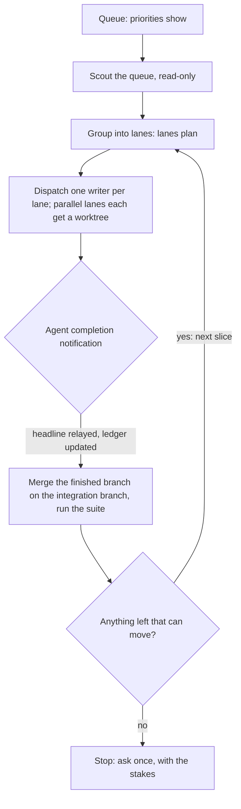

# Bolero

**Load when** the user hands over a queue and wants it worked to the end, not one item at a time. Otherwise the generic the-maestro files are enough.

Bolero is a loop: scout the whole queue read-only, group it into lanes, dispatch one writer per lane (one writer per worktree), advance each time an agent reports, merge the finished feature branches locally on an integration branch to test them together, then take the next slice, and stop only when nothing is left that can move.

The name is the musical form: one short theme repeated, each pass adding voices. Every pass is the same small procedure, and every pass runs more lanes at once than the last.

Everything here restates a rule written elsewhere in this skill and cites it, so the sources win if they disagree. [lanes-template.md](lanes-template.md) is the plan to fill in per run, and [stop-conditions.md](stop-conditions.md) is the checklist to read before stopping.

## When to use it, and when not

Use it when the user says to keep going until the queue is done and there are several independent items to run: a ranked list of tickets, a set of slices of one plan, or a backlog of a stream. The order comes from `journal.ts priorities show`, read fresh before every pick ([reference/dispatch.md:128-139](../reference/dispatch.md)).

Do not use it for:

- **One item.** Scout, brief and dispatch normally ([reference/dispatch.md:153-205](../reference/dispatch.md)).
- **A queue the user has not handed over.** Bolero is invoked, never assumed; absent the word, the normal one-pick-at-a-time flow applies.
- **A queue that is mostly one file or one design question.** Lanes only help when work is independent. A single hard design call is an Opus decision, not a loop.
- **Work that needs the user's decision on every item.** Each such item is a stop condition, so the loop would stop at once.
- **PR-producing work while the review queue is over its cap.** `journal.ts review-queue` exits 1 or 2: queue the work and dispatch only fixes to PRs already open, unless the user asks for that work by name ([reference/dispatch.md:111-126](../reference/dispatch.md)).

## The loop

| Step | Who | What |
|---|---|---|
| 1. Pick | Orchestrator | Read `journal.ts priorities show` fresh, take the top unblocked items, run the liveness check on each ([reference/dispatch.md:141-151](../reference/dispatch.md)). An item that fails goes back with a one-line note and is not dispatched. |
| 2. Scout | Read-only agent: Haiku for listings and sweeps, Sonnet when it must read and size code | One scout per queue or per repo, capped at about 10 tool calls or 5 minutes, recommending the stage-2 shape ([reference/dispatch.md:160-183](../reference/dispatch.md)). The orchestrator never greps the repos itself ([SKILL.md:24](../SKILL.md)). |
| 3. Lanes | Orchestrator | Turn the scout's findings into the lanes plan ([lanes-template.md](lanes-template.md)): which items share files, which depend on which, which are independent. |
| 4. Dispatch | Orchestrator launches; Sonnet writes | One writer per lane (a worktree each when lanes run in parallel), independent lanes launched in a single message so they run concurrently ([cost/budget.md:56-57](../cost/budget.md)). The brief is the eight fields plus the standing block printed by `scripts/brief-block.ts` ([reference/brief.md:8-30](../reference/brief.md)). Opus only for a design call or a bug-finding review ([cost/budget.md:20-21](../cost/budget.md)). |
| 5. Advance | Orchestrator | On each completion notification, and only then: relay the headline, update the ledger, merge the finished branch on the integration branch, run the suite, and dispatch the next slice that is now unblocked. |
| 6. Repeat | Orchestrator | Back to step 1 for the next slice, until a stop condition holds. |

The orchestrator dispatches and decides; scouts only read; writers only write inside their worktree and scope. A reviewer is a fresh agent, never the one that wrote the code.

## Lane rules

A lane is a set of items one writer works through, in order, in one worktree or checkout.

- **One writer per worktree.** Parallel lanes in one repo each get their own worktree under the container's `.worktrees/` folder, cut from the repo's base. A lone lane may use the main checkout, which is the generic default; a worktree is for the busy case: another agent is writing that repo, the main checkout is dirty, or the lane is long-running ([reference/dispatch.md:351-367](../reference/dispatch.md)). Parallel lanes are the busy case. The cost is real: a fresh worktree needs `npm ci` before anything runs ([reference/dispatch.md:351-353](../reference/dispatch.md)), and in a git-crypt repo it cannot decrypt until the user links the keys, a step that is theirs, so ask and wait or the lane stalls silently ([reference/dispatch.md:373-378](../reference/dispatch.md)). Tell the user a worktree is in play and give its path ([reference/dispatch.md:379](../reference/dispatch.md)).
- **No two lanes on the same files at once.** Never dispatch two agents to edit the same file, even in separate worktrees; sequence those items in one lane or in dependent slices ([reference/dispatch.md:388-389](../reference/dispatch.md)). Two items that touch one shared script go in order, never in parallel.
- **Sequence the dependencies.** Items that stack on one another, take the same migration number or share a file wait for the one before. The lanes plan records the order so it is a decision made once.
- **Shared external state is a file you cannot see.** Worktrees isolate files only: two suites against one test database or port still corrupt each other ([reference/dispatch.md:381-385](../reference/dispatch.md)). Sequence those lanes.
- **The brief block is pasted, not paraphrased.** Print it with `node scripts/brief-block.ts` and paste it once at the end of each brief ([reference/brief.md:28-30](../reference/brief.md)). If it exits non-zero, do not hand-write one.
- **Each brief names its scope and the files it must not touch.** The lanes plan lists the files other live lanes are changing, so the brief can say so.
- **Size each item to one reviewable change.** If it will not fit the PR size budget, split it before dispatch ([reference/dispatch.md:149](../reference/dispatch.md)).
- **Check mergeable state at PR open and again at finish.** A conflicting head is reported, and bringing the base into it is a merge, which needs the same explicit word as any other ([reference/git.md:40](../reference/git.md)).

## The integration branch

Finished feature branches are merged together locally, so the slices are tested as the set they will become.

- **A local branch in its own worktree**, named for the stream: `local/integration-<stream>`, cut from the base the feature branches were cut from. It is never a lane's worktree.
- **Merge in dependency order** (a merge needs the user's explicit ask ([reference/git.md:40](../reference/git.md)), and this skill grants none: when the user has given that standing instruction for this stream, merge locally on the integration branch; otherwise ask once. The instruction is the user's, kept in their own ledger and memory and not in this repo; it covers local integration merges and nothing wider), one finished branch at a time, running the full suite after each. A failing merge is a finding about the set, not a reason to edit a feature branch from here: send it back to its lane.
- **Never local `main`. Never push the merge. Never merge on GitHub.** The integration branch is a test bench and is thrown away; the feature branches are what ship, and merging them is the user's. Writing a protected branch is out under [reference/git.md:1-6](../reference/git.md), and merging on GitHub stays the user's job.
- **Where a repo is held local**, the feature branches stay local too: no push and no draft PR until the user says. Say where each one sits (repo, branch, worktree path, head sha, review verdict, diff command) in every reply that mentions local work. This hold is the user's standing instruction for such repos and is not written in this skill's reference files.
- **Where the repo is the user's own**, feature branches may be pushed and opened as drafts with `scripts/pr-open.ts`, never a bare `gh pr create` ([SKILL.md:63](../SKILL.md)). A branch is pushed only after its name carries the tracker key and it has been reviewed locally ([reference/git.md:44-53](../reference/git.md)).
- **Twin-flow repos** keep the order: the release-candidate PR waits for its integration twin ([reference/git.md:61-75](../reference/git.md)).
- **Clean up.** Remove a worktree once its branch is merged or abandoned ([reference/dispatch.md:386-387](../reference/dispatch.md)); `roll` removes stale ones too.

## Advancing on completion

- **Advance on the notification, nothing else.** After launching, end the turn. Do not poll, sleep, loop or check on an agent, and do not read its transcript ([SKILL.md:36-47](../SKILL.md)). Agents wait in the foreground and never use background watchers ([reference/brief.md:44](../reference/brief.md), cost reasons at [cost/budget.md:70-73](../cost/budget.md)).
- **Relay the headline only**, under 150 words, plus the report's path; open the file only when a decision needs something the headline lacks ([reference/dispatch.md:419-421](../reference/dispatch.md)). Hold small completions and relay them together; relay at once only a blocker, a finding the user must act on, a failure or a decision ([reference/dispatch.md:406-413](../reference/dispatch.md)).
- **Check before you relay.** A status from a subagent report is cross-checked against the code and the ledger first ([SKILL.md:66](../SKILL.md)).
- **Log as it moves.** `journal.ts start` when a lane is dispatched, `done` when it lands, `log --kind blocked` for a block, and `queue` for slices not yet started ([reference/ledger.md:46-67](../reference/ledger.md), [reference/ledger.md:69-93](../reference/ledger.md)). Log at the moment you would tell the user, never later.
- **Incidental findings are their own ticket.** A problem noticed in passing gets one ticket, filed against the repo it lives in and linked by id with its title; it is never smuggled into a lane's branch ([reference/citations.md:32-49](../reference/citations.md)).
- **Close with the footer.** Every reply ends with the status footer built from `ListAgents` and `journal.ts status --footer` ([SKILL.md:75-98](../SKILL.md)).

## Stopping

Stop only when completely blocked. [stop-conditions.md](stop-conditions.md) is the checklist. Short form:

- A decision only the user can make.
- Failing tests that cannot be explained after a root-cause pass.
- An external dependency: an access, an allowlist, a credential, another person's review.

Then ask once, with the stakes (what is blocked, what each answer unlocks, what the recommendation is), and say what is still moving. Park the blocked item and keep every lane that does not depend on it going: a decision only the user can make is an `ask` ([reference/ledger.md:54](../reference/ledger.md)); an external block is `journal.ts log "<what is blocked>" --kind blocked`, adding `--gate gh:pr:<repo>#N|date:YYYY-MM-DD|ticket:<id>` only when the wait ends on a PR merge, a date or a ticket closing, since a gate cannot express a user decision or an allowlist and `--gate` on any other kind exits 1 (`scripts/journal.ts:414-419`, [reference/ledger.md:314](../reference/ledger.md)). A block on one lane is not a stop for the loop.

A decision the user states while the loop runs is recorded in the ledger in the same turn, tied to the action it gates.

## Cost and context hygiene

- **Model tiers.** Haiku for read-only listings, sweeps, ticket closes, relays and verifiable gathering; Sonnet for builds, writes and scouts that must read code; Opus only for design calls and reviews that find real bugs. Always pass `model` explicitly ([cost/budget.md:11-28](../cost/budget.md)).
- **A tool-call budget in every brief** ([cost/budget.md:48-49](../cost/budget.md)).
- **Headline-only relays**, batched ([reference/dispatch.md:406-421](../reference/dispatch.md)).
- **Reads of the ledger and the board go to a Haiku agent** that returns a headline, not into the main thread.
- **Roll early.** `roll soon` is at 60 percent of the limit: finish relays in flight and start no new long dispatch chains. `roll now` is at 90: run the roll, then open every reply asking the user to compact ([cost/budget.md:91-107](../cost/budget.md)). A long Bolero is exactly the session that runs past its limit, so check the Session line on every relay.
- **No new PRs over the review cap** ([reference/dispatch.md:111-126](../reference/dispatch.md)).

## The composer hook (planned)

This section describes a planned convention, not something implemented in this repo today: no `journal.ts learned` command and no composer exist yet. The plan is that a single writer, the composer, turns `learned` ledger entries into library pages, while task agents and the orchestrator only append entries. When `journal.ts learned` is available, every landing in a Bolero run records what was learned while it was fresh: the fact, the evidence path and where it applies. Until then, put the fact in the item's `done` line and in the report file, so it can be promoted later.

## What is enforced, and what is only described

Documented only today, with a script gate worth building later:

| Rule | Why a gate would help |
|---|---|
| One writer per worktree, no two lanes on one file | Nothing compares the files two lanes touch. A `lanes-check` that reads the lanes plan and the worktrees' diffs against base would catch overlap. |
| The integration branch is never `main` and is never pushed | Only the user's git rules and hooks stand behind it. A guard that refuses a push of any `local/integration-*` branch would make it true. |
| Advance on notification, no polling | A rule of the orchestrator's turn ([README safety section](../README.md#convention-only)). |
| Every landing records `learned` | Needs `journal.ts learned` first; then `triage` can list landings with none. |
| Stop only when blocked | The skill cannot tell a real block from a tired loop. A record of what was still moving at each stop would make it auditable. |

Enforced by a script that refuses: the brief block's completeness (`brief-block.ts` exits non-zero on an empty slot), and PR size, body sections and draft state (`pr-open.ts`).

Documented, and checked by a command the orchestrator runs, not enforced: the review-queue cap. `journal.ts review-queue` reports it, but nothing blocks a dispatch if it is skipped ([SKILL.md:31](../SKILL.md), [reference/dispatch.md:111-126](../reference/dispatch.md)).

## Worked example

A session had two streams of queued tickets: ten slices of one plan for a tooling stream, and a handful of independent integration items for a partner API stream.

1. **Scout first.** One Haiku scout listed the tooling queue and checked each item live (open PR, not superseded, no decision outstanding). One Sonnet scout read the integration stream's tickets, branches and PR states and found that most items were already merged and the rest were blocked on an external allowlist.
2. **Lanes.** The tooling slices that all touch one script were sequenced into a single lane; the slices on separate files became their own lanes. The integration stream had no lane that could move, only a read-only diagnosis, which was dispatched as a Haiku run.
3. **Dispatch.** One Sonnet writer per lane, each parallel lane in its own worktree, each brief carrying the printed standing block and the files other lanes were changing.
4. **Advance.** Each completion notification produced a headline relay, a ledger `done`, a merge of that branch on `local/integration-<stream>`, a full suite run, and the next unblocked slice. Findings noticed in passing became their own tickets.
5. **Stop.** The loop paused only on the allowlist, an external dependency, with one question to the user stating what it unlocked, while the tooling lanes kept moving.

Only the shape is reproduced here; ids and names stay in the ledger.
