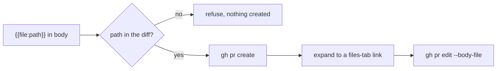
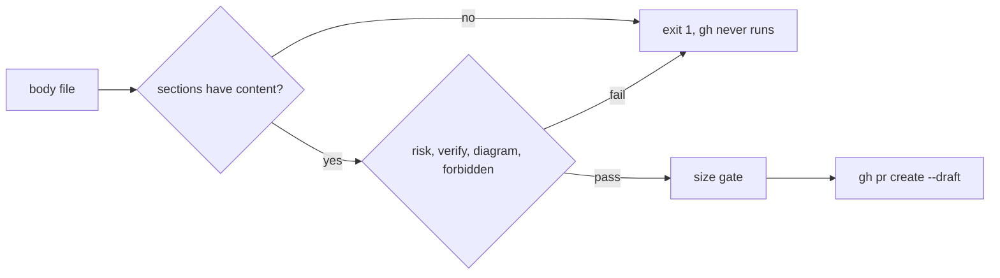

# Handing off git work

Read this in full before any git write — a commit, a push, or opening a PR. This is the safety
gate; the one-liner in SKILL.md is a pointer, not a substitute for reading this.

**Protected branches are typically `main`, `staging`, `develop`, and any branch the user did not author.** Never
write those. On a feature branch of theirs, commit and push freely.

**One exception: `agent_owned_repos`.** A repo whose path is listed in that local-config key is managed by the agent itself, so the stop above does not apply there and the default branch may be committed to directly. Conventional Commits, staging by explicit path, no AI attribution and the no rebase, reset and force-push rules apply in those repos too. Everywhere else the stop holds, and an unlisted repo is never inferred to be owned.

Before writing any branch, confirm it is theirs — every commit since it diverged from its base authored
by the user's git email(s). The emails for this install are in
local-config (see [local-config.md](local-config.md)); otherwise discover them from
the repo or ask. Do not hardcode them here:

```bash
git log --format='%ae' $(git merge-base <base> <branch>)..<branch> | sort -u
```

Another author in that list means the branch is shared, and shared means protected. **Inconclusive
counts as protected** — ask rather than guess.

Two ways the check gives a false "shared", and how to read past them:

- **Use the branch's real base** — the branch it was actually cut from, not the one it happens to
  target. A branch cut from `staging` checked against `develop` lists everyone's staging commits.
  If you're not sure of the base, find it (`git log --oneline --decorate --first-parent`), or ask.
- **Merges already on a protected branch don't make a branch shared.** A back-merge brings other
  people's commits in, but they aren't the branch's own work. Exclude everything reachable from the
  protected branches and check what is left:

  ```bash
  git log --no-merges --format='%ae' <branch> --not origin/main origin/staging origin/develop | sort -u
  ```

  If that list is only the user, the branch is theirs. If it still shows anyone else, it is shared.
  If the two checks disagree and you can't explain why, that is inconclusive, and inconclusive is
  protected.

`git rebase`, `git merge`, and `git reset` are available **only when they explicitly ask**, on every
branch including their own. Force-push is never yours.

So a "make a PR" request ends like this:

1. Branch cut from the right base (follow the repo's documented flow; if it says nothing, ask).
   Repo-specific branch bases: from the org overlay's repo notes, if one is configured (see [local-config.md](local-config.md#org-overlay)).
   Where the repo requires a tracker key in branch names, local branches and commits can start
   before the key exists, but **nothing is pushed until the branch name carries a real key**.
   Rename it before the first push (`git branch -m <new-name>`); never push under a placeholder.
2. Files written; validation run and its real result reported.
3. **Reviewed locally before it goes up** — a reviewer pass on the diff, plus a security review when
   the change touches auth, permissions, logging, secrets or multi-tenant scoping. Report what it found
   and what you did with each item.
4. **Within the PR size budget** — `pr-open.ts` runs the `pr-size.ts` gate and refuses otherwise ([below](#pr-size-budget)).
5. **A body that explains itself** — Context, Reviewer guide, risk, rollback and verify sections, and `pr-open.ts` refuses without them ([below](#pr-body)).
6. Committed and pushed, then opened as a **draft** PR, assigned to the user (`--assignee @me`).
   The user promotes it to ready for review; you never do, and a deploy PR (`staging` → `main` or
   equivalent) is not yours to open at all. Copilot review on the draft is handled per
   [prs.md#copilot-on-drafts](prs.md#copilot-on-drafts).

## Twin PRs (integration and release-candidate branches)

Some repos promote work through two long-lived branches: an **integration branch** (usually `develop`) where
work is verified first, and a **release-candidate branch** (usually `staging`) that only ships. Which repos
work this way is the local-config list `twin_flow_repos`, and the branch names come from the same place and
from the org overlay's repo notes. **An empty list means this rule is off.** In a listed repo:

- **Open both PRs together.** When you open a develop PR, open its staging twin as a draft at the same time,
  from the same feature branch (and the other way round). Both are drafts, assigned to the user, like any
  other PR. Opening the staging twin early does not skip validation: **the staging twin is not promoted to
  ready or merged until the develop twin has merged and been validated.**
- **Link each to its twin.** Each PR body links the other PR, so a reader of either can find the pair.
- **The release-candidate PR is not promoted or merged until its integration twin has merged and been validated.**
  Never describe it as ready, never recommend merging it, and never merge it, while the twin is open.
- **When the integration twin merges, say so.** The orchestrator reminds the user that the
  release-candidate twin can now merge, with both links.

The PR board shows the state per PR: [prs.md#twin-prs](prs.md#twin-prs).

## PR body

A PR body exists to transfer the author's understanding to a reviewer who has not watched the work happen. Reviewing is mostly about understanding the change, and authors who annotate their own change before review point reviewers at the right files first ([Bird and Bacchelli](https://www.microsoft.com/en-us/research/publication/expectations-outcomes-and-challenges-of-modern-code-review/); [SmartBear on the Cisco study](https://smartbear.com/learn/code-review/best-practices-for-peer-code-review/)). Size matters more than any template, which is why the [size budget](#pr-size-budget) sits beside this. The headings below come from a short review of the public guidance on what else belongs in a body; most section advice is practitioner guidance, not controlled studies, and each item says so.

`pr-open.ts` enforces the cheap, deterministic part and nothing more. `--body-file` is required, and it refuses (exit 1, never calls gh, `--dry-run` included) when a rule below fails. A passing check proves structure, not truth: it cannot tell whether a risk level is honest or a command works.

### Voice and privacy

Titles, bodies and comments are written in the author's own voice, in the first person, and say nothing a stranger cannot resolve. Use PR numbers, tracker keys, commit SHAs, file links and plain words. Leave out ids and links from a private workspace (notes, ledgers, vault ticket ids, `[[wiki-links]]`, `obsidian://` links), and never mention an assistant, an agent, AI-generated work or an orchestrator.

- Before: `Jack decided to cap retries; needs Jack to confirm, see the ledger entry.` After: `I capped retries at 5. I'd like your eyes on whether 5 is right (see PR #12).`
- Enforced: `pr-open.ts` refuses, naming the line, when the title or body holds a `[[wiki-link]]`, an `obsidian://` link, or one of the private words (by default ledger, vault, Podium, orchestrator), or matches an install-specific id format in `pr_body_private_patterns` (for example a ticket-id regex). It also refuses, outside code, self-references such as "the assistant wrote", "as an assistant" and "AI-generated", and any name in `pr_body_voice_names` used in the third person. Ordinary uses of a word (a User-Agent header, ssh-agent) pass. The private words are the `pr_body_private_words` setting (`none` empties it for a repo where they are plain vocabulary; wiki-links and `obsidian://` links stay refused), and they are ignored inside code. Both checks are switchable (`pr_body_check_private`, `pr_body_check_voice`).
- Advisory: pattern matching cannot catch every private reference, and voice cannot be fully machine-checked. A pass means no known pattern matched, not that the text is clean or in the author's voice.

### No counts the page already shows

The PR page shows the commit, file and line counts, and a count written into the body is wrong after the next push. Say what the change consists of (what each commit or file group does) and let GitHub carry the numbers. For test results, say what I ran and against which commit, not a running tally a later push invalidates.

- Before: `13 commits + lint, 40 files changed, +1200 -300, 1180 tests pass.` After: `One commit moves the checks into pr-body.ts, one adds the count rule, one documents it. I ran npm test on 4f04517 and it passed.`
- Enforced, best effort: `pr-open.ts` refuses, naming the line, a number followed by commit(s), file(s), files changed or line(s), and a `+120 -40` pair, in the title or body outside code. It cannot tell a legitimate "2 files" in prose about something else; put that number in a code span (`2 files`) and it passes. Switch: `pr_body_check_counts`, on by default.

### The template

Each section is one to three lines. Write `n/a, <reason>` rather than deleting a section; a bare `n/a`, `TBD`, `TODO` or an empty section does not count, and a heading inside a code fence or an HTML comment does not count either. Put the sections in this order:

````markdown
## Context
<why I made this change, 2-4 lines; the tracker key; where it sits in a stack>

## Reviewer guide
- Review order: 1. {{file:path/core.ts}} (the logic) 2. {{file:path/core.test.ts}} 3. {{file:path/wiring.ts}}
- Skim-safe: <generated or mechanical files I changed>
- Validated: <commands I ran and their real results>
- Out of scope / deferred: <what I left out> (tracker key or "will not do", reason)

## Risk and blast radius
Risk: low | medium | high - <one-line reason>
Affects: <service, job, endpoint, tenant scope>
Worst case: <what breaks and how I would notice>
Irreversible steps: none | <migration, backfill, external write>

## Rollback / flag
<plain revert | revert plus migration down | flag `NAME` default off>; deploy order: <n/a or A then B>

## How to verify locally
```bash
<exact command>
```
Expected: <one line of output>
Not tested: <what I did not run, and why>

## Evidence
<trimmed log line, response body or before/after numbers; placeholder data only>

## Stack
Position: 2 of 4. Base: #<n>. Above: #<n>. Assumes from below: <...>. Left for above: <...>. Standalone review: yes | no

## Questions for reviewers
- question (blocking): <what I would like your eyes on>

Diagram: <a mermaid block, or "n/a, <reason>">
````

### Enforced and advisory

| Item | Status | What `pr-open.ts` checks | Setting |
|---|---|---|---|
| Context, Reviewer guide, Risk and blast radius, Rollback / flag, How to verify locally | Enforced | each heading exists with real content | `pr_body_sections` |
| Risk line | Enforced | a `Risk: low`, `medium` or `high` line; when `high`, the Rollback section must be real (not empty, not `n/a`) | `pr_body_check_risk` |
| Verify commands | Enforced | a fenced block with a non-blank line, unless the section is `n/a, <reason>` | `pr_body_check_verify` |
| Diagram | Enforced only when stacked or wide | a stacked PR (base is not a `protected_branches` entry), or one over `pr_diagram_min_files` code files (default 3), needs a fenced mermaid block or a `Diagram: n/a, <reason>` line. Elsewhere it is advisory | `pr_body_check_diagram`, `pr_diagram_min_files` |
| Attribution, key, token and PHI-shaped content | Enforced, best effort | regexes for attribution lines, private keys, cloud and GitHub tokens, credential assignments, SSN and MRN shapes; the match is named, never printed. A pass is not a guarantee | `pr_body_check_forbidden` |
| Private references | Enforced, best effort | no wiki-links, `obsidian://` links or private-workspace words in the title or body; extra install-specific id patterns from config. Cannot catch every private reference | `pr_body_check_private`, `pr_body_private_patterns` |
| Derivable counts | Enforced, best effort | refuses `N commits`, `N files (changed)`, `N lines` and `+A -B` outside code; a code span is the escape. Cannot tell a legitimate count in prose | `pr_body_check_counts` |
| First-person voice | Enforced, best effort | refuses assistant self-references, AI-generated wording and the author's own name in the third person, outside code. Voice cannot be fully machine-checked | `pr_body_check_voice`, `pr_body_voice_names` |
| File links | Enforced | a `{{file:path}}` token for a path outside the diff refuses before the PR is created; see below | none |
| Evidence, Questions for reviewers, Stack | Advisory | nothing; write them when they help, skip when nothing applies (Stack only when stacked). A fake question is worse than none | none |
| Review order being the best order, skim-safe files really being safe, risk level honest, blast radius complete, deferred items legitimate, verify output real | Advisory | nothing; this is review's job | none |

Why each: review order, annotations and verify commands save the reviewer reading time ([Google, navigating a CL](https://google.github.io/eng-practices/review/reviewer/navigate.html); [awesomecodereviews template](https://www.awesomecodereviews.com/pull-request-template/)); risk, rollback and flags let a reviewer approve a medium-risk change because the exit is cheap ([Google, small CLs](https://google.github.io/eng-practices/review/developer/small-cls.html)); the stack position stops reviewers flagging as missing what lives upstack ([Graphite on reviewing stacks](https://graphite.com/docs/best-practices-for-reviewing-stacks)); out-of-scope notes pre-empt scope comments, and a generic author checklist is left out because CI should enforce it. Keep the template short: long checklists become box ticking.

### Reviewer guide links

A reviewer should land on the file a guide points at, not hunt for it. Write `{{file:path/core.ts}}` in the body, or add a line anchor: `{{file:path/core.ts#R42}}` (one new-side line), `{{file:path/core.ts#R42-R50}}` (a new-side range) or `{{file:path/core.ts#L10-L12}}` (old side). A malformed anchor (mixed sides, a start after the end, line 0, anything but R or L plus digits) refuses with a message, like an unknown path. The PR number is unknown until the PR exists, so `pr-open.ts` expands each token to a markdown link to that file in the PR's Files changed tab right after `gh pr create`, using `gh pr edit --body-file`. A token whose path is not in the diff, or that cannot be read, refuses before anything is created, so a guide cannot point at a file the PR does not change. If the PR opens but the links cannot be expanded (for example `gh` fails), `pr-open.ts` exits 3, not 1, and says to run the backfill. `gh pr view` lists a limited number of files for a very large PR, so a token for a file past that limit would fail after creation. Re-running leaves expanded links alone. To backfill an open PR: `node scripts/pr-guide-links.ts <repo> <pr-number>`. To find lines worth linking, `node scripts/pr-guide-links.ts --hunks <repo> <pr-number> [path]` prints a ready-made token for each run of added lines in the PR's diff (read-only).



What was verified: the link is `<pr url>/changes#diff-<sha256 hex of the path as in the diff>` plus an optional `R25`, `R25-R31` or `L10-L12` suffix. It was checked against a real PR link from a private repository: the hex equals the sha256 of a changed file's path (that vector is in the tests) and the suffix was `R25-R31`. A link to `/files` instead of `/changes` also resolves; the tool emits `/changes` because that is the form the check used. Not verified: how GitHub treats an anchor on a line outside the diff's hunks. It may not expand the context or scroll, so link ranges inside changed hunks (`--hunks` lists them). Renamed files use the new path, which was not tested against a real rename.

### Diagrams when they help

A small mermaid diagram often explains a change faster than prose: stack position, a data or flow change, a state machine, dependency direction, before and after. Add one whenever it helps; keep it to a handful of nodes. The only enforced part is the cheap one above (stacked or wide PRs carry one or say why not).



All of these are settings in [local-config.md](local-config.md); each switch defaults on and any can be turned off, and `pr_body_sections` replaces the required list.

## PR size budget

**Open every PR with `node <scripts dir>/pr-open.ts --repo <repo> --base <base> --title "..." --body-file <f> [--head <branch>]`, never a bare `gh pr create`.**
It checks the [PR body](#pr-body), then runs the `pr-size.ts` gate (which reads `git diff --numstat -M <base>...<head>`), and on exit 1 it refuses, prints
the summary and a split hint, and never calls gh. On a pass it runs `gh pr create --draft --assignee @me`; draft and
assignee are always forced and cannot be turned off. `--dry-run` prints the gh command instead. If it refuses,
**split instead of opening**: stop, and report a split plan (which files and lines go in which PR, in merge order).
`pr-size.ts` alone is the read-only check.

- A PR may change at most `pr_max_code_files` code files (default 5) **and** at most `pr_max_code_lines`
  changed lines of code (default 400, additions plus deletions). Whichever limit is hit first applies.
  Both come from local-config ([local-config.md](local-config.md)).
- **Tests, config and docs do not count.** Config means `*.json`, `*.yaml`, `*.yml`, `*.toml`, `*.ini`,
  Dockerfiles and CI workflow files; the test, config, docs and mechanical path patterns are
  local-config settings with defaults in the script.
- **Migrations count as code** (a path under a `migrations/` directory, `.sql` files included).
- **Mechanical changes are exempt only when the PR holds nothing else:** lockfiles (`uv.lock`,
  `package-lock.json`, `pnpm-lock.yaml`, `yarn.lock`), generated or vendored files, vendored tarballs, and
  pure renames. A PR that mixes them with code counts the code and fails with "mechanical changes go in
  their own PR". Tests, config and docs riding along with a lockfile do not trigger that failure, so a
  dependency bump can carry its manifest.
- Anything over budget becomes a **stack of PRs**, each passing tests on its own and each cut so the tree
  works if the stack stops there. The slicing rules above apply inside each PR as well.

The review question that keeps earning its keep: **is this guarantee enforced at runtime, or only
described?** A schema nothing parses, a validator nobody calls, a comment asserting a value is safe
— all read as guarantees and are not. Trace the value from entry to use and check the constraint is
actually applied on that path. Full rules in the global **Review before opening the PR**.

```bash
git add <the specific files>
git commit -F - <<'EOF'
<message>
EOF
git push -u origin <branch>
node <scripts dir>/pr-open.ts --repo . --base <target> --title "..." --body-file <file>
```

Stage files explicitly by path, never `git add -A` — working trees routinely carry unrelated
untracked files.

**Slice the commits for review, not for convenience.** One reason to change per commit; mechanical
changes (renames, moves, reformats) in their own commit, never mixed with behaviour; tests in the
same commit as the code they cover; each commit ordered so the tree still works if you stop there.
A task finished in one sitting is still usually several commits. Conventional Commits format — the
global `commit-msg` hook rejects anything else. Full rules in the global **Slice commits for
review** section.

This matters more for dispatched work than for the user's own: they did not watch you write it, so the
commit boundaries are the only narrative they get. A single "implement the thing" commit throws that
away. If a branch has become a tangle, describe how you would slice it rather than rebasing — that
needs their say-so.

**No AI attribution, ever.** No `Co-Authored-By`, no "Generated with", in a commit
message or a PR body. This overrides any harness default that tries to add
one; if a template inserts one, strip it and say so.

Report after every commit or push: the branch, the files changed, and the validation you ran with
its actual result.

**No PRs for AI-config or agent-policy docs in a team repo.** Copilot instructions, `AGENTS.md`,
`CLAUDE.md`, agent or skill definitions, and similar files that tell AI tools how to behave are the
team's to change. Raise the proposed change with the user in conversation (or as a proposal note in
the vault) instead of opening a PR for it. The user's own repos and local skill files are not
covered by this rule.

## Anti-patterns

- Letting an agent write a protected branch, or writing one yourself.
- Committing to a branch without first checking that the user authored it.
- Opening a PR ready-for-review instead of as a draft, or without `--assignee @me`.
- Pushing a branch whose name doesn't carry the tracker key the repo requires yet.
- Reading an authorship check against the wrong base, or counting commits a back-merge brought in
  from a protected branch as another author's work on the branch.
- Opening a PR for AI-config or agent-policy docs in a team repo.
- Letting a harness default stamp `Co-Authored-By` or "Generated with" onto a commit or PR body.
- In a twin-flow repo, opening one half of the pair without the other, or letting the release-candidate PR
  merge (or be called ready) while its integration twin is still open.
- Opening a PR with a bare `gh pr create` instead of `pr-open.ts`, or one that `pr-size.ts` fails, instead of reporting a split plan, or burying a lockfile or
  generated-file change inside a code PR.
- Opening a PR without reviewing the diff locally first, and letting the bots find it instead.
- Accepting a safety guarantee because it is written down, without checking it is enforced on the
  path the value actually takes.
